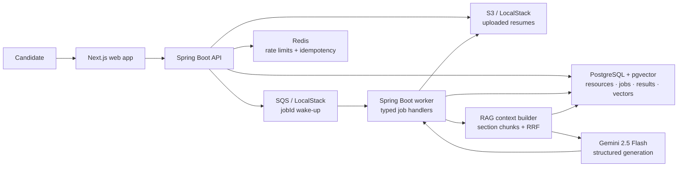

# AI Interview Coach

An AI-powered interview coach for technical candidates. Upload a resume, add an optional job description, and receive evidence-grounded resume assessment, tailored interview questions, and feedback on practice answers.

Built as a reliable modular monolith: Spring Boot handles the API and asynchronous jobs, while Next.js provides the candidate workflow.

## What it does

| Capability | How it works |
| --- | --- |
| Resume ingestion | Accepts PDF, DOC, DOCX, TXT, and Markdown; Apache Tika/PDFBox extracts and normalizes text. |
| Grounded assessment | Scores technical depth, impact, clarity, relevance, and ATS alignment using Resume and JD evidence. |
| Interview practice | Generates role-specific questions at Warmup, Core, and Deep Dive difficulty, then evaluates submitted answers. |
| Reliable AI jobs | Runs extraction, analysis, and feedback asynchronously with PostgreSQL leases, checkpoints, retries, and a DLQ. |
| Document-level RAG | Uses section-aware chunking, pgvector retrieval, per-source Resume/JD recall, deterministic RRF ranking, and source evidence IDs. |

## Architecture



### Request flow

1. The API stores an uploaded resume, creates a durable PostgreSQL job, and sends only its `jobId` to SQS.
2. A worker claims the job through a PostgreSQL lease, extracts text, creates section-aware chunks, and persists progress checkpoints.
3. For long documents, RAG retrieves Resume and JD evidence independently, then merges candidates with deterministic Reciprocal Rank Fusion (RRF).
4. Gemini receives selected, traceable evidence and returns structured assessment, interview questions, or answer feedback.
5. The frontend polls job status until results are complete, partial, or failed.

PostgreSQL is the source of truth for job state. SQS wakes workers; it does not carry document content or determine job completion.

## RAG design

- **Structured chunks:** Experience, Research Experience, and Projects preserve blank-line-separated entries; large chunks use natural boundaries with overlap.
- **Per-source retrieval:** Resume and Job Description indexes are retrieved independently, so a strong Resume match cannot crowd out JD evidence.
- **Deterministic fusion:** All query/source candidates are collected before ranking with RRF (`rrf-k=15`), using stable tie-breaks.
- **Evidence quality controls:** JD evidence is reserved when available, section diversity is capped, and overlapping neighboring chunks are suppressed.
- **Prompt-safe snippets:** section prefixes improve embedding retrieval but original persisted text is restored before being sent to Gemini or returned as evidence.

## Tech stack

| Layer | Technology |
| --- | --- |
| Backend | Java, Spring Boot, Gradle, JdbcTemplate, Flyway |
| Frontend | Next.js, TypeScript |
| AI | Gemini 2.5 Flash, structured JSON generation |
| Retrieval | PostgreSQL, pgvector, Gemini embeddings |
| Async workflow | AWS SQS + DLQ, PostgreSQL leases/checkpoints |
| Storage | S3-compatible storage via LocalStack |
| Operational guardrails | Redis rate limits and idempotency keys |
| Testing | JUnit 5, Mockito, MockMvc, Testcontainers, Vitest |

## Quick start

### 1. Configure local environment

```bash
cp .env.example .env
```

Set `DATABASE_URL`, `DATABASE_USERNAME`, and `DATABASE_PASSWORD` for a PostgreSQL instance with pgvector. The default is `interview_guide` on `localhost:5432`.

To enable Gemini locally, add the following to the untracked `.env` file:

```properties
GEMINI_API_KEY=your-api-key
AI_CHAT_MODEL=google-genai
AI_EMBEDDING_MODEL=google-genai
GEMINI_CHAT_MODEL=gemini-3.6-flash
GEMINI_THINKING_LEVEL=medium
GEMINI_MAX_OUTPUT_TOKENS=4096
GEMINI_EMBEDDING_MODEL=gemini-embedding-001
RAG_EMBEDDING_DIMENSIONS=1024
RAG_CHUNK_SCHEMA=section-block-v3
```

Never commit API keys or a populated `.env` file.

### 2. Start local dependencies

```bash
docker compose up -d
```

This starts LocalStack on `localhost:4566` and Redis on `localhost:6380` by default. LocalStack initializes the S3 bucket and the `ai-interview-jobs` / `ai-interview-jobs-dlq` queues.

To run an isolated PostgreSQL container too:

```bash
docker compose --profile managed-postgres up -d
```

The managed PostgreSQL service is exposed on `localhost:55432` by default.

### 3. Start the application

In one terminal:

```bash
./gradlew bootRun
```

In another terminal:

```bash
cd apps/web
npm install
npm run dev
```

Open `http://127.0.0.1:3000`. The backend status endpoint is `http://127.0.0.1:8080/api/status`.

## Container images

The backend image accepts the same environment variables as a local Spring Boot
run. `JOB_RUNTIME_MODE=api` and `JOB_RUNTIME_MODE=worker` can therefore use the
same image when the API and worker are deployed separately. Create `.env` from
`.env.example` and configure `GEMINI_API_KEY` before starting the API container.

Build both images from the repository root:

```bash
docker build -t ai-interview-api:local .
docker build -t ai-interview-web:local apps/web
```

For a manual local container run, first start the managed dependencies:

```bash
docker compose --profile managed-postgres up -d
```

Then run the API. These `host.docker.internal` addresses let the API container
reach the dependencies that Compose exposes on the host; they work with Docker
Desktop on macOS and Windows.

```bash
docker run --rm --name ai-interview-api -p 8080:8080 --env-file .env \
  -e JOB_RUNTIME_MODE=all \
  -e DATABASE_URL=jdbc:postgresql://host.docker.internal:55432/ai_interview \
  -e DATABASE_USERNAME=ai_interview \
  -e DATABASE_PASSWORD=ai_interview \
  -e REDIS_HOST=host.docker.internal \
  -e REDIS_PORT=6380 \
  -e S3_ENDPOINT=http://host.docker.internal:4566 \
  -e SQS_ENDPOINT=http://host.docker.internal:4566 \
  ai-interview-api:local
```

Build the web image with the browser-visible API address, then serve it:

```bash
docker build \
  --build-arg NEXT_PUBLIC_API_BASE_URL=http://127.0.0.1:8080 \
  -t ai-interview-web:local apps/web
docker run --rm --name ai-interview-web -p 3000:3000 ai-interview-web:local
```

Open `http://127.0.0.1:3000`, then verify the backend independently with
`curl http://127.0.0.1:8080/api/status`. On Linux, replace
`host.docker.internal` with a host gateway address or place the API and its
dependencies on a shared Docker network.

## Minikube and Helm

The local Helm chart at `deploy/ai-interview` deploys the web app, one API pod,
two worker pods, PostgreSQL with pgvector, Redis, and LocalStack. It is a
development chart: the default PostgreSQL password is intentionally local-only,
while the Gemini key must be supplied separately as a Kubernetes Secret.

Load the Docker images into the running Minikube cluster, create the Secret,
then install the chart:

```bash
minikube image load ai-interview-api:local
minikube image load ai-interview-web:local

kubectl create namespace ai-interview --dry-run=client -o yaml | kubectl apply -f -
kubectl -n ai-interview create secret generic ai-interview-gemini \
  --from-literal=GEMINI_API_KEY='your-api-key'

helm upgrade --install ai-interview ./deploy/ai-interview \
  --namespace ai-interview
```

Check the release and wait for all pods to become ready:

```bash
helm -n ai-interview status ai-interview
kubectl -n ai-interview get pods
kubectl -n ai-interview rollout status deployment/ai-interview-api
kubectl -n ai-interview rollout status deployment/ai-interview-worker
kubectl -n ai-interview rollout status deployment/ai-interview-web
```

The frontend image uses `http://127.0.0.1:8080` as its browser-visible API
address, so port-forward both services during this local phase:

```bash
kubectl -n ai-interview port-forward service/ai-interview-api 8080:8080
kubectl -n ai-interview port-forward service/ai-interview-web 3000:3000
```

Open `http://127.0.0.1:3000`. An Ingress or same-origin web proxy is the next
step before exposing this deployment beyond local Minikube.

## Argo CD GitOps

After Argo CD is installed, it can render and continuously reconcile the same
Helm chart from Git. The Application manifest tracks the
`docker-kubernetes-gitops` branch, deploys into `ai-interview`, and uses the
same Helm release name. Its automated policy self-heals drift and prunes
resources removed from the chart.

The chart deliberately references an existing `ai-interview-gemini` Secret;
do not commit the Gemini API key to Git. Create that Secret in Minikube before
the first Argo CD sync, as shown in the Helm section above.

First push this branch so Argo CD can fetch the chart, then bootstrap the
Application:

```bash
git push -u origin docker-kubernetes-gitops
kubectl apply -f deploy/argocd/ai-interview-application.yaml
kubectl -n argocd get application ai-interview
kubectl -n argocd wait --for=jsonpath='{.status.sync.status}'=Synced \
  application/ai-interview --timeout=5m
kubectl -n argocd wait --for=jsonpath='{.status.health.status}'=Healthy \
  application/ai-interview --timeout=5m
```

After that initial bootstrap, change `deploy/ai-interview` through Git commits
and pushes. Do not run `helm upgrade` for this release: Argo CD is the owner.

## GitHub Actions image publishing

The `Build and publish images` workflow builds multi-architecture API and web
images, pushes them to GitHub Container Registry, and commits the immutable
source commit SHA to `deploy/ai-interview/values.yaml`. Argo CD then observes
that values commit and rolls out the corresponding images.

The workflow runs for pushes to `docker-kubernetes-gitops`; its values-only
commit is ignored by the trigger, preventing a rebuild loop. It uses the
repository's `GITHUB_TOKEN`, with package-write permission for publishing and
contents-write permission only for the values update.

For Minikube to pull the resulting GHCR images, make the two GHCR packages
public in GitHub, or create a `ghcr-pull` image-pull Secret and add it to
`imagePullSecrets` in `deploy/ai-interview/values.yaml`:

```yaml
imagePullSecrets:
  - name: ghcr-pull
```

The initial `:local` image references remain in the values file until the first
successful GitHub Actions run writes the real image SHAs.

## Runtime modes

The same Spring Boot build supports API and worker deployment independently:

```properties
JOB_RUNTIME_MODE=all     # local default: API and worker
JOB_RUNTIME_MODE=api     # submit/query jobs only
JOB_RUNTIME_MODE=worker  # consume jobs only
```

Workers use SQS long polling and PostgreSQL-backed leases. Database retries use full jitter; terminal failures are routed to the DLQ. `PARTIAL` jobs preserve successful Gemini output and only fill missing portions with fallback content.

## API overview

| Endpoint | Purpose |
| --- | --- |
| `POST /api/resumes` | Upload a resume and create an extraction job. |
| `GET /api/resumes/current` | Retrieve the current resume; `404` means none exists. |
| `POST /api/analyses` | Submit combined assessment and question-generation work. |
| `POST /api/interview/feedback` | Submit answer-feedback work. |
| `GET /api/jobs/{jobId}` | Poll job status, stage, attempts, result, and error. |

Mutation endpoints accept an optional `Idempotency-Key`. Redis handles short-lived HTTP idempotency and rate limits; PostgreSQL fingerprints reuse identical AI jobs for five minutes.

## Verification

```bash
./gradlew check
./gradlew integrationTest

cd apps/web
npm test -- --run
npm run typecheck
npm run build
```

Testcontainers covers PostgreSQL/pgvector and LocalStack integration scenarios. Frontend tests use Vitest.

## Local destructive reset

To remove every record in the local `interview_guide` database and this project's LocalStack S3/SQS state, first stop the API and worker, then run:

```bash
RESET_CONFIRM=DROP_INTERVIEW_GUIDE \
RESET_DATABASE_NAME=interview_guide \
RESET_DATABASE_OWNER=ai_interview \
RESET_DATABASE_ADMIN_URL='postgresql://…@localhost:5432/postgres' \
./scripts/reset-local-environment.sh
```

The script refuses non-local hosts, databases other than `interview_guide`, and resources outside this project. It is irreversible: resumes, jobs, chunks, vectors, and interview history must be recreated.

## Further documentation

See [project design](docs/project-design.md) for the architecture, domain model, API surface, and implementation details.
