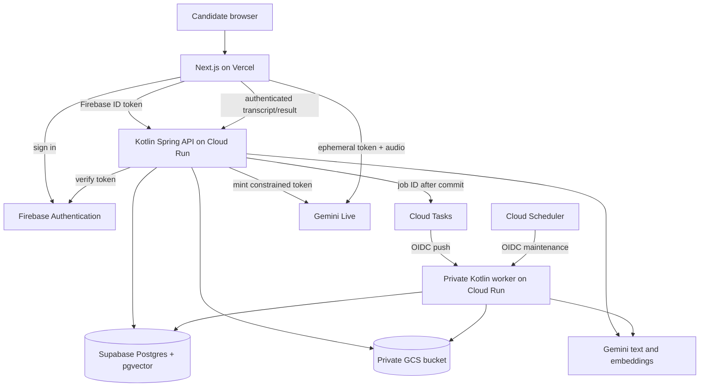
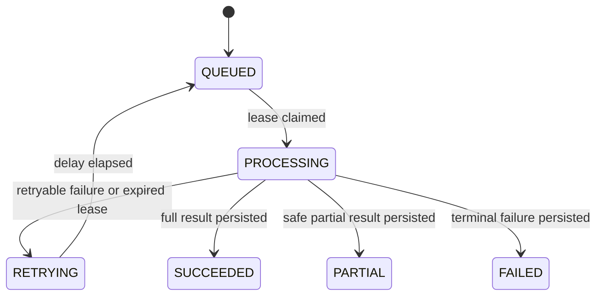

# Target Stack Architecture and Migration - Plan

## Goal Capsule

- **Objective:** Candidates can securely use resume analysis, interview practice, feedback, history, and eventually live voice interviews on a reliable hosted service.
- **Means:** Keep the Next.js frontend and Kotlin/Spring modular monolith; move hosting, identity, storage, queueing, and embeddings to the selected Vercel + Google Cloud + Supabase + Gemini stack (KD1, KTD1–KTD7).
- **Authority:** The stack and no-DNS choice in the current project brief govern product scope; current source code governs migration details; linked provider documentation governs external contracts.
- **Execution:** Code, delivered in dependency order. The Kotlin production-source migration is already committed on `codex/kotlin-production-phase-1`; the units below cover remaining work.
- **Stop conditions:** Do not expose candidate data publicly before cross-user authorization tests pass. Do not switch embedding models before the new index is populated and retrieval is checked. Do not launch voice until the Live token flow works in the chosen account and region.

---

## Product Contract

### Summary

Move the existing text interview workflow to the chosen hosted stack, then add live voice. Preserve the durable job and source-grounded retrieval behavior already in the repository.

### Problem Frame

The current backend is Kotlin, but the running design still assumes one fixed local user, S3/LocalStack, SQS polling, Redis, and local or Minikube deployment. That is unsuitable for a public, multi-user Vercel/Cloud Run application. `README.md` and `docs/project-design.md` also describe older stack choices and must be updated after cutover.

### Key Decisions

- KD1. **Selected platform:** Next.js/TypeScript on Vercel; Kotlin/Spring Boot on Cloud Run; Firebase Authentication; Supabase Postgres/pgvector; Google Cloud Storage and Tasks; Gemini text, Embedding 2, and Live. Governs R1–R8. (session-settled: user-directed — chosen over the earlier Cognito/AWS proposal: the project should use the Vercel, GCP, Supabase, and Gemini stack.)
- KD2. **No DNS work:** Use the Vercel and Cloud Run provided HTTPS URLs during this migration. Governs R7. (session-settled: user-directed — chosen over Cloudflare/domain setup: DNS was explicitly removed from scope.)
- KD3. **Kotlin scope:** The backend is Kotlin; the explicitly selected Next.js frontend remains TypeScript. Governs R7.

### Requirements

**Candidate access and workflow**

- R1. A signed-in candidate can access only their own resumes, job descriptions, interviews, jobs, and results.
- R2. Resume upload, text analysis, question generation, answer feedback, and job-status restoration keep their current user-visible behavior.
- R3. Original files are private and recoverable; database records identify their owner and storage object.
- R4. Background work survives duplicate delivery, process restart, and transient provider failure without duplicate visible results.

**Grounding and voice**

- R5. Retrieval uses the candidate's permitted resume/JD content, keeps source evidence traceable, and does not mix embedding models or tenants.
- R6. A candidate can run a live voice practice session against their generated questions and save its transcript plus grounded feedback to interview history after the core text flow is hosted.

**Operations**

- R7. Production runs on the selected stack without custom-domain or DNS changes; secrets and privileged service credentials stay server-side.
- R8. Existing persistent records that must be retained remain readable after cutover, and old S3/SQS/Redis production dependencies are removed only after equivalent behavior is verified.

### Acceptance Examples

- AE1. Given users A and B, when B requests A's resume, job, or interview ID, the API returns no private content and B's browser cannot restore A's cached workflow. Covers R1.
- AE2. Given a job committed to Postgres while task creation fails, when reconciliation runs, the worker receives the job ID and produces one persisted result. Covers R4.
- AE3. Given an old `gemini-embedding-001` index, when Embedding 2 is enabled, queries use only rebuilt Embedding 2 vectors; old vectors are never compared to them. Covers R5.
- AE4. Given a signed-in candidate with generated interview questions, when a voice session ends, the browser saves the transcript through the authenticated API and the candidate can reopen grounded feedback from history. Covers R6.

### Scope Boundaries

The first hosted release includes the text workflow and a way to reopen saved results. Gemini Live follows as a separate gated release. Firebase Authentication is the identity provider; Supabase is used for Postgres/pgvector, not Supabase Auth or browser-side database access. Identity Platform is a later upgrade only if a needed enterprise identity feature appears. DNS, Cloudflare, and a custom domain are outside this plan.

### Deferred to Follow-Up Work

Self-service account deletion UI, analytics dashboards, native mobile apps, and audio recording retention beyond the transcript are separate product decisions. The voice unit below stores no raw audio and retains a saved transcript only until its owner deletes that interview.

---

## Planning Contract

### Target Tech Stack

| Layer | Target | Current migration boundary |
|---|---|---|
| Frontend | Next.js + TypeScript on Vercel | `apps/web` already exists; add Firebase sign-in and deploy configuration. |
| Backend | Kotlin + Spring Boot on two Cloud Run services | Reuse one image in API and private worker modes; Phase 1 Kotlin conversion is complete. |
| Identity | Firebase Authentication | Replace `LocalUserService`; verify ID tokens in the API and map stable Firebase UID to an internal user ID. |
| Database/retrieval | Supabase Postgres + pgvector | Move Flyway-managed data and vectors; keep Postgres authoritative for jobs and history. |
| File storage | Google Cloud Storage | Replace the S3 implementation behind `ObjectStorageService`. |
| Async/maintenance | Cloud Tasks + Cloud Scheduler | Replace SQS polling with authenticated task pushes; schedule recovery/cleanup explicitly. |
| AI | Gemini text, `gemini-embedding-2`, Gemini Live | Keep structured text output; rebuild embeddings; add voice after core launch. |
| Supporting GCP | Secret Manager, Artifact Registry, Cloud Logging/Monitoring | Hold the Gemini API key and DB secret server-side; deploy and observe the two Cloud Run services. |

### Key Technical Decisions

- KTD1. **Verify Firebase ID tokens at the Kotlin API boundary.** Use the Firebase Admin Java SDK from Kotlin, map `uid` to an immutable internal UUID, and apply owner checks in every lookup and mutation. Email is mutable and cannot be the identity key. Browser requests carry a refreshed bearer token over HTTPS. [Firebase verification](https://firebase.google.com/docs/auth/admin/verify-id-tokens).
- KTD2. **Connect Cloud Run to Supabase through a bounded JDBC pool.** Start with the IPv4 session pooler, TLS, and an explicit Hikari pool/Cloud Run instance budget; keep Flyway migration access separate. The transaction pooler does not support prepared statements. Disable Supabase's Data API because only the Kotlin services should access these tables, including the existing `public.vector_store`. [Supabase connection guidance](https://supabase.com/docs/guides/database/connecting-to-postgres), [Data API security](https://supabase.com/docs/guides/api/securing-your-api).
- KTD3. **Keep Postgres as the job authority.** The API commits a job before enqueueing its ID. Cloud Tasks sends an OIDC-authenticated HTTP request to a private worker. The worker claims the Postgres lease, checkpoints effects, and returns a retryable response only when a retry is safe. Cloud Scheduler invokes reconciliation because request-based Cloud Run CPU cannot reliably run idle `@Scheduled` loops. [Cloud Tasks HTTP targets](https://docs.cloud.google.com/tasks/docs/creating-http-target-tasks), [Cloud Run CPU allocation](https://docs.cloud.google.com/run/docs/configuring/billing-settings).
- KTD4. **Keep object ownership in Postgres.** GCS stores private original files under opaque keys; the existing pending/ready/compensation flow remains, with cleanup based on DB state rather than S3 tags. The backend's service account alone reads and writes the bucket.
- KTD5. **Use `gemini-embedding-2` at 1,536 dimensions in a new index generation.** Re-embed all retained source documents because Embedding 2 and `gemini-embedding-001` spaces are incompatible. 1,536 stays within ordinary pgvector `vector` index limits; make index identity user-scoped to avoid shared-content deletion and tenant ambiguity. Embedding 2 can aggregate multiple inputs into one vector, so produce one vector per chunk through an API path that preserves that mapping. [Gemini migration](https://ai.google.dev/gemini-api/docs/embeddings), [Supabase vector indexes](https://supabase.com/docs/guides/ai/vector-indexes).
- KTD6. **Connect the browser directly to Gemini Live with a constrained ephemeral token.** The authenticated Kotlin API mints the token, restricts model/session settings, and never exposes the long-lived Gemini key. Ephemeral tokens are currently Preview, so voice stays behind a release flag. On connection rollover, start a fresh session from the candidate-visible transcript rather than enabling `SessionResumptionConfig`, which can retain provider-side audio state for up to 24 hours. [Gemini ephemeral tokens](https://ai.google.dev/gemini-api/docs/live-api/ephemeral-tokens), [session management](https://ai.google.dev/gemini-api/docs/live-api/session-management), [provider retention](https://ai.google.dev/gemini-api/docs/zdr).
- KTD7. **Retire Redis after preserving its useful guarantees.** Keep user-scoped rate limiting and `Idempotency-Key` conflict/replay behavior with small Postgres-backed records; reuse the existing Postgres job fingerprint/lease machinery for job reuse. Do not retain Redis solely for these low-volume request guards.

### High-Level Technical Design



The normal text path keeps the existing `202 Accepted` and job polling contract:

```mermaid
sequenceDiagram
  participant W as Next.js
  participant A as Cloud Run API
  participant D as Postgres
  participant Q as Cloud Tasks
  participant J as Private worker
  participant G as GCS / Gemini
  W->>A: Bearer token + request
  A->>D: Resolve owner; commit job
  A->>Q: Enqueue job ID after commit
  A-->>W: 202 + job ID
  Q->>J: OIDC task with job ID
  J->>D: Claim lease and load owned inputs
  J->>G: Read file / generate result
  J->>D: Checkpoint effects and terminal state
  W->>A: Poll owned job ID
  A-->>W: Status and result
```

Postgres job state remains independent of Cloud Tasks delivery state:



### Sequencing and Risks

The Kotlin conversion is the completed baseline. Identity and owner checks come first, followed by Supabase and GCS. Cloud Tasks migration and Embedding 2 reindexing can proceed independently once their own dependencies are ready; Vercel/Cloud Run cutover waits for both. Gemini Live follows the working text release.

Run write-producing two-user flows in staging. For production cutover, freeze writes for the final data/object copy and perform read-only counts, object reads, and job-state checks before opening the new stack to writes. The old S3/SQS runtime is a rollback target only during that frozen window. Once new-stack writes begin, run production two-user smoke flows and recover forward with a compatible Cloud Run revision if needed; the old runtime cannot see new files or jobs. Do not mix old and new embedding indexes.

Records owned by the current shared local user must never be assigned to a new Firebase account automatically. Retain them only with a verified owner mapping; otherwise treat them as local development data.

Cloud Tasks HTTP dispatch has a finite deadline, so cap each worker invocation below the configured deadline and checkpoint long work into resumable stages; an expired request can still leave work running. [Cloud Tasks task reference](https://docs.cloud.google.com/tasks/docs/reference/rest/v2/projects.locations.queues.tasks). Gemini Live tokens and model names may change during Preview. Validate the exact model, region, and token constraints at voice implementation time. The old `rag_document_indexes` identity is shared by content hash; moving to per-user indexes is part of the reindex, not a metadata-only switch.

---

## Implementation Units

### U1. Establish backend identity and owner checks

- **Goal:** Replace the fixed local user with verified Firebase identity across the API.
- **Requirements:** R1, R2, R7; AE1; KD1, KD3; KTD1.
- **Dependencies:** Completed Kotlin baseline.
- **Files:** `build.gradle.kts`; `src/main/resources/db/migration/V*__*.sql`; `src/main/kotlin/dev/jiaming/ai_interview/common/LocalUserService.kt`; `src/main/kotlin/dev/jiaming/ai_interview/common/FirebaseAuthenticationFilter.kt`; `src/main/kotlin/dev/jiaming/ai_interview/jobs/JobSubmissionService.kt`; `src/main/kotlin/dev/jiaming/ai_interview/jobs/JobController.kt`; `src/main/kotlin/dev/jiaming/ai_interview/resume/ResumePersistenceService.kt`; `src/main/kotlin/dev/jiaming/ai_interview/interview/InterviewController.kt`; `src/test/kotlin/dev/jiaming/ai_interview/web/WebApiContractTests.kt`.
- **Approach:** Add a Firebase UID column and immutable UID mapping; require an authenticated principal on candidate endpoints; pass internal user ID through current repository ownership predicates. Workers use the owner ID persisted on each job, never an HTTP request principal. Configure CORS for the selected Vercel origin, not an open wildcard. Keep an explicit local-dev authentication path outside production configuration.
- **Test scenarios:** Valid token creates/reuses one user despite an email change; missing, expired, or wrong-project token is rejected; B cannot read or mutate A's resource/job by guessed UUID; extraction under a worker uses the job's owner ID; public health and private task routes obey their separate auth rules.
- **Verification:** Every candidate API path has a user boundary and cross-user contract tests pass before public deployment.

### U2. Add frontend sign-in and user-scoped workflow state

- **Goal:** Make the Next.js workflow work for a signed-in candidate without leaking restored state across accounts.
- **Requirements:** R1, R2, R7; AE1; KTD1.
- **Dependencies:** U1.
- **Files:** `apps/web/package.json`; `apps/web/app/page.tsx`; `apps/web/lib/api/ai.ts`; `apps/web/lib/api/resumes.ts`; `apps/web/lib/api/jobs.ts`; `apps/web/lib/jobWorkflow.ts`; `apps/web/tests/aiApi.test.ts`; `apps/web/tests/jobWorkflow.test.ts`; `apps/web/tests/pageWorkflow.test.tsx`.
- **Approach:** Add Firebase client sign-in, acquire/refetch ID tokens for API calls, handle sign-out, and namespace or clear local/session storage by Firebase UID. Show an auth-loading state before private data; signed-out and sign-in-error states offer sign-in/retry. A 401 returns to sign-in and may resume an unsent in-memory draft only if the same UID signs back in. Preserve upload, polling, reload recovery, and local fallback presentation.
- **Test scenarios:** Auth loading and signed-out screens expose no private result; sign-in failure offers retry; a signed-in request includes a fresh token; a 401 prompts re-authentication without replaying another user's state; logout then login as B does not restore A's active job or draft; failed generation still displays the existing local fallback.
- **Verification:** The complete text workflow works under one account and account switching leaves no prior account data visible.

### U3. Move durable data to Supabase and replace Redis request guards

- **Goal:** Run Flyway-managed app data and request guards on Supabase Postgres.
- **Requirements:** R1, R4, R7, R8; KTD2, KTD7.
- **Dependencies:** U1.
- **Files:** `src/main/resources/application.yaml`; `src/main/resources/db/migration/V*__*.sql`; `src/main/kotlin/dev/jiaming/ai_interview/common/RedisRequestGuard.kt`; `src/main/kotlin/dev/jiaming/ai_interview/jobs/BackgroundJobStore.kt`; `src/test/kotlin/dev/jiaming/ai_interview/common/RedisRequestGuardTests.kt`; `src/integrationTest/kotlin/dev/jiaming/ai_interview/jobs/BackgroundJobStoreIntegrationTests.kt`.
- **Approach:** Provision pgvector and the app schema through Flyway, disable Supabase's Data API before importing candidate data, use a TLS session-pooler connection and bounded JDBC pools, migrate retained rows, and move rate/idempotency records to Postgres. Keep request fingerprints user-scoped. Inventory and verify retained data before stopping the old DB. Require an explicit verified owner mapping before moving any shared-local-user records into a real account.
- **Test scenarios:** Same user's repeated key/payload replays once, changed payload conflicts, distinct users' keys do not collide, concurrent job submissions materialize one active job, migrated record counts/owner links match the source, and anonymous REST/GraphQL cannot read `public.vector_store` or app tables.
- **Verification:** API and worker can read/write Supabase without exhausting connection limits; Redis is no longer needed for production request handling; Supabase Data API access is disabled.

### U4. Replace S3 with private GCS objects

- **Goal:** Preserve upload, extraction, and orphan cleanup on GCS.
- **Requirements:** R2, R3, R8; KTD4.
- **Dependencies:** U1, U3.
- **Files:** `src/main/kotlin/dev/jiaming/ai_interview/storage/ObjectStorageService.kt`; `src/main/kotlin/dev/jiaming/ai_interview/storage/S3ObjectStorageService.kt`; `src/main/kotlin/dev/jiaming/ai_interview/resume/ResumeStorageService.kt`; `src/main/kotlin/dev/jiaming/ai_interview/resume/ResumeStorageReconciler.kt`; `src/test/kotlin/dev/jiaming/ai_interview/resume/ResumeStorageServiceTests.kt`; `src/test/kotlin/dev/jiaming/ai_interview/resume/ResumeStorageReconcilerTests.kt`.
- **Approach:** Implement the existing storage contract with a private GCS bucket and service identity. Store pending/ready ownership in Postgres; copy retained originals with verified object hashes, then switch readers and writers. Preserve deletion compensation when DB persistence fails.
- **Test scenarios:** Authorized upload can be extracted after restart; a failed DB write deletes its object; orphan cleanup spares ready objects; B cannot obtain A's file; copied object hashes match before cutover.
- **Verification:** No production S3 credentials or bucket are required; retained resume files remain readable.

### U5. Replace SQS polling with Cloud Tasks push and deployable worker mode

- **Goal:** Keep durable jobs and recovery while changing only the wake-up transport and worker entry point.
- **Requirements:** R2, R4, R7; AE2; KTD3.
- **Dependencies:** U3, U4.
- **Files:** `src/main/kotlin/dev/jiaming/ai_interview/jobs/JobQueueService.kt`; `src/main/kotlin/dev/jiaming/ai_interview/jobs/JobDispatcher.kt`; `src/main/kotlin/dev/jiaming/ai_interview/jobs/JobWorker.kt`; `src/main/kotlin/dev/jiaming/ai_interview/jobs/JobDlqReconciler.kt`; `src/main/kotlin/dev/jiaming/ai_interview/jobs/JobsConfig.kt`; `src/main/kotlin/dev/jiaming/ai_interview/jobs/BackgroundJobStore.kt`; `src/test/kotlin/dev/jiaming/ai_interview/jobs/JobWorkerTests.kt`; `src/test/kotlin/dev/jiaming/ai_interview/jobs/JobSubmissionServiceTests.kt`; `src/integrationTest/kotlin/dev/jiaming/ai_interview/jobs/QueueAndStorageLocalStackIntegrationTests.kt`.
- **Approach:** Expose a private HTTP task handler in worker mode, verify Cloud Run OIDC through IAM, and enqueue only job IDs after commit. Map task retry responses to existing lease/checkpoint semantics. Replace idle-process schedulers for undispatched jobs, expired leases, payloads, pending objects, and RAG cleanup with authenticated Cloud Scheduler triggers. Remove SQS polling, receipt, visibility, and DLQ assumptions after recovery tests pass.
- **Test scenarios:** Duplicate push yields one effect; failed enqueue is recovered; timed-out worker is safely retried after lease expiry; terminal failure remains queryable; a maintenance trigger recovers work on a scale-to-zero deployment.
- **Verification:** Job status/polling contracts remain unchanged and no production SQS or continuously polling worker is required.

### U6. Migrate retrieval to Gemini Embedding 2 and validate text output

- **Goal:** Preserve grounded interview results after replacing the embedding space.
- **Requirements:** R2, R5, R8; AE3; KTD5.
- **Dependencies:** U3.
- **Files:** `src/main/resources/application.yaml`; `src/main/resources/db/migration/V*__*.sql`; `src/main/kotlin/dev/jiaming/ai_interview/rag/RagDocumentIndexIdentity.kt`; `src/main/kotlin/dev/jiaming/ai_interview/rag/RagDocumentIndexRepository.kt`; `src/main/kotlin/dev/jiaming/ai_interview/rag/RagIndexingService.kt`; `src/main/kotlin/dev/jiaming/ai_interview/rag/RagRetrievalService.kt`; `src/main/kotlin/dev/jiaming/ai_interview/coach/CoachRagContextService.kt`; `src/integrationTest/kotlin/dev/jiaming/ai_interview/rag/RagDocumentIndexRepositoryIntegrationTests.kt`; `src/test/kotlin/dev/jiaming/ai_interview/gemini/GeminiClientTests.kt`.
- **Approach:** Add a 1,536-dimension vector generation and user-scoped index identity; make the live Spring AI vector-store embedding path and retained-document backfill both return one vector per chunk, using a per-chunk adapter or Batch API request with separate inputs. Remove the old embedding `task-type` option, which Embedding 2 does not support. Atomically select only fully indexed Embedding 2 content. Preserve independent resume/JD retrieval, evidence IDs, and structured text response validation. Keep the text model configurable and compare representative outputs before cutover.
- **Test scenarios:** A newly uploaded two-chunk document and a backfilled two-chunk document each produce two distinct stored vectors; old/new vectors never mix; same-content documents from A and B have separate index ownership; missing evidence triggers existing abstention behavior; reindex restart is idempotent; structured result fields remain parseable.
- **Verification:** Reindex counts match retained documents and a source-grounded regression set passes before Embedding 2 becomes the default.

### U7. Deploy the text product and history on Vercel and Cloud Run

- **Goal:** Make the authenticated text workflow and saved results usable on the chosen hosted services.
- **Requirements:** R1–R5, R7, R8; KD1, KD2; KTD1–KTD5, KTD7.
- **Dependencies:** U1–U6.
- **Files:** `Dockerfile`; `.github/workflows/publish-images.yml`; `apps/web/next.config.mjs`; `apps/web/app/page.tsx`; `src/main/kotlin/dev/jiaming/ai_interview/interview/InterviewController.kt`; `src/main/kotlin/dev/jiaming/ai_interview/assessment/AssessmentController.kt`; `src/test/kotlin/dev/jiaming/ai_interview/web/WebApiContractTests.kt`; `apps/web/tests/pageWorkflow.test.tsx`; `src/main/resources/application.yaml`; `README.md`; `docs/project-design.md`; `deploy/gcp/README.md`.
- **Approach:**
  1. Add owner-scoped reads and a small history view for saved assessments, questions, and feedback. Show loading, empty, and retryable error states. Each row shows queued, processing, retrying, partial, failed, or completed status and opens a result only when one exists.
  2. Publish one backend image to Artifact Registry. Deploy public API and private worker Cloud Run services with least-privilege identities, Secret Manager, and Cloud Tasks/Scheduler. Deploy `apps/web` to Vercel. Register its host as an authorized Firebase domain and configure an exact CORS origin.
  3. Use write-producing tests in staging, read-only checks during the production write freeze, and production write smoke tests only after the switch to forward-only repair. Use provider HTTPS URLs without DNS work.
  4. Update documentation to distinguish the target runtime from local Compose fixtures. Remove obsolete production AWS/Redis/Minikube wiring after cutover checks.
- **Test scenarios:** A and B can sign in and complete separate end-to-end text flows, then reopen their own saved assessment and interview feedback from history; empty and failed history requests are distinguishable and retryable; queued/partial/failed rows show the correct available action; B cannot open A's history; worker rejects direct unauthenticated calls; a queued job survives a worker revision restart; secret values do not appear in frontend bundles or logs; the provided Vercel URL reaches the Cloud Run API without DNS work.
- **Verification:** Staging write flows and production read-only pre-cutover checks pass; after the switch, production smoke checks reopen saved results. Migrations/backups and the prewrite rollback/forward-repair boundary are recorded. Dashboards show job failures, queue delay, API errors, and database connection use.

### U8. Add Gemini Live voice practice

- **Goal:** Support a low-latency spoken practice session linked to interview history.
- **Requirements:** R1, R5, R6, R7; AE4; KTD6.
- **Dependencies:** U7.
- **Files:** `apps/web/app/page.tsx`; `apps/web/components/InterviewPracticePanel.tsx`; `apps/web/lib/api/ai.ts`; `src/main/kotlin/dev/jiaming/ai_interview/interview/InterviewController.kt`; `src/main/kotlin/dev/jiaming/ai_interview/gemini/VoiceTokenService.kt`; `src/main/resources/db/migration/V*__*.sql`; `apps/web/tests/pageWorkflow.test.tsx`; `src/test/kotlin/dev/jiaming/ai_interview/web/WebApiContractTests.kt`.
- **Approach:**
  1. Start from an owned generated question set and its permitted resume/JD evidence. Create an owned session, issue a constrained short-lived Live token after Firebase authorization, and stream audio directly browser-to-Gemini.
  2. On interruption or connection rollover, start a fresh token/session seeded from the visible transcript. Do not configure provider session resumption or persist raw audio.
  3. Submit the final answer transcript to the existing grounded feedback job and link its result to history. Offer Save/Discard and owner-scoped Delete controls. Keep unsaved drafts in memory and retain them for retry if save fails. Saved transcripts remain until the owner deletes the interview.
  4. Provide accessible names and status announcements for connection, listening, speaking, interruption, and save/error states. Move focus to session controls on start and the summary on end.
- **Test scenarios:** Token issuance rejects another user's interview ID; connection rollover preserves visible transcript without a resumption handle; microphone denial, unsupported browser, or Live/token/network error offers retry or text practice; interrupted or partial transcripts can be saved or discarded; save failure retains the draft; Save persists transcript and grounded feedback only to the owner's history, and Delete purges it; keyboard controls and screen-reader status/focus work; no long-lived Gemini key is sent to the browser.
- **Verification:** An end-to-end voice session produces feedback that can be reopened from history in a supported browser/account/region, transcript ownership/deletion tests pass, and disabling the voice flag leaves the hosted text flow intact.

---

## Verification Contract

| Gate | Evidence required |
|---|---|
| Backend | `./gradlew check --no-daemon` passes, including Testcontainers integration tests when Docker is available; focused auth, queue, storage, and RAG tests pass for affected units. |
| Frontend | In `apps/web`: `npm ci`, lint, typecheck, test, and build pass against the changed auth/API contracts. |
| Migration | Flyway applies to a fresh Supabase project and a retained-data copy; row counts, owner links, object hashes, and reindex totals are checked before traffic cutover. |
| Security | Two-user API/browser tests show no cross-account reads or restored state; private worker IAM and secret handling are exercised in staging. |
| Operations | Forced enqueue failure, duplicate task, expired lease, provider timeout, and rollback are observed in staging rather than inferred from unit mocks. |
| Voice | Browser microphone, reconnect, transcript ownership, token expiry, and text-only fallback are exercised with Gemini Live in the chosen environment. |

The local Phase 1 Kotlin checks passed previously; the full `check` gate needs a Docker daemon for the current Testcontainers suite. Later units must report this separately if Docker is unavailable rather than treating compilation as integration proof.

---

## Definition of Done

The core hosted release is done when U1–U7 pass their own scenarios, production uses the selected services, two users' data remain isolated, retained data and files are verified, async recovery works, and rollback is documented. Voice is done only when U8's Live and transcript checks pass. Each unit should land as a focused commit with its tests and no abandoned experimental code; the plan file itself is not a progress tracker.
