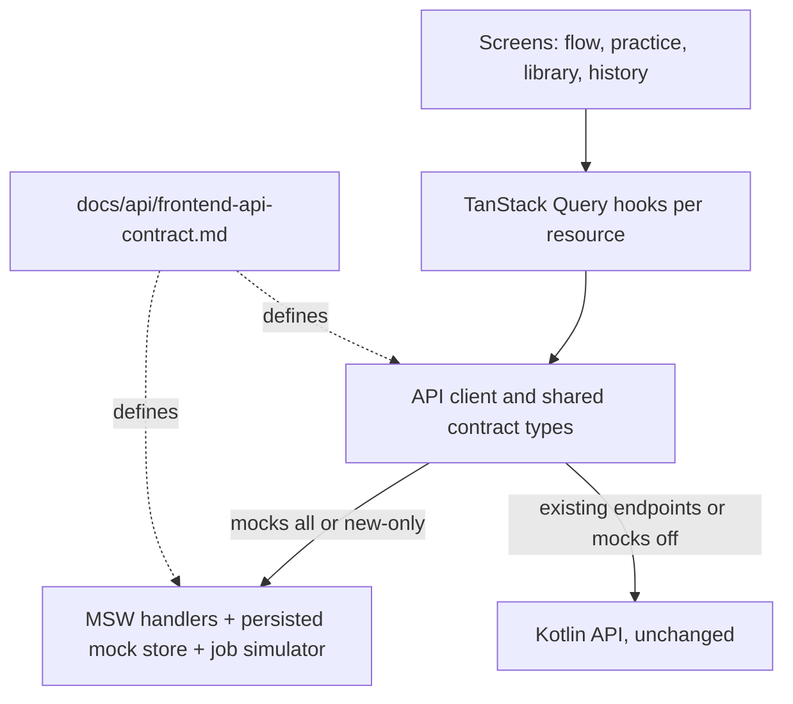
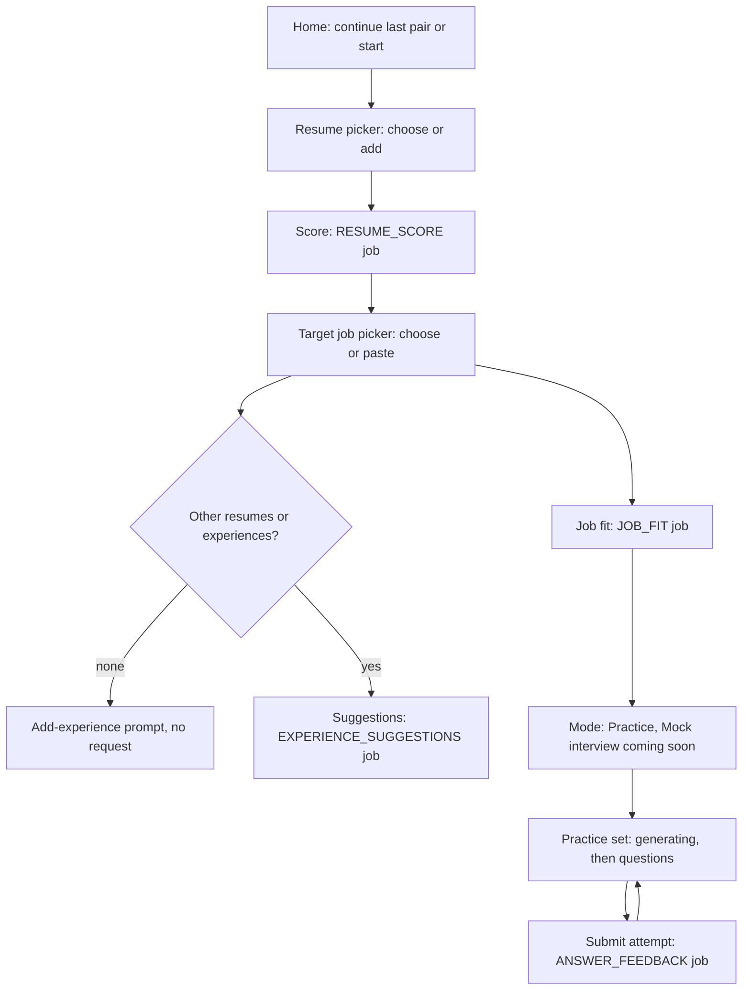
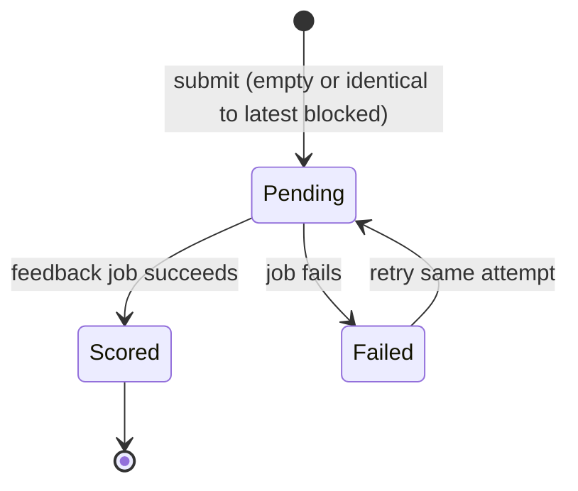

# Frontend and UX Rewrite - Plan

## Goal Capsule

- **Objective:** A candidate can score a resume, save named resumes and target jobs, see job fit with suggestions from their past experience, and practice interview answers that are kept and compared over time, in a redesigned web app whose results survive reloads; and the backend team has an exact API contract to build against.
- **Means:** Rebuild `apps/web` on Next.js 16, React 19, TanStack Query, Tailwind CSS and shadcn/ui (KTD1–KTD3), develop it against mocks generated from a written API contract (KTD5), and leave the backend untouched (KTD4).
- **Authority:** This plan's Product Contract, then the origin brainstorm (see origin: `docs/brainstorms/2026-09-28-frontend-ux-rewrite-brainstorm.md`), then the API contract doc for request and response shapes, then current source code.
- **Execution profile:** Contract and platform first, then mocks, then screens. Branch `feat/frontend-rewrite`.
- **Stop conditions:**
  - Do not change anything under `src/`, `build.gradle.kts` or backend migrations; record needed backend behavior in the API contract instead.
  - Do not ship a screen that shows fabricated AI results outside mock mode.
  - Stop and ask if a unit needs sign-in, voice or hosting work.
- **Finishing:** `ce-work` executes units; shipping follows the repo's normal review and PR flow.

---

## Product Contract

### Summary

Replace the single-page app with a guided flow (resume → score → target job → job fit and suggestions → mode → practice) plus a library of named resumes, target jobs, experiences and history. The frontend is built entirely against a new API contract document and a mock layer generated from it, because most endpoints the new UX needs do not exist yet. Backend work, voice, sign-in and deployment are separate plans.

### Problem Frame

The current UI is one 512-line client page. Completed results vanish on reload, there is one implicit "current" resume, and failures are papered over with keyword-generated fake scores (`apps/web/lib/mockAssessment.ts`). The brainstorm redefined the product around a saved library and a stepwise journey. Today's backend supports only resume upload, one combined score-plus-questions job, answer feedback by question text, and job polling, so the new screens need an agreed contract and a way to run before the backend exists.

### Requirements

**Library**
- R1. Users save resumes as a flat list of named items, by file upload or pasted text, and choose which one to use.
- R2. Users save pasted job descriptions as named, reusable target jobs; saved job text is not editable, only renamed.
- R3. Users can add past experience through an optional project form (title and description required) or pasted LinkedIn Experience text that the AI splits into saved items shown for review, where each item can be removed and items already saved are skipped with a note.
- R4. Adding a resume or job description whose text is already saved resolves to the existing item with an "Already saved as <name>" notice, a link to it and a rename action for it.
- R5. Users can rename and delete resumes, target jobs and experiences. Deleting removes everything derived from the item (scores, fit results, suggestions, practice sets and attempts), and the confirmation lists what will be removed.

**Scoring and job fit**
- R6. The general score uses the resume and an optional job title only (never a job description or seniority) and shows an overall score, sub-scores, ranked fixes and copyable rewrites of weak bullets.
- R7. Rewrites never invent facts; missing numbers or scope appear as placeholders such as `[X%]`.
- R8. Changing a resume's job title marks its general score stale and offers a re-score; unchanged input is not re-scored automatically.
- R9. With a resume and a target job selected, job fit shows a 0–100 fit score, matched and missing requirements, and job-specific feedback, saved per resume–job pair.
- R10. Past-experience suggestions draw on the user's other ready resumes and experiences and show the match, why it fits and guidance on presenting it, with no generated bullets, naming their source.
- R11. When there are no other sources, no request runs and the user is invited to add a project or paste LinkedIn text; when nothing matches, the user sees an honest "no strong matches" state.
- R12. Suggestions offer "Refresh" when sources were added or removed since they were made.

**Practice**
- R13. Before questions are generated the user chooses a mode; Practice (chat) is available and Mock interview (voice) is shown as coming soon.
- R14. Practice requires a target job. Each resume–job pair has one practice set, generated once and resumed on return.
- R15. The AI decides the question mix and count (3–8) from the job description; each question shows a "why this question" tag.
- R16. Users can add their own questions (10–500 characters, up to 10 per set), tagged "Added by you".
- R17. Every submitted answer is saved as a numbered attempt with its feedback and the score change from the previous scored attempt; a failed scoring keeps the attempt text for retry; empty text or text identical to the latest attempt cannot be submitted; answers are limited to 4,000 characters, shown to the user.
- R18. Several questions can have answers scoring at once, and unsent drafts are kept per question in the browser.

**History and experience**
- R19. History lists resumes with their latest general score, target jobs with fit scores, and practice sets with per-question score changes, with small trends that appear once there are two points; rows link into that pair's flow or practice set.
- R20. Every AI step shows progress, an honest error with retry that keeps the user's input, and, for non-retryable failures, what to change.
- R21. Results, selections and in-progress work are restored from the API after reload or in a new tab; links to deleted items show a "this was deleted" page.
- R22. The UI is English only, desktop first while still fitting a phone, and uses a new calm, professional visual design with keyboard and screen-reader support.

**Platform**
- R23. The backend is not changed. Every endpoint, shape, error code, job type and delete behavior the frontend relies on is documented in one API contract, marked existing, changed or new.
- R24. The frontend runs fully against mocks generated from the contract, and can point at the real backend for endpoints the contract marks existing and compatible.

### Key Decisions

- **General score plus job fit.** (session-settled: user-approved — chosen over fit-only or general-only scoring: users get value before adding a job.) Governs R6, R9.
- **Flat list of named resumes and named reusable target jobs.** (session-settled: user-directed — chosen over nested resume versions and pasting the job each time: users name and choose.) Governs R1, R2.
- **No seniority; optional job title.** (session-settled: user-directed — chosen over a seniority input: the AI infers level.) Governs R6.
- **Fixes plus copyable rewrites; suggestions give guidance, not bullets, and are for resume tailoring only.** (session-settled: user-directed — chosen over comments-only feedback and generated bullets for past items: generated bullets risk invented details.) Governs R6, R7, R10.
- **Practice is a chat drill with versioned answers, AI-chosen questions, a why-this-question tag and user-added questions.** (session-settled: user-directed — chosen over a text mock interview, fixed categories, "generate more" and "compare attempts".) Governs R14–R17.
- **Optional project form and pasted LinkedIn text as extra experience.** (session-settled: user-directed — chosen over resume uploads only.) Governs R3.
- **Guided flow plus library, lists with small trends, desktop first, calm and professional, English only.** (session-settled: user-approved — chosen over a dashboard or chat thread, a progress dashboard, mobile first, and other styles or languages.) Governs R19, R22.
- **Delete resumes, target jobs and experiences with their derived data, including practice history.** (session-settled: user-approved — chosen over deleting practice history or accounts separately.) Governs R5.
- **Duplicate content resolves to the existing item.** (session-settled: user-approved — chosen over saving a second named copy: avoids scores attaching to the wrong item.) Governs R4.
- **One practice set per resume–job pair, no regeneration yet; practice needs a target job.** (session-settled: user-approved — chosen over a new set per visit.) Governs R14.
- **Honest errors replace fabricated fallback results.** (session-settled: user-approved — chosen over keyword-based "local draft" results.) Governs R20.
- **Paste text remains a way to add a resume.** (session-settled: user-approved — chosen over upload-only.) Governs R1.
- **No sign-in; private/dev use with the single local user.** (session-settled: user-directed — chosen over adding auth now or a public per-browser guest ID.)
- **Voice gets its own plan.** (session-settled: user-approved — chosen over including it here.) Governs R13.
- **Frontend only; backend needs go into an API contract doc.** (session-settled: user-directed — chosen over changing the backend in this plan.) Governs R23.
- **Build against mocks generated from the contract.** (session-settled: user-directed — chosen over building only the screens today's backend supports.) Governs R24.

### Scope Boundaries

- No backend code, schema or configuration changes.
- Sign-in, the visitor trial and public launch belong to a later auth phase.
- Deployment and hosting changes (AWS, Supabase provisioning, Vercel) are not part of this plan.
- Out of this phase per the brainstorm: in-app resume editor and export, job URL import, generated bullets for past items, "generate more questions", side-by-side attempt comparison, deleting practice history on its own, account deletion, Chinese UI, mobile-first design, a progress dashboard.

#### Deferred to Follow-Up Work

- Backend plan implementing the API contract: data model, library endpoints, per-step AI jobs, multi-document retrieval, practice attempts, history, CORS and error-mapping fixes.
- Voice mock interview plan.
- Auth-phase plan: provider choice (Supabase Auth or Cognito), trial with job title and seniority, per-user limits.
- Update the AWS deployment plan's database and auth sections, and mark `docs/plans/2026-09-28-1159-feat-target-stack-architecture-plan.md` superseded.

### Success Criteria

- In mock mode a tester can complete resume → score → target job → fit and suggestions → practice with two attempts, reload at any step, and see the same results.
- A backend developer can implement every new endpoint from the contract doc alone, without reading frontend code.

### Sources

- Origin brainstorm: `docs/brainstorms/2026-09-28-frontend-ux-rewrite-brainstorm.md`.
- Original design notes: `docs/project-design.md` (domain model, scoring design, future API sketch).
- Current API surface: controllers under `src/main/kotlin/dev/jiaming/ai_interview/` (`resume/ResumeController.kt`, `jobs/AnalysisController.kt`, `interview/InterviewController.kt`, `jobs/JobController.kt`) and error contract `common/ApiExceptionHandler.kt`.

---

## Planning Contract

### Key Technical Decisions

- KTD1. **Upgrade to Next.js 16 and React 19 inside this rewrite.** Adopt Next 16 (Turbopack default, `middleware` renamed `proxy`, `next lint` removed, async request APIs) and React 19 with matching `@types`. Remove the custom `distDir` (`NEXT_DIST_DIR`). (session-settled: user-directed — chosen over staying on Next 15.5 and React 18: the rewrite replaces nearly all UI code anyway.)
- KTD2. **TanStack Query owns server state.** Every API read is a query keyed by resource ID; mutations invalidate affected lists; job polling uses `refetchInterval` that stops when the job is terminal or after about 10 minutes, then offers "Check again". No other global store. (session-settled: user-approved — chosen over SWR and hand-written polling: stronger invalidation and self-stopping polling.)
- KTD3. **New visual design on Tailwind CSS and shadcn/ui.** Radix-based components give accessible dialogs, tabs, sheets and toasts; design tokens (neutral scale, one accent, spacing up to 64px, type scale, one light theme; dark mode deferred) live in the Tailwind theme. The old `apps/web/app/globals.css` is replaced. (session-settled: user-directed — chosen over extending the existing CSS tokens: the user asked for a redesign.)
- KTD4. **The backend is read-only for this plan.** The contract doc (`docs/api/frontend-api-contract.md`) records every endpoint the UI needs, marked `existing`, `changed` or `new`, plus backend obligations the UI assumes: owner-scoped lookups returning 404 for other users' IDs, the existing AI rate limit on every AI job submission including retries, resource-ID job fingerprints so repeated attempts are never swallowed, cascade-delete behavior, and duplicate resolution. Implements R23.
- KTD5. **Mocks come from the contract through Mock Service Worker.** `apps/web/mocks/` holds MSW handlers backed by a mock store and a job simulator. In the browser the store persists to localStorage under a versioned key so data survives reloads and is shared across tabs; tests keep it in memory. The simulator derives each job's status and stage from its stored creation time and configured delays (no timers), so a job in progress keeps advancing after a reload; a programmatic switch forces the next job of a type to fail. `NEXT_PUBLIC_API_MOCKS` selects `all` (default in dev), `new-only` (endpoints marked `new` or `changed` are mocked; `existing` ones pass through to the backend) or `off`. In `new-only`, the job-poll handler answers for job IDs the mock store created and passes other IDs to the backend. The backend plan changes an endpoint's status to `existing` when it ships it, so passthrough follows the contract. Vitest uses the same handlers through `msw/node`. Production builds default to `off`. Implements R24.
- KTD6. **Shared TypeScript types mirror the contract.** `apps/web/lib/api/types.ts` defines every request, response, job type, stage and error code named in the contract; the API client and mocks both use it, so drift between screens and mocks is a type error.
- KTD7. **The API is the source of truth.** URLs carry the selected resume, target job and practice set IDs; every item read includes its active job (ID, status, stage). Browser storage holds only conveniences: last-used pair and unsent answer drafts. This replaces the per-job-type localStorage keys in `apps/web/lib/jobWorkflow.ts`.
- KTD8. **Honest failures.** `apps/web/lib/mockAssessment.ts` and the starter resume are deleted after moving the real result types into `apps/web/lib/api/types.ts`. Every AI step renders progress, retrying ("attempt 2 of 3"), failed-with-retry, or a non-retryable message from the error-code map; copy names no vendors.
- KTD9. **One API client and base URL.** `apps/web/lib/api/config.ts` reads `NEXT_PUBLIC_API_BASE_URL` (default `http://127.0.0.1:8080`); `client.ts` wraps fetch with timeout, `no-store`, an idempotency key per user action (the client's automatic retries reuse it; a user pressing Retry after a failed request or job sends a new one), and one `ApiError` type with retryable status for network errors, 408, 429 and 5xx.

### High-Level Technical Design

**Architecture**

**Journey**

**Attempt states**

**Routes**

| Route | Purpose |
|---|---|
| `/` | Home: "Continue <resume> × <job>" when the stored pair still exists, otherwise Start |
| `/flow` | Resume picker |
| `/flow/[resumeId]` | Score |
| `/flow/[resumeId]/jobs` | Target job picker |
| `/flow/[resumeId]/jobs/[jobId]` | Job fit, suggestions, mode |
| `/practice/[setId]` | Practice |
| `/library/resumes`, `/library/jobs`, `/library/experiences` | Library |
| `/history` | History |

The stepper shows all six steps; steps whose prerequisite ID is missing are disabled. Steps 4 (fit and suggestions) and 5 (mode) share one page, ordered fit card, suggestions, mode chooser; the stepper marks step 5 current once fit has succeeded.

### Sequencing

U1 (contract) and U2 (platform) can run in parallel because U2 only defines platform types; U3 writes the contract-derived types and mocks, so it needs both; screen units U4–U7 build on U3.

### Risks & Dependencies

| Risk | Mitigation |
|---|---|
| Mocks drift from what the backend later builds | Contract doc is the single authority; shared types (KTD6); the backend plan implements the doc and the `new-only` mock mode exercises real endpoints as they land |
| Next 16 and React 19 break testing-library or shadcn assumptions | U2 lands the platform with a smoke page and passing checks before any screen work |
| The app only works end to end in mock mode until the backend plan ships | Accepted; Success Criteria are measured in mock mode |
| Mock data leaks into a real build | Production defaults to `off`; the MSW worker is only registered when mocks are enabled |

### System-Wide Impact

- **API contract:** the doc becomes the interface agreement between this frontend and the next backend plan; old endpoints the new UI no longer uses are marked for removal there, not removed here.
- **Build and CI:** Next 16 drops `next lint`; `.github/workflows/publish-images.yml` keeps running the ESLint CLI, and the web Dockerfile stops using `.next-build`.

---

## Implementation Units

### U1. API contract document

- **Goal:** Write the contract the new UI and its mocks follow, and that the backend plan will implement.
- **Requirements:** R23; KTD4, KTD6.
- **Dependencies:** none.
- **Files:**
  - `docs/api/frontend-api-contract.md` (new)
- **Approach:**
  1. For each endpoint, give method, path, status (`existing`, `changed`, `new`), request, response, error codes and the UI screen that uses it. Cover resumes (upload with name and optional job title, paste, list with active job, detail, rename, delete, delete-impact preview, score), target jobs, experiences (form, LinkedIn split), job fit, suggestions (including the empty-sources and stale flags), practice sets (a `POST` that always returns a set ID immediately, with its active job and an empty question list while generating), user questions, attempts and retry, history, and job polling.
  2. List job types and stages: `RESUME_EXTRACTION` (existing, stages READING_FILE, EXTRACTING_TEXT, NORMALIZING_TEXT, CHUNKING_TEXT; pasted-text resumes skip it), then the new `RESUME_SCORE`, `JOB_FIT`, `EXPERIENCE_SUGGESTIONS`, `PRACTICE_QUESTIONS`, `EXPERIENCE_SPLIT` and changed `ANSWER_FEEDBACK`, with the result shape of each. Mark `GET /api/jobs/{id}` as `changed` because it gains the new job types.
  3. State the backend obligations from KTD4 and the product rules the backend enforces: duplicate resolution (R4), cascade delete (R5), no JD or seniority in the general score (R6), placeholder rewrites (R7), question count and user-question limits (R15, R16), attempt rules (R17).
  4. Mark today's endpoints the new UI stops using (`/api/analyses`, `/api/assessments`, `/api/interview/questions`, `/api/interview/feedback`, `/api/resumes/current`) as removable by the backend plan.
- **Patterns to follow:** current error contract `{code, message}` in `src/main/kotlin/dev/jiaming/ai_interview/common/ApiErrorResponse.kt`; job polling shape in `src/main/kotlin/dev/jiaming/ai_interview/jobs/JobStatusResponse.kt`.
- **Test scenarios:** Test expectation: none -- documentation; U3's mock tests and U2's shared types enforce it.
- **Verification:** Every endpoint called by U4–U7 appears in the doc with its status; a reviewer can trace each screen state to a documented response.

### U2. Frontend platform upgrade

- **Goal:** Move `apps/web` to Next 16, React 19, Tailwind CSS, shadcn/ui and TanStack Query with the shared client and types, before screen work.
- **Requirements:** R20–R22; KTD1–KTD3, KTD6–KTD9.
- **Dependencies:** none.
- **Files:**
  - `apps/web/package.json`, `apps/web/next.config.mjs`, `apps/web/tsconfig.json`
  - `apps/web/eslint.config.mjs` (replaces `.eslintrc.json`)
  - `apps/web/postcss.config.mjs`, `apps/web/components.json` (new)
  - `apps/web/app/globals.css` (replaced by Tailwind entry and theme tokens)
  - `apps/web/lib/api/config.ts`, `apps/web/lib/api/client.ts`, `apps/web/lib/api/types.ts` (new)
  - `apps/web/lib/query/queryClient.ts`, `apps/web/lib/query/useJob.ts` (new)
  - `apps/web/lib/errorMessages.ts`
  - `apps/web/tests/setup.ts`, `apps/web/tests/apiClient.test.ts`, `apps/web/tests/useJob.test.tsx`
  - `apps/web/Dockerfile`
- **Approach:**
  1. Upgrade Next, React, types and eslint-config-next together; run the Next 16 codemod; drop `NEXT_DIST_DIR`.
  2. Add Tailwind and shadcn/ui; define tokens and one light theme.
  3. Build `client.ts` per KTD9 and `useJob` per KTD2; `types.ts` starts with platform types only (ApiError, the job status envelope, result types moved out of `mockAssessment.ts`); strip vendor names from error copy.
  4. Test setup mocks `next/navigation` and stubs `matchMedia` and clipboard.
- **Execution note:** Land with a temporary smoke page and green lint, typecheck, test and build before screen units start.
- **Patterns to follow:** error parsing in `apps/web/lib/api/jobs.ts` and the `friendlyError` code map.
- **Test scenarios:**
  - A fetch TypeError maps to a retryable network error.
  - A 429 response is retryable; a 400 with a code is not and keeps the code.
  - `useJob` stops polling on SUCCEEDED and after its time ceiling, then exposes "Check again".
  - Automatic retries of one request send the same idempotency key; a user-initiated Retry after a FAILED job sends a new one.
- **Verification:** `npm run lint`, `typecheck`, `test` and `build` pass on Node 22.

### U3. Mock API layer

- **Goal:** Run every contract endpoint in the browser and in tests without the backend.
- **Requirements:** R24; KTD5, KTD6.
- **Dependencies:** U1, U2.
- **Files:**
  - `apps/web/lib/api/types.ts` (contract-derived request, response, job-type and error-code types)
  - `apps/web/mocks/handlers.ts`, `apps/web/mocks/store.ts`, `apps/web/mocks/jobSimulator.ts`, `apps/web/mocks/fixtures.ts` (new)
  - `apps/web/mocks/browser.ts`, `apps/web/mocks/server.ts` (new)
  - `apps/web/app/MockProvider.tsx` (new)
  - `apps/web/public/mockServiceWorker.js` (generated)
  - `apps/web/tests/mocks.test.ts` (new)
- **Approach:**
  1. Write the contract-derived types (KTD6). The store holds resumes, target jobs, experiences, scores, fit results, suggestions, practice sets and attempts, and applies the contract's duplicate, cascade-delete and validation rules.
  2. The store and simulator follow KTD5: persisted in the browser, stage derived from timestamps, and a programmatic failure switch (retryable or not) for tests and the browser console.
  3. `MockProvider` starts the worker only when `NEXT_PUBLIC_API_MOCKS` is `all` or `new-only`, and renders children only after the worker has started. All API reads happen in client components, with no server-side fetch or prefetch, so every request goes through the worker.
  4. Fixtures are clearly fake sample content; mock mode shows a small "Mock data" badge in the header.
- **Patterns to follow:** contract types from `apps/web/lib/api/types.ts`.
- **Test scenarios:**
  - Uploading a resume with text matching a saved one returns the saved item as a duplicate.
  - Deleting a resume removes its scores, fit results, suggestions and practice sets, and the delete preview reports matching counts.
  - A practice-set `POST` returns a set ID immediately and the set gains 3–8 questions when its job succeeds.
  - Submitting text identical to the latest attempt is rejected with the contract's error code.
  - A forced failure produces a FAILED job with the documented error shape.
  - A resume, its score and a pending job survive re-creating the store from storage, and the pending job reaches SUCCEEDED once its delay has passed.
- **Verification:** Mock tests pass; the dev app runs with the backend stopped.

### U4. App shell, design system and library screens

- **Goal:** Build the shell and the screens to add, rename and delete resumes, target jobs and experiences.
- **Requirements:** R1–R5, R21, R22.
- **Dependencies:** U3.
- **Files:**
  - `apps/web/app/layout.tsx`, `apps/web/app/page.tsx`, `apps/web/app/not-found.tsx`
  - `apps/web/app/library/resumes/page.tsx`, `apps/web/app/library/jobs/page.tsx`, `apps/web/app/library/experiences/page.tsx`
  - `apps/web/components/shell/` (side menu, mobile sheet, header, skip link)
  - `apps/web/components/library/` (upload dialog, paste dialog, item row, delete confirm, project form, LinkedIn paste and review list, list states)
  - `apps/web/lib/query/library.ts`
  - `apps/web/tests/library.test.tsx`, `apps/web/tests/shell.test.tsx`
- **Approach:**
  1. Side menu: Home, Resumes, Target jobs, Experiences, History; below the tablet breakpoint it collapses into a sheet opened from a header button.
  2. Home validates the stored last-used pair against the library lists and shows Continue only when both exist.
  3. Lists share states: skeleton rows, an empty state with the primary add action, an inline error with retry.
  4. Upload and paste dialogs require a name (defaulted from file name or first line). Pasted text and job saves show duplicate notices inside the dialog. An upload shows a processing row; if it resolves as a duplicate, the row becomes a persistent, dismissible notice per R4 whose link scrolls to and highlights the existing row. Rename is one shared inline-edit control used by rows and the duplicate notice. Rows expand to show the extracted text read-only; the job title is edited on the score step.
  5. Processing items show progress, cannot be deleted (reason shown) and cannot be chosen in the flow until ready; failed uploads show their reason and a delete action.
  6. The job paste dialog has a live counter with an inline error over 20,000 characters.
  7. Delete confirm lists the counts from the delete-impact preview; links to a deleted item from the flow or practice pages show the shared deleted state.
  8. The LinkedIn review list shows saved items with Remove and skipped duplicates with a note; a split that finds nothing says so and keeps the pasted text. The project form limits the title to 120 characters and the description to 2,000, with inline counters.
  9. Deleted or unknown IDs render a shared "This item was deleted" state with links to the library and Home.
- **Patterns to follow:** shadcn Dialog, Sheet, Toast and DropdownMenu; U2 query hooks.
- **Test scenarios:**
  - Uploading with an empty name is blocked with an inline message.
  - An upload that resolves as a duplicate turns its row into the "Already saved as Backend" notice with a link and Rename.
  - Delete confirm shows counts from the preview and removes the row; opening a flow link for the deleted resume shows the deleted state.
  - Home hides Continue when the stored resume no longer exists.
  - Keyboard users reach main content through the skip link; the mobile sheet opens and traps focus.
- **Verification:** Tests pass; library screens work in mock mode.

### U5. Guided flow screens

- **Goal:** Build the resume picker, score, target job picker, fit and suggestions, and mode steps.
- **Requirements:** R6–R14, R20, R21.
- **Dependencies:** U4.
- **Files:**
  - `apps/web/app/flow/page.tsx`, `apps/web/app/flow/[resumeId]/page.tsx`, `apps/web/app/flow/[resumeId]/jobs/page.tsx`, `apps/web/app/flow/[resumeId]/jobs/[jobId]/page.tsx`
  - `apps/web/components/flow/` (stepper, score card, fixes list, rewrite with copy, fit card, suggestion list, mode chooser)
  - `apps/web/lib/query/scoring.ts`, `apps/web/lib/query/practice.ts`
  - `apps/web/tests/flow.test.tsx`
- **Approach:**
  1. The stepper follows the route table; below the tablet breakpoint it collapses to "Step N of 6".
  2. Each step reads saved results first and starts a job only when none exists or the user re-scores.
  3. Score card leads with the overall score, then sub-scores, then ranked fixes, then rewrites (original, rewrite with placeholders, Copy with a select-text fallback); a changed job title shows the stale badge and Re-score (R8).
  4. Fit card leads with the fit score, then missing requirements, then matched ones, then feedback.
  5. Fit and suggestions load in parallel; suggestions show empty, no-match, stale-with-Refresh and failed states.
  6. Each step has one primary advance action ("Continue to target job" on Score, "Practice this job" on Mode); the mode chooser shows Mock interview as coming soon, and Practice is enabled once fit has succeeded. Choosing Practice creates or opens the pair's set and navigates to it.
   The add-experience prompt opens the project form and LinkedIn dialogs in place and refreshes suggestions when an item is saved.
  7. Job status changes are announced in a polite live region; focus moves to the step heading after navigation.
- **Patterns to follow:** U4 list states and components.
- **Test scenarios:**
  - The resume picker disables resumes that are still processing.
  - Reloading the score step shows the saved score without starting a job.
  - A failed score shows an error with retry and keeps the job title input.
  - With no other sources, suggestions show the add-experience prompt and no request is sent.
  - A stale suggestions response shows Refresh.
  - Choosing Practice navigates to the pair's practice set.
- **Verification:** Tests pass; the flow works end to end in mock mode.

### U6. Practice screen

- **Goal:** Build question navigation, answering, attempts with deltas and user-added questions.
- **Requirements:** R14–R18, R20.
- **Dependencies:** U5.
- **Files:**
  - `apps/web/app/practice/[setId]/page.tsx`
  - `apps/web/components/practice/` (question tabs, why tag, answer editor with counter, attempt list, feedback view, add-question dialog, generating state)
  - `apps/web/lib/drafts.ts`
  - `apps/web/tests/practice.test.tsx`
- **Approach:**
  1. While the set is generating, show progress; if generation fails, show retry.
  2. Questions render as a vertical ARIA tab list (number, short title, latest score) in a left column on desktop and a horizontally scrolling strip of numbers and scores on narrow screens. For the selected question the page shows, in order: question text with its why tag or "Added by you", the answer editor, the latest attempt's score, delta and feedback (fields per the contract's ANSWER_FEEDBACK result), then earlier attempts collapsed to score and delta.
  3. The editor shows the 4,000-character counter, turns to an error state over the limit, and disables Submit when the draft is empty, over the limit or identical to the latest attempt of any status; drafts persist per question and are cleared when an attempt is created.
  4. Submitting creates an attempt and polls its job. Different questions can score at once; one question has at most one pending attempt, with Submit disabled and "Scoring in progress" shown. A failed attempt is retried through its own Retry action.
  5. The attempt list shows number, score, change from previous and feedback; failed attempts offer retry.
  6. Add question is disabled with an explanation once the set has 10 user questions.
- **Patterns to follow:** U5 progress, error and live-region handling.
- **Test scenarios:**
  - A generating set shows progress, then questions with why tags.
  - Submitting shows the attempt as pending, then scored with its delta.
  - Submit is disabled for an unchanged draft.
  - A draft survives navigating away and back.
  - Adding a question shows it with "Added by you"; the eleventh is blocked.
  - A failed attempt keeps its text and retry scores it.
- **Verification:** Tests pass; two attempts on one question show the score change in mock mode.

### U7. History screen and old UI removal

- **Goal:** Add History and delete the old UI, fake fallbacks and obsolete tests.
- **Requirements:** R19, R20.
- **Dependencies:** U6.
- **Files:**
  - `apps/web/app/history/page.tsx`
  - `apps/web/components/history/` (lists, sparkline)
  - Removed: `apps/web/components/ResumeInputPanel.tsx`, `AssessmentPanel.tsx`, `InterviewPracticePanel.tsx`, `apps/web/lib/mockAssessment.ts`, `apps/web/lib/seniority.ts`, `apps/web/lib/useScrollSpy.ts`, `apps/web/lib/workflows/`, `apps/web/lib/jobWorkflow.ts`, `apps/web/lib/useJobPolling.ts`, `apps/web/lib/evidence.ts`, `apps/web/lib/api/ai.ts`
  - Removed or rewritten tests under `apps/web/tests/` that target removed code
  - `apps/web/tests/history.test.tsx`
- **Approach:** Render the history lists with small inline SVG sparklines that appear from two points and carry a text alternative (for example "Score rose from 62 to 74 over 3 attempts"). Rows link to the pair's flow step or practice set. Delete old modules once nothing imports them.
- **Test scenarios:**
  - With one score, no sparkline renders and the single score shows.
  - With three attempts, the row shows a sparkline with its text alternative and the latest delta.
  - Empty history shows a first-run state linking to the flow.
  - A practice-set row navigates to that set.
- **Verification:** No import of removed modules remains; all frontend checks pass.

---

## Verification Contract

| Gate | Command | Applies to |
|---|---|---|
| Frontend lint | `npm run lint` in `apps/web` (ESLint CLI) | U2–U7 |
| Frontend types | `npm run typecheck` in `apps/web` | U2–U7 |
| Frontend tests | `npm test` in `apps/web` on Node 22 | U2–U7 |
| Frontend build | `npm run build` in `apps/web` | U2–U7 |
| Backend untouched | `git diff master -- src build.gradle.kts` shows no changes from this plan | all |
| End-to-end smoke | Manual run of the Success Criteria journey in mock mode, backend stopped | after U7 |

## Definition of Done

- Every unit's verification passes, and all gates above pass on the final branch.
- The Success Criteria journey works in mock mode, including reloads at each step.
- `docs/api/frontend-api-contract.md` covers every request the frontend makes, and the shared types match it.
- No screen shows fabricated results outside mock mode; no user-facing copy names vendors; no seniority input remains.
- Removed modules have no remaining references.
- Abandoned or experimental code from approaches that did not pan out is removed from the diff.
