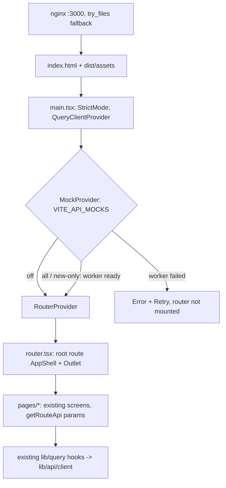

# Vite and TanStack Router Migration - Plan

## Goal Capsule

- **Objective:** Candidates get the same screens at the same URLs, and deep links, reloads and back/forward all work, from a web container that serves static files with no Node runtime. Developers keep mock mode and the same `npm` commands.
- **Means:** Replace Next.js 16 in `apps/web` with a React 19 Vite SPA, a code-based TanStack Router route tree, and nginx (KTD1, KTD5). TanStack Query, Tailwind, shadcn/ui and MSW stay as they are.
- **Authority:** This plan, then the Product Contract of `docs/plans/2026-09-28-2128-feat-frontend-ux-rewrite-plan.md` (unchanged), then `docs/api/frontend-api-contract.md`, then current code.
- **Execution profile:** Behavior-preserving swap, not a redesign. U1 and U2 land together because the build can't pass between them. U3 is proven by a container smoke test. Branch `feat/frontend-rewrite`. Commit at each green checkpoint: (1) this plan doc plus the pointer in the rewrite plan, (2) U1 + U2 once lint, typecheck, tests and build pass, (3) U3 once the image smoke passes.
- **Stop conditions:**
  - Do not change anything under `src/`, `build.gradle.kts` or Helm values/ports.
  - Do not change screen behavior, copy or styling beyond what the router swap forces.
  - Stop and ask if a screen turns out to depend on server rendering.
- **Finishing:** `ce-work` executes the units. Shipping follows the repo's normal review and PR flow.

---

## Product Contract

### Summary

Swap the web app's platform from Next.js to Vite with TanStack Router. Every screen, route, test and mock mode keeps working. The container changes from a Node standalone server to nginx serving `dist/` with history fallback.

### Problem Frame

All 41 UI modules are `"use client"`, and no page uses server rendering, server actions or middleware, so Next only adds a Node server, its build output and a routing layer. The rewrite plan (KTD1 there) already chose a Vite SPA with TanStack Router, but the screens (U4–U7 there) shipped on Next first. The Next-specific surface is small: `next/link`, `next/navigation` and `next/dynamic` in about 15 files, `next.config.mjs`, the ESLint preset, the test mock of `next/navigation`, and the Dockerfile.

### Requirements

**Behavior preservation**
- R1. Every current route renders the same screen on direct load, reload and back/forward: `/`, `/flow`, `/flow/$resumeId`, `/flow/$resumeId/jobs`, `/flow/$resumeId/jobs/$jobId`, `/practice/$setId`, `/library/resumes`, `/library/jobs`, `/library/experiences`, `/history`.
- R2. A known route with a deleted ID keeps its per-page "This item was deleted" state. An unmatched path renders the shared `DeletedState`, as `app/not-found.tsx` does today.
- R3. Mock modes `all`, `new-only` and `off` behave as today, and the worker is intercepting before the first API request. If the worker fails to start, the app shows an error with Retry instead of running unmocked.
- R4. The document title ("AI Interview"), description, `lang="en"`, skip link, toaster and scroll-to-top on navigation are kept.

**Platform**
- R5. Public config is `VITE_API_BASE_URL` (default `http://127.0.0.1:8080`) and `VITE_API_MOCKS`. Mocks default to `all` in dev and `off` in production builds.
- R6. The web image listens on port 3000 as a non-root user. It returns `index.html` for app routes, serves `/mockServiceWorker.js` as JavaScript, and returns a real 404 for missing assets.
- R7. The `dev`, `build`, `lint`, `typecheck` and `test` script names stay the same, so the CI steps in `.github/workflows/publish-images.yml` only change their build-arg name.

### Key Decisions

- **Migrate the platform only; the product behavior of the rewrite plan stays as-is.** (session-settled: user-directed — chosen over rewriting the big plan in place: a small focused plan keeps finished screen work separate from the migration.) Governs R1–R4.

### Scope Boundaries

- No backend, Helm value or port changes. No screen redesign and no new features.
- Not included: TanStack Start/SSR, file-based routing, router devtools, `@tailwindcss/vite`, route loaders (Query hooks keep owning data), and search-param validation.

---

## Planning Contract

### Target Stack

| Layer | Before (Next) | After | Where it's set up |
|---|---|---|---|
| UI library | React 19 | React 19 (unchanged) | `apps/web/main.tsx` (U1) |
| Build / dev server | Next 16 (Turbopack) | Vite + `@vitejs/plugin-react` | `apps/web/vite.config.ts`, `apps/web/index.html` (U1) |
| Routing | Next App Router (`app/**/page.tsx`) | TanStack Router, code-based | `apps/web/router.tsx`, `apps/web/pages/*` (U2), KTD1–KTD3 |
| Server state | TanStack Query | TanStack Query (unchanged) | `apps/web/lib/query/*` |
| Styling | Tailwind 4 + shadcn/ui | unchanged | `apps/web/app/globals.css`, `postcss.config.mjs` |
| Mocks | MSW via `next/dynamic` | MSW via plain `import()`, fail-closed | `apps/web/app/MockProvider.tsx` (U1) |
| Tests | Vitest + mocked `next/navigation` | Vitest + real route tree in memory history | `apps/web/tests/render.tsx` (U2), KTD7 |
| Container runtime | Node `server.js` (standalone) | nginx (`nginx-unprivileged:alpine`) on :3000 | `apps/web/Dockerfile`, `apps/web/nginx.conf` (U3), KTD5 |

### Key Technical Decisions

- KTD1. **Code-based TanStack Router tree in one file, `apps/web/router.tsx`.** It holds a root route (AppShell + `Outlet` + Toaster), one `createRoute` per R1 path, `notFoundComponent: DeletedState`, `scrollRestoration: true`, and the `Register` type declaration for typed `Link`/`navigate`. (session-settled: user-approved — chosen over file-based routing via `@tanstack/router-plugin`: about 10 routes don't need a Vite plugin and a generated `routeTree.gen.ts`.)
- KTD2. **Pages move out of the Next `app/` convention into `apps/web/pages/` with screen names** (`HomePage.tsx`, `ResumePickerPage.tsx`, `ScorePage.tsx`, `TargetJobPickerPage.tsx`, `FitPage.tsx`, `PracticePage.tsx`, `ResumesPage.tsx`, `TargetJobsPage.tsx`, `ExperiencesPage.tsx`, `HistoryPage.tsx`). Pages read params with `getRouteApi('<route id>').useParams()`. That keeps them typed without importing `router.tsx`, which would create an import cycle.
- KTD3. **Navigation maps one-to-one onto TanStack Router APIs.** `next/link` becomes `Link` with `to` plus `params`, which removes the `href as never` casts. `useRouter().push` becomes `useNavigate()`, and `usePathname` becomes `useLocation().pathname`. `asChild` Buttons wrapping `Link` keep working because TanStack `Link` renders an `<a>`.
- KTD4. **Vite reads the existing PostCSS/Tailwind config, and Vitest config moves into `vite.config.ts`.** The dev server is pinned to port 3000 with `strictPort`, because the backend's `@CrossOrigin` only allows `localhost:3000` and `127.0.0.1:3000` (for example `src/main/kotlin/dev/jiaming/ai_interview/resume/ResumeController.kt`), and the backend is read-only. `process.env.NEXT_PUBLIC_*` and `NODE_ENV` become `import.meta.env.VITE_*` and `import.meta.env.PROD`.
- KTD5. **nginx serves the SPA** from `nginxinc/nginx-unprivileged:alpine`, listening on 3000. `try_files $uri /index.html` applies to app routes only. Requests with a file extension use `try_files $uri =404`, and `/assets/` gets long-lived cache headers. (session-settled: user-approved — chosen over Node `serve -s`: its SPA fallback would answer a missing `.js` with `index.html`.)
- KTD6. **ESLint moves to `@eslint/js` + `typescript-eslint` + `eslint-plugin-react-hooks` + `eslint-plugin-jsx-a11y`,** which keeps the hooks and accessibility rules `eslint-config-next` supplied. `next` and `eslint-config-next` are removed.
- KTD7. **Tests render the real route tree in memory history.** A `renderRoute(path)` helper in `apps/web/tests/render.tsx` builds the router with `createMemoryHistory` inside a fresh QueryClient. It replaces the `vi.mock("next/navigation")` spies in `apps/web/tests/setup.ts`. Navigation assertions read `router.state.location.pathname` instead of `router.push` calls, which also exercises R1 and R2 routing.
- KTD8. **Remove Next-only leftovers during the swap:** all `"use client"` directives, the `useSyncExternalStore` server-snapshot workaround in the Home page (read `readLastPair()` directly), and `next/dynamic` in `app/MockProvider.tsx` (use a plain dynamic `import()` of `@/mocks/browser` inside an effect).

### High-Level Technical Design

### Risks & Dependencies

| Risk | Mitigation |
|---|---|
| Vitest 4 needs a matching Vite major | Choose the `vite` version inside Vitest 4's peer range at install time |
| Hidden reliance on Next behavior (scroll reset, StrictMode double effects) | `scrollRestoration: true` and `<StrictMode>` in `main.tsx`, as `reactStrictMode: true` did before. The existing test suites catch regressions |
| Dev server lands on a port the backend CORS rejects | `strictPort: 3000` (KTD4) |
| nginx fallback masks missing assets or the MSW worker | Extension-based `=404` rule plus the U3 smoke test |

### Sources & Research

- The local pattern is well established (TanStack Query, MSW and Vitest are already in use), so no external research was run. Reference docs: <https://tanstack.com/router/latest/docs/framework/react/guide/code-based-routing>, <https://vite.dev/guide/static-deploy>, <https://mswjs.io/docs/integrations/browser>.
- Next surface to replace: `rg "from ['\"]next" apps/web` (about 15 files), `apps/web/tests/setup.ts`, `apps/web/eslint.config.mjs`, `apps/web/next.config.mjs`, `apps/web/Dockerfile`.

---

## Implementation Units

### U1. Vite toolchain and entry point

- **Goal:** `apps/web` builds and runs on Vite with the same providers, config and mock startup.
- **Requirements:** R3–R5, R7; KTD4, KTD6, KTD8.
- **Dependencies:** none. Lands together with U2.
- **Files:**
  - `apps/web/package.json`, `apps/web/package-lock.json`
  - `apps/web/vite.config.ts`, `apps/web/index.html`, `apps/web/main.tsx`, `apps/web/vite-env.d.ts` (new)
  - `apps/web/tsconfig.json`, `apps/web/tsconfig.typecheck.json`, `apps/web/eslint.config.mjs`
  - `apps/web/lib/api/config.ts`, `apps/web/app/providers.tsx`, `apps/web/app/MockProvider.tsx`
  - Removed: `apps/web/next.config.mjs`, `apps/web/vitest.config.mts`, `apps/web/app/layout.tsx`, `apps/web/mocks/MockWorker.tsx`
  - `apps/web/.gitignore`, `.gitignore`, `.dockerignore`, `apps/web/.dockerignore` (`.next` → `dist`)
  - `apps/web/tests/config.test.ts`, `apps/web/tests/mockProvider.test.tsx` (new)
- **Approach:**
  1. Scripts: `dev` = `vite`, `build` = `vite build` (typecheck keeps its own script), and `preview` = `vite preview`. Remove `start`.
  2. `index.html` carries the title, description meta and `lang="en"` from `app/layout.tsx`, and imports `app/globals.css` through `main.tsx`.
  3. `main.tsx`: `StrictMode` → `Providers` (QueryClient + MockProvider) → `RouterProvider`. MockProvider gates the router mount per R3. When startup is rejected it renders a message with a Retry button that re-runs `startMockWorker`.
  4. `config.ts` exports a pure `parseMockMode(value, isProd)` so it can be tested. `API_MOCKS` calls it with `import.meta.env`.
  5. tsconfig drops the `next` plugin, `next-env.d.ts` and `.next` includes, and adds `vite/client` types. The `@/*` alias stays.
- **Patterns to follow:** current `app/providers.tsx` composition. `startMockWorker` in `apps/web/mocks/browser.ts`.
- **Test scenarios:**
  - `parseMockMode(undefined, true)` is `off`, `parseMockMode(undefined, false)` is `all`, and an explicit `new-only` wins in both.
  - A rejected worker start shows the error and Retry and does not render routed content. Retry with a resolving start renders the children.
  - With mode `off`, children render immediately and the worker module is never imported.
- **Verification:** `npm run dev` serves on 3000 with mocks intercepting the first request, and `npm run build` emits `dist/` (after U2).

### U2. Route tree, navigation swap and router test harness

- **Goal:** Every page is reachable through TanStack Router with typed navigation, and the test suite runs against the real route tree.
- **Requirements:** R1, R2, R4; KTD1–KTD3, KTD7, KTD8.
- **Dependencies:** U1.
- **Files:**
  - `apps/web/router.tsx` (new)
  - `apps/web/pages/*.tsx` (moved from `apps/web/app/**/page.tsx`; `apps/web/app/not-found.tsx` removed)
  - `apps/web/components/shell/AppShell.tsx`, `apps/web/components/flow/Stepper.tsx`, `apps/web/components/flow/ModeChooser.tsx`, `apps/web/components/library/DeletedState.tsx`
  - `apps/web/tests/setup.ts`, `apps/web/tests/render.tsx`
  - `apps/web/tests/flow.test.tsx`, `practice.test.tsx`, `library.test.tsx`, `history.test.tsx`, `shell.test.tsx`
  - `apps/web/tests/routes.test.tsx` (new)
- **Approach:**
  1. Build the route tree per KTD1. The root component is `AppShell` wrapping `Outlet`, plus `Toaster`.
  2. Move each page per KTD2, replace `useParams` with `getRouteApi`, and convert `Link`/`push`/`usePathname` per KTD3. Stepper's `href` strings become `{ to, params }` objects.
  3. Strip `"use client"` across `app/`, `components/`, `lib/` and `mocks/` (KTD8).
  4. Replace the `next/navigation` mock with `renderRoute(path)` (KTD7). Existing tests keep their assertions and change only how they render and navigate.
- **Patterns to follow:** existing `isNotFound` + `DeletedState` handling in the score and practice pages. `setupMockBackend` in `apps/web/tests/render.tsx`.
- **Test scenarios:**
  - `renderRoute('/flow/<id>')` for a saved resume shows its saved score and starts no job.
  - `renderRoute('/flow/<deletedId>')` and `renderRoute('/practice/<deletedId>')` show the deleted state for that item type.
  - `renderRoute('/no-such-page')` shows the shared `DeletedState` and sends no API request (MSW `onUnhandledRequest: "error"`).
  - Choosing Practice ends at `/practice/<setId>` in router state.
  - Picking a resume on `/flow` navigates to `/flow/<id>`, and `history.back()` returns to `/flow` with the picker shown.
  - Stepper renders links to `/flow/<resumeId>/jobs` when a resume ID is present, and disabled items when it is missing.
  - On `/library/jobs` the side menu marks "Target jobs" as current.
  - All existing flow, practice, library, history and shell scenarios still pass.
- **Verification:** `rg "from ['\"]next" apps/web --glob '!node_modules'` returns nothing. Lint, typecheck, tests and build pass.

### U3. Container, CI and docs

- **Goal:** The web image serves the built SPA on port 3000 and CI and docs name the new build inputs.
- **Requirements:** R5–R7; KTD5.
- **Dependencies:** U1, U2.
- **Files:**
  - `apps/web/Dockerfile`, `apps/web/nginx.conf` (new)
  - `.github/workflows/publish-images.yml` (build-arg `VITE_API_BASE_URL`)
  - `deploy/ai-interview/templates/NOTES.txt`, `README.md` (Next.js mentions and the build-arg example), `docs/api/frontend-api-contract.md` (`NEXT_PUBLIC_API_MOCKS` → `VITE_API_MOCKS`)
- **Approach:**
  1. Build stage: `node:22-alpine`, `npm ci`, `ARG VITE_API_BASE_URL`, `npm run build`.
  2. Runtime stage: `nginxinc/nginx-unprivileged:alpine`, copy `dist/` and `nginx.conf`, listen on 3000. The Helm `containerPort` and `/` probes in `deploy/ai-interview/templates/web-deployment.yaml` stay unchanged.
- **Execution note:** This is packaging. Prove it with the image smoke test below rather than unit tests.
- **Test scenarios:**
  - Direct GETs for `/`, `/flow/abc`, `/flow/abc/jobs/def` and `/practice/xyz` return 200 with the SPA `index.html`.
  - `/mockServiceWorker.js` returns 200 with a JavaScript content type.
  - `/assets/missing.js` returns 404, not `index.html`.
  - The container process runs as a non-root UID.
- **Verification:** The smoke passes against a locally built image, and the `publish-images.yml` test job passes.

---

## Verification Contract

| Gate | Command | Applies to |
|---|---|---|
| Lint | `npm run lint` in `apps/web` | U1–U2 |
| Types | `npm run typecheck` in `apps/web` | U1–U2 |
| Tests | `npm test` in `apps/web` on Node 22 | U1–U2 |
| Build | `npm run build` in `apps/web` | U1–U3 |
| No Next left | `rg "from ['\"]next\|NEXT_PUBLIC" apps/web README.md docs/api deploy .github --glob '!node_modules'` is empty | U2–U3 |
| Image smoke | `docker build apps/web`, run it, then curl the U3 scenarios | U3 |
| Backend untouched | `git diff master -- src build.gradle.kts` is empty | all |
| Manual journey | `npm run dev`, mock mode, backend stopped: resume → score → job → fit → practice with two attempts, reloading at each step and using browser back | after U3 |

## Definition of Done

- All gates pass on the final branch.
- Every R1 route works on direct load, reload and back/forward, both in dev and in the built image.
- No `next` dependency, import, config or `NEXT_PUBLIC_*` reference remains.
- The rewrite plan's U2 carries the one-line pointer to this plan.
- Leftover code from approaches that were tried and dropped is removed from the diff.
