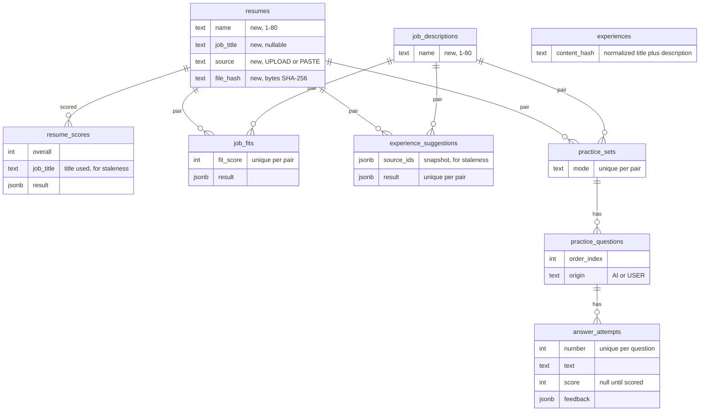
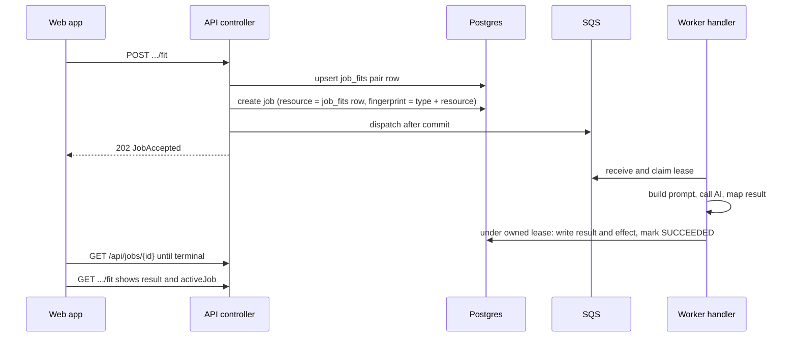
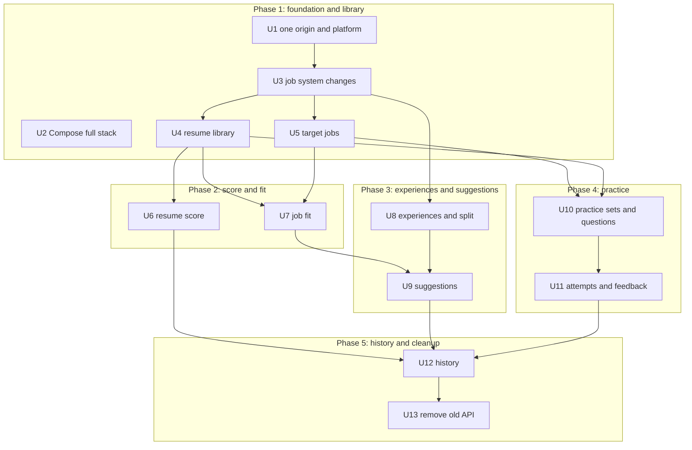

# Backend and Frontend Connection - Plan

## Goal Capsule

- **Objective:** A candidate using the web app gets real AI results that are saved and survive reloads and restarts: named resumes, target jobs, experiences, scores, job fit, suggestions, practice attempts and history all come from the Kotlin API, with no mock data. One command starts the whole stack locally.
- **Means:** Implement every endpoint in `docs/api/frontend-api-contract.md` on the existing Spring Boot job system and AI layer, in five phases that each ship on their own (Key Decisions; KTD3–KTD7), with one origin everywhere through `/api` (KTD10).
- **Authority:** This plan's Product Contract, then `docs/api/frontend-api-contract.md` for request and response shapes, then the rewrite plan's Product Contract (see origin: `docs/plans/2026-09-28-2128-feat-frontend-ux-rewrite-plan.md`), then `apps/web/mocks/store.ts` for edge behavior the contract leaves open, then current code.
- **Execution profile:** Five phases in order. Each phase ends with its endpoints marked `existing` in the contract and its screens working against the real API with mocks off. Commit per unit on branch `feat/backend-frontend-connection`.
- **Stop conditions:**
  - Do not add sign-in, per-user auth or EC2 production setup (TLS, real S3/SQS, secrets).
  - Do not touch the legacy `public.*` tables from `V1__foundation`.
  - Stop and ask if a contract shape has to change beyond the §11.3 clarification in KTD5.
- **Finishing:** `ce-work` executes the units. Shipping follows the repo's normal review and PR flow, after PR #9 (`feat/frontend-rewrite`) merges.

---

## Product Contract

### Summary

This plan implements every endpoint in the frontend API contract in five phases: library, score and fit, experiences and suggestions, practice, then history and cleanup. It extends the existing job system and AI layer rather than building new ones, keeps frontend changes to the connection itself, and adds the whole stack to Docker Compose.

### Problem Frame

The rewritten web app runs only on browser mocks. The contract lists 35 endpoints, and only `GET /api/status` exists today in the shape the UI needs. The backend still serves the old single-page flow: one implicit "current" resume, a combined analysis job, answer feedback keyed by question text, a seniority input, and job reuse based on request content. The web app now reaches the API through nginx on one origin, but the API still uses per-controller CORS and keys rate limits on the caller's IP, which is nginx's IP behind the proxy.

### Requirements

**Connection**
- R1. Every endpoint in contract §2 is served by the Kotlin API with the contract's request, response, status code and error code. Each is marked `existing` in the contract when it ships.
- R2. With mocks off, the web app completes the full journey (library → score → target job → fit and suggestions → practice with attempts → history) against the API, both under `npm run dev` and in the Compose stack.
- R3. The browser calls `/api` on the page's own origin in development, in the container and behind nginx.
- R4. One command starts Postgres, Redis, LocalStack, the API, the worker and the web app locally.

**Contract obligations** (contract §11)
- R5. Every lookup is scoped to the local user, and an ID owned by someone else returns the same 404 as a missing one (§11.1).
- R6. Every AI job submission, retries included, counts against the AI limit, and uploads count against the upload limit. Limits apply per real client even behind nginx (§11.2).
- R7. Job de-duplication keys on resource IDs. Re-scores and retries always start a new job (§11.3, as clarified in KTD5).
- R8. Deletes cascade as in §3.7, §4.6 and §5.7. Delete-impact counts match what the delete removes, stored files are removed, and polls for jobs of deleted resources return `JOB_NOT_FOUND` (§11.4).
- R9. Duplicates resolve to the existing item: resumes by file bytes then normalized text, target jobs by normalized text, experiences by normalized title plus description (§11.5).
- R10. The general score uses only resume text and the optional job title. Rewrites use placeholders instead of invented facts. Suggestions name their source and give guidance, not bullets. Practice sets get 3–8 AI questions, each with a rationale (§11.6, §11.7; rewrite R6, R7, R10, R15).
- R11. The limits and attempt rules in §11.8 and §11.9 are enforced, and validation errors name the field.
- R12. Every resource that owns jobs returns its latest job as `activeJob`, and each resume and target job pair has at most one practice set (§11.10, §11.11).
- R13. A score is stale when the resume's job title changed after it. Suggestions are stale when their source set changed after they ran (rewrite R8, R12).

**Cleanup**
- R14. The old endpoints, the `ANALYSIS` job type, the `ASSESSING_RESUME` stage, the seniority input and the tables only they used are removed (§12).

### Key Decisions

- **The whole contract, delivered in shippable phases.** (session-settled: user-directed — chosen over a first slice of library, score and fit, or a practice-first slice: one plan keeps the data model coherent while each phase still ships.) Governs R1, R2.
- **Old endpoints and their tables are removed in the last phase.** (session-settled: user-directed — chosen over keeping them, or removing code but keeping tables: nothing calls them since the old UI was deleted.) Governs R14.
- **One EC2 box, with nginx serving the app and proxying `/api`.** (session-settled: user-directed — chosen over S3 plus CloudFront for the frontend: a public API needs a front door anyway, and one origin removes CORS.) Governs R3, R6.
- **The full stack runs in Docker Compose; EC2 production setup stays out.** (session-settled: user-approved — chosen over backend code only or also planning EC2 production: one command gives a real end-to-end check and is the starting point for the EC2 box.) Governs R4.
- **No sign-in; the single local user stays.** Carried from the rewrite plan. Governs R5.

### Scope Boundaries

- No sign-in, sessions or per-user limits. Contract §1 keeps the single local user.
- No voice mode, pagination, or `mode` values other than `PRACTICE`.
- No changes to the legacy `public.*` tables or to `vector_store`.

#### Deferred to Follow-Up Work

- EC2 production plan: provisioning, TLS, real S3 and SQS instead of LocalStack, secrets, backups.
- Auth plan (Cognito was recommended for the one-EC2 setup): sign-in, owner IDs from tokens, per-user limits.
- Removing the legacy `public.*` tables, as drafted in `docs/legacy-schema-audit.sql`.

### Success Criteria

- With the Compose stack up and mocks off, a tester completes the rewrite plan's Success Criteria journey with real AI results, reloads at every step, restarts the containers, and still sees the same data.
- Every row in contract §2 reads `existing`, and the `new-only` mock mode is gone.

---

## Planning Contract

### Key Technical Decisions

- KTD1. **Tables: reuse `job_descriptions` for target jobs, add new tables for everything else.** (session-settled: user-approved — chosen over reusing the assessment and interview tables: they lack versioning, origins and pair keys.)
  - `resumes` gains `name`, `job_title`, `source` and `file_hash`.
  - `job_descriptions` gains `name` and keeps its table name.
  - New tables: `resume_scores`, `job_fits`, `experience_suggestions`, `experiences`, `practice_sets`, `practice_questions`, `answer_attempts`.
  - The pair tables cascade from both `resumes` and `job_descriptions`, following the migration conventions below.
  - `resume_assessments` and the three `interview_*` tables are dropped in U13.
- KTD2. **AI results are stored as jsonb in the contract's result shape**, plus the scalar columns history and deltas need (`overall`, `fit_score`, attempt `score`). The API returns the stored document, so a job's `result` equals what its resource returns (§8.1). Results convert to plain values the way `JobStatusResponse.from` does (`jsonValue`), so they serialize under Spring's Jackson 3 mapper.
- KTD3. **`activeJob` comes from the resource the job writes.**
  - Every new job row sets `resource_type` and `resource_id` to the row it will write: the resume, `job_fits`, `experience_suggestions`, the practice set or the attempt.
  - Fit and suggestions `POST` upsert their pair row first so the job has a resource ID.
  - `activeJob` is the newest job for that resource.
  - `EXPERIENCE_SPLIT` has no resource; its result lives only on the job.
- KTD4. **Statuses and staleness are derived when read, not stored.**
  - Attempt status is `SCORED` when feedback exists. Otherwise it's `FAILED` when its latest job failed, and `PENDING` in any other case.
  - Practice set status follows the same pattern using its AI questions and its latest job.
  - A score is stale when its `job_title` differs from the resume's current one.
  - Suggestions are stale only when a stored result exists and its source-ID snapshot differs from the current source IDs.
  - The suggestions view drops result items whose source is no longer a current source, so deleted resumes and experiences disappear from other pairs' suggestions without rewriting stored results.
  - Pair rows without a result (created by a `POST` whose job has not succeeded) count as neither fits nor suggestion sets in delete-impact; the delete still removes them.
  - This matches `apps/web/mocks/store.ts` and needs no terminal-failure handlers for the new job types.
- KTD5. **Jobs are keyed on their resource, and the recent-success reuse window is removed.** (session-settled: user-approved — chosen over keeping the 300-second reuse of recently finished jobs: Re-score and Retry must always run.)
  - The fingerprint is the job type plus the resource ID, so the existing active-fingerprint unique index allows one running job per resource.
  - A submit while one is running returns that job with `reused: true`. Contract §11.3 is amended to say so, alongside same-`Idempotency-Key` reuse.
  - The success branch of `BackgroundJobStore.findReusable` and `JOB_REUSE_WINDOW_SECONDS` are deleted.
  - `EXPERIENCE_SPLIT` jobs have no resource and get a null fingerprint, which the partial unique index skips, so every split runs.
  - Every AI job submission calls `assertAiAllowed` with one shared action name, so all AI endpoints draw from the single budget in contract §1.
  - Each `POST` endpoint wraps its whole operation (resource creation plus any job submission) in `withIdempotentRetryCache` under its own action name, caching the HTTP status with the body, so a client retry with the same `Idempotency-Key` gets the first response instead of a duplicate or a `409`.
- KTD6. **New job types follow the existing handler pattern.** For each type:
  - Add `JobType` and `JobStage` entries.
  - Add a payload data class with `payloadVersion`, a `@Component` `JobHandler`, and a branch in `JobPayloadDecoder`.
  - Save a checkpoint, then write the result through `JobExecutionContext`'s owned-lease effect materialization, adding the job's effect type to the `background_job_effects` CHECK in that unit's migration.
  - Update `ContractFreezeTests`.

  Shared job changes:
  - `JobInputRefs` becomes `{resumeId, targetJobId, practiceSetId, attemptId}`, and `clearExpiredPayloads` keeps all four.
  - `JobStatusResponse` and `ActiveJob` gain `maxAttempts`.
- KTD7. **Prompts and mappers extend the `coach/` style.**
  - Each new result shape gets one prompt method in `CoachPromptBuilder` and one parser in `CoachResponseMapper`, sent through `StructuredGenerationClient` with the existing single repair attempt.
  - Mappers clamp scores to 0–100, fill empty lists, and enforce counts (3–8 questions).
  - Seniority is removed from prompts and retrieval.
  - Suggestions input (session-settled: user-approved — chosen over new multi-document retrieval): experiences go in directly, since each is at most 4,000 characters. Other resumes go in directly within a character budget. A resume over the budget is narrowed with the existing `CoachRagContextService` retrieval against the job description.
- KTD8. **Delete runs in one transaction, then cleans storage.**
  1. Delete the job rows for every affected resource, so polls return `JOB_NOT_FOUND` and an in-flight handler loses its lease and writes nothing.
  2. Delete the resource; foreign keys cascade.
  3. Remove the S3 object after commit.
  - Delete-impact uses the same selection queries as the delete, so the counts match.
  - Exception: when extraction finds that a new upload duplicates an existing resume by text, it removes only the new resume and its file. It keeps its own job, which reports `duplicateOf`.
- KTD9. **Validation lives in the services, through one small helper.**
  - Failures throw `ApiRequestException(400, INVALID_REQUEST, "<field> …")`, and the specific codes (`ANSWER_EMPTY`, `ANSWER_TOO_LONG`, `UNSUPPORTED_FILE_TYPE`) come from the same place.
  - Bean Validation is not used, because several limits apply after trimming or depend on stored state.
- KTD10. **One origin everywhere.** (session-settled: user-approved — chosen over keeping CORS for `npm run dev`: dev then behaves like the container.)
  - The Vite dev server proxies `/api` to `http://127.0.0.1:8080`, and the default API base URL becomes empty.
  - The per-controller `@CrossOrigin` annotations are deleted.
  - `server.forward-headers-strategy: native` makes Tomcat read `X-Forwarded-For` from private-network proxies, so `RedisRequestGuard` sees the real client while `clientId()` keeps reading `remoteAddr`.
  - nginx overwrites `X-Forwarded-For` with `$remote_addr` instead of appending to it, so a client cannot pick its own rate-limit bucket by sending a forged header.
- KTD12. **Compose adds `api`, `worker` and `web` under an `app` profile.**
  - They sit next to the existing Postgres, Redis and LocalStack services and build from the root `Dockerfile` and `apps/web/Dockerfile`.
  - `JOB_RUNTIME_MODE` is `api` for the API service and `worker` for the worker.
  - The web image uses its default `API_UPSTREAM=http://api:8080`.
  - `GEMINI_API_KEY` comes from `.env`.
- KTD13. **Tests follow the existing split.**
  - Standalone MockMvc controller tests (the `web/WebApiContractTests` style) assert each endpoint's JSON fields, statuses and error codes.
  - Testcontainers integration tests in `src/integrationTest` cover migrations, cascade and delete-impact, duplicates, owner scope and derived statuses.
  - Handler tests mock the AI client.
  - `apps/web/lib/api/types.ts` remains the frontend's mirror of the contract; no code generation.

### High-Level Technical Design

**New and changed tables** (only columns that carry relationships or rules):

**AI job round trip** (all new job types; fit shown):

**Phases and unit dependencies:**

### Migration Conventions

Migrations continue at `V8__` in `src/main/resources/db/migration`, one per unit that changes the schema: V8 (U4) through V15 (U11), then V16 (U13). U3 adds no migration. Applied migrations are never edited. They follow the existing conventions:
- Tables are schema-qualified as `ai_interview_app.`.
- IDs are `uuid PRIMARY KEY DEFAULT gen_random_uuid()`, times are `timestamptz DEFAULT now()`, and jsonb columns default to `'[]'::jsonb` where they hold lists.
- Enums are CHECK constraints, and deletes cascade through `ON DELETE CASCADE`.
- New `NOT NULL` columns on existing tables are backfilled in the same migration: resume `name` from `original_filename` without its extension, and target job `name` from `title`, then `company`, then `'Untitled job'`.

### Risks & Dependencies

| Risk | Mitigation |
|---|---|
| `jsonb` results serialized with the internal Jackson 2 mapper reach Spring's Jackson 3 mapper as foreign nodes | Convert to plain values like `JobStatusResponse.from` does (KTD2); controller tests assert the JSON |
| A delete races an in-flight job that is about to write its result | The delete removes the job row in the same transaction, so the handler's owned-lease write finds no lease and writes nothing (KTD8) |
| AI output misses the result shape or count rules | Mapper normalization plus the existing single repair attempt (KTD7); handler tests cover malformed output |
| Rate limits collapse to one client behind nginx | Forwarded-header trust (KTD10), with a test on the resolved client address |
| Manual end-to-end runs need a real AI key and cost money | Only the final journey per phase uses the real key; automated tests mock the AI client |
| Removing `ANALYSIS` leaves undecodable job rows | U13's migration deletes `ANALYSIS` jobs and their effects before the enum value goes |

### Sources & Research

- Backend shape: `jobs/JobSubmissionService.kt`, `jobs/BackgroundJobStore.kt` (`findReusable`, `clearExpiredPayloads`), `jobs/JobExecutionContext.kt`, `jobs/JobEffectMaterializationService.kt`, `jobs/FeedbackJobHandler.kt`, `resume/ResumeJobSubmissionService.kt`, `resume/ResumeExtractionJobHandler.kt`, `resume/ResumePersistenceService.kt`, `interview/JobDescriptionPersistenceService.kt`, `coach/CoachPromptBuilder.kt`, `coach/CoachResponseMapper.kt`, `coach/CoachRagContextService.kt`, `common/RedisRequestGuard.kt` (`clientId` reads `remoteAddr`), `common/LocalUserService.kt`, `common/ApiExceptionHandler.kt`.
- Edge-behavior reference: `apps/web/mocks/store.ts` implements every contract rule the UI was built against (duplicates, cascade counts, staleness, set and attempt states).
- Test patterns: `src/test/.../web/WebApiContractTests.kt`, `src/integrationTest/.../jobs/JobHardeningMigrationIntegrationTests.kt`, `src/integrationTest/.../jobs/BackgroundJobStoreIntegrationTests.kt`.

---

## Implementation Units

| U-ID | Title | Key files | Depends on |
|---|---|---|---|
| U1 | One origin and platform tweaks | `apps/web/vite.config.ts`, `apps/web/nginx.conf.template`, `src/main/resources/application.yaml` | none |
| U2 | Compose full stack | `docker-compose.yml`, `.env.example`, `README.md` | none |
| U3 | Job system changes | `jobs/JobSubmissionService.kt`, `jobs/BackgroundJobStore.kt`, `jobs/JobInputRefs.kt`, `jobs/JobStatusResponse.kt` | U1 |
| U4 | Resume library | `resume/`, `V8__` migration | U3 |
| U5 | Target jobs | new `targetjob/`, `V9__` migration | U3 |
| U6 | Resume score | new `score/`, `coach/` | U4 |
| U7 | Job fit | new `fit/`, `coach/` | U4, U5 |
| U8 | Experiences and LinkedIn split | new `experience/`, `coach/` | U3 |
| U9 | Experience suggestions | new `suggestions/`, `coach/` | U7, U8 |
| U10 | Practice sets and questions | new `practice/`, `coach/` | U4, U5 |
| U11 | Answer attempts and feedback | `practice/`, `jobs/FeedbackJobHandler.kt` | U10 |
| U12 | History | new `history/` | U6, U9, U11 |
| U13 | Remove the old API | `assessment/`, `interview/`, `jobs/Analysis*`, `apps/web/mocks/` | U12 |

### Phase 1: Foundation and library

### U1. One origin and platform tweaks

- **Goal:** Dev, container and API agree on one origin, rate limits see real clients, and the shared helpers the new endpoints need exist.
- **Requirements:** R3, R6, R11; KTD9, KTD10.
- **Dependencies:** none.
- **Files:**
  - `apps/web/vite.config.ts`, `apps/web/lib/api/config.ts`, `apps/web/tests/apiClient.test.ts`, `apps/web/nginx.conf.template`
  - `src/main/resources/application.yaml`
  - Controllers carrying `@CrossOrigin` (10 annotations under `src/main/kotlin/dev/jiaming/ai_interview/`)
  - `common/RequestValidation.kt` (new), `common/ApiExceptionHandler.kt`
  - `src/test/.../common/RequestValidationTests.kt` (new), `src/integrationTest/.../common/ForwardedClientIntegrationTests.kt` (new, embedded server on a random port)
- **Approach:**
  1. Add a Vite `server.proxy` for `/api` to `http://127.0.0.1:8080`, and default `API_BASE_URL` to an empty string.
  2. Delete every `@CrossOrigin`, set `server.forward-headers-strategy: native`, and make nginx overwrite `X-Forwarded-For` (KTD10).
  3. Add the validation helper: trimmed length checks, `YYYY-MM` dates, and field-naming messages. Map `ResponseStatusException(415)` to `UNSUPPORTED_FILE_TYPE`.
- **Patterns to follow:** `ApiRequestException` usage in `resume/ResumeJobSubmissionService.kt`.
- **Test scenarios:**
  - Against the embedded server, a request from loopback carrying `X-Forwarded-For: 203.0.113.7` is rate-limited under `203.0.113.7`, not under the proxy.
  - A loopback request carrying `X-Forwarded-For: 198.51.100.9, 203.0.113.7` is rate-limited under `203.0.113.7`.
  - The validation helper rejects a 0-character and an 81-character name with `INVALID_REQUEST` and a message naming `name`, and accepts 1 and 80 characters after trimming.
  - `2023-13` and `23-01` fail the `YYYY-MM` check; `2023-01` passes.
  - The API client builds `/api/resumes` with the empty default base URL.
- **Verification:** `npm run dev` loads the app on port 3000, and its `/api/status` request reaches the API through the proxy with no CORS headers involved.

### U2. Compose full stack

- **Goal:** One command runs Postgres, Redis, LocalStack, the API, the worker and the web app.
- **Requirements:** R4; KTD12.
- **Dependencies:** none.
- **Files:** `docker-compose.yml`, `.env.example` (new or updated), `README.md`.
- **Approach:**
  1. Add `api`, `worker` and `web` services under profile `app`, depending on the infrastructure services' health checks. Postgres joins the `app` profile as well as `managed-postgres`.
  2. Point the API and worker at the Compose service names through the existing environment variables (`DATABASE_URL`, `REDIS_HOST`, `SQS_ENDPOINT` and the storage endpoint).
  3. Publish only `web`, as `127.0.0.1:3000:3000`, so the browser reaches the API through nginx the same way it will on EC2 while other machines cannot reach the unauthenticated app. Postgres's published port is bound to `127.0.0.1` too, now that the `app` profile starts it.
- **Execution note:** Packaging work. Prove it by starting the stack and loading the app, not with unit tests.
- **Test scenarios:** Test expectation: none -- Compose configuration; verified by the smoke below.
- **Verification:**
  - `docker compose --profile app up --build` brings every service to healthy.
  - `http://localhost:3000/api/status` answers through nginx.
  - The worker logs that it is polling the queue.
  - `docker compose --profile app ps` shows the web and Postgres ports bound to `127.0.0.1`.

### U3. Job system changes

- **Goal:** The job system supports resource-keyed jobs, reports `maxAttempts` and the new input refs, and can delete jobs by resource.
- **Requirements:** R6, R7, R8, R12; KTD3, KTD5, KTD6.
- **Dependencies:** U1.
- **Files:**
  - `jobs/JobSubmissionService.kt`, `jobs/BackgroundJobStore.kt`, `jobs/JobProperties.kt`, `jobs/JobInputRefs.kt`, `jobs/JobStatusResponse.kt`, `jobs/JobAcceptedResponse.kt`
  - `jobs/ActiveJob.kt` (new: the contract's `ActiveJob` and a lookup of the newest job per resource)
  - `jobs/JobEffectType.kt`
  - `common/RedisRequestGuard.kt` (cache the HTTP status with the body)
  - `src/main/resources/application.yaml` (remove `JOB_REUSE_WINDOW_SECONDS`)
  - `src/test/.../jobs/JobSubmissionServiceTests.kt`, `src/integrationTest/.../jobs/BackgroundJobStoreIntegrationTests.kt`
- **Approach:**
  1. Add a submission entry point that takes type, resource type, resource ID and payload, fingerprints on type plus resource, and checks the shared AI limit (KTD5). Endpoints own the idempotency cache around their whole operation (KTD5).
  2. Remove the recent-success branch of `findReusable`.
  3. Extend `JobInputRefs` and the payload cleanup (KTD6), and add `maxAttempts` to both response shapes.
  4. Add `deleteByResources(resourceType, ids)` for KTD8.
- **Patterns to follow:** the existing `createOrReuse` transaction and `dispatchAfterCommit`.
- **Test scenarios:**
  - Two score submissions for the same resume while the first is `PROCESSING` return the same job, the second with `reused: true`.
  - A submission after the previous job for that resume `SUCCEEDED` a second ago creates a new job.
  - Two attempts with identical text on different questions create two jobs.
  - The same `Idempotency-Key` with the same body returns the first response. With a different body it returns `409 CONFLICT`.
  - An AI submission over the limit returns `429 RATE_LIMITED`, including for retry endpoints.
  - Twelve score submissions followed by one fit submission in the same window make the fit return `429 RATE_LIMITED`.
  - Replaying an endpoint's `Idempotency-Key` returns the first response's status and body.
  - `GET /api/jobs/{id}` includes `maxAttempts` and `inputRefs` with `targetJobId`, `practiceSetId` and `attemptId`, and they survive payload cleanup.
  - After `deleteByResources`, `GET /api/jobs/{id}` returns `404 JOB_NOT_FOUND`, and an in-flight handler's owned-lease write is rejected.
- **Verification:** Unit and integration tests pass; existing job tests still pass.

### U4. Resume library

- **Goal:** Resumes are named, listed, renamed and deleted; upload and paste resolve duplicates; `activeJob` tracks extraction.
- **Requirements:** R1, R5, R8, R9, R11, R12; KTD1, KTD3, KTD8, KTD9; contract §3.1–§3.7.
- **Dependencies:** U3.
- **Files:**
  - `V8__resume_library.sql` (resume columns, backfill, and a partial unique index on `(user_id, file_hash)` where `file_hash` is not null)
  - `resume/ResumeController.kt`, `resume/ResumeJobSubmissionService.kt`, `resume/ResumePersistenceService.kt`, `resume/ResumeExtractionJobHandler.kt`, `resume/ResumeModels.kt`
  - `common/DeleteImpactService.kt` (new; each later phase adds its tables)
  - `src/test/.../resume/ResumeControllerTests.kt`, `src/test/.../resume/ResumeExtractionJobHandlerTests.kt`
  - `src/integrationTest/.../resume/ResumeLibraryIntegrationTests.kt` (new)
  - `docs/api/frontend-api-contract.md`
- **Approach:**
  1. Upload hashes the file bytes, and a matching `file_hash` returns `200` with `duplicate: true` before any storage or job. Two uploads of the same bytes racing each other hit the unique index, and the loser returns the winner's resume as the duplicate. Otherwise it stores the file and returns `202` with `ResumeCreated`. `name` defaults to the filename without its extension.
  2. On success, extraction checks `content_hash` against the user's other resumes. On a match it removes the new resume and returns `{resumeId, duplicateOf}` (the KTD8 exception).
  3. Paste reuses the `findOrCreateDocument` dedupe and saves the resume as `READY` with `source = PASTE`.
  4. The status maps `PENDING` to `PROCESSING` in the API.
  5. `PATCH` updates `name` and `job_title` only.
  6. Delete and delete-impact follow KTD8, counting only resume-owned rows until later units add theirs.
  7. Mark §3.1–§3.7 `existing` in the contract.
- **Patterns to follow:** `ResumeJobSubmissionService` compensation on reuse; `ResumeTerminalFailureHandler` S3 cleanup.
- **Test scenarios:**
  - Uploading bytes identical to a saved resume returns `200`, `duplicate: true`, the saved resume, and starts no job.
  - A different file whose extracted text matches a saved resume ends `SUCCEEDED` with `duplicateOf`, and `GET` of the new ID returns `404`.
  - Pasting 99 characters returns `400 INVALID_REQUEST` naming `text`; 100 characters returns `201` with a `READY` resume and no job.
  - An upload with an 81-character `name` returns `400` naming `name`; a `.exe` file returns `415 UNSUPPORTED_FILE_TYPE`.
  - The list is newest first, and each item's `activeJob` is its extraction job.
  - `PATCH` with `jobTitle: null` clears the title.
  - `GET`, `PATCH` and `DELETE` for another user's resume ID return `404 RESUME_NOT_FOUND`.
  - Delete removes the S3 object, and its extraction job then returns `404 JOB_NOT_FOUND`.
  - The V8 migration test: an existing resume gets `name` from its filename and `source = UPLOAD`.
- **Verification:** With mocks off, the Resumes library screen adds, renames and deletes resumes against the API, and the duplicate notice appears for a repeated upload.

### U5. Target jobs

- **Goal:** Target jobs are saved from pasted text with a name, listed, renamed and deleted, with duplicates resolved.
- **Requirements:** R1, R5, R8, R9, R11; KTD1, KTD8; contract §4.
- **Dependencies:** U3.
- **Files:**
  - `V9__target_job_names.sql`
  - `targetjob/TargetJobController.kt` and `targetjob/TargetJobService.kt` (new), reusing `interview/JobDescriptionPersistenceService.kt`
  - `common/ApiExceptionHandler.kt` (`TARGET_JOB_NOT_FOUND` replaces `JOB_DESCRIPTION_NOT_FOUND`)
  - `src/test/.../targetjob/TargetJobControllerTests.kt`, `src/integrationTest/.../targetjob/TargetJobIntegrationTests.kt` (new)
  - `docs/api/frontend-api-contract.md`
- **Approach:** Create dedupes on the normalized-text `content_hash`. `PATCH` accepts only `name`. Delete and delete-impact follow KTD8; `scores` and `staleSuggestionSets` are always `0`. Mark §4 `existing`.
- **Patterns to follow:** `JobDescriptionPersistenceService` normalization and hashing.
- **Test scenarios:**
  - Saving text that normalizes to an existing job's text returns `200`, `duplicate: true` and the existing item.
  - 99 characters or 20,001 characters return `400` naming `text`.
  - `PATCH` with a `text` field leaves the text unchanged.
  - An unknown or foreign ID returns `404 TARGET_JOB_NOT_FOUND`.
  - The V9 migration names an existing row from its title, and falls back to `Untitled job`.
- **Verification:** With mocks off, the Target jobs screen and the flow's job picker save, reuse and delete jobs against the API.

### Phase 2: Score and fit

### U6. Resume score

- **Goal:** A resume gets a general score with fixes and placeholder rewrites, shown as its latest score with staleness.
- **Requirements:** R1, R6, R7, R10, R12, R13; KTD2, KTD4, KTD6, KTD7; contract §3.8, `ResumeScoreResult`.
- **Dependencies:** U4.
- **Files:**
  - `V10__resume_scores.sql`
  - `score/ResumeScoreJobHandler.kt`, `score/ResumeScorePayload.kt` and `score/ResumeScoreService.kt` (new)
  - `resume/ResumeController.kt` (`POST /score`, `score` and `latestScore` in the views)
  - `coach/CoachPromptBuilder.kt`, `coach/CoachResponseMapper.kt`
  - `jobs/JobType.kt`, `jobs/JobStage.kt`, `jobs/JobPayloadDecoder.kt`, `src/test/.../contract/ContractFreezeTests.kt`
  - `src/test/.../score/ResumeScoreJobHandlerTests.kt`, `src/test/.../coach/CoachResponseMapperTests.kt`
  - `docs/api/frontend-api-contract.md`
- **Approach:**
  1. The prompt takes the resume text and optional job title only.
  2. The mapper clamps scores, ranks fixes, and collects bracketed placeholders from each rewrite into `placeholders`.
  3. Each successful run inserts a `resume_scores` row with the job title it used. `ResumeDetail.score` is the newest row, and staleness follows KTD4.
  4. Submitting while the resume isn't `READY` returns `409 RESUME_NOT_READY`.
  5. Mark §3.8 `existing`.
- **Patterns to follow:** `jobs/FeedbackJobHandler.kt` checkpoint and materialization flow.
- **Test scenarios:**
  - The built prompt contains the job title and resume text, and no job description or seniority.
  - A model rewrite `"cut time by [X%]"` maps to `placeholders: ["[X%]"]`; a score of 130 maps to 100.
  - Invalid JSON gets one repair attempt; a second failure ends `FAILED` with a `GEMINI_*` code and `retryable` set.
  - Scoring, then changing `jobTitle`, makes `latestScore.stale` true without starting a job. Re-scoring clears it.
  - Two scores leave both rows for history, and `ResumeDetail.score` is the newer one.
  - Scoring a `PROCESSING` resume returns `409 RESUME_NOT_READY`.
- **Verification:** With mocks off, the score step shows a real score that survives a reload.

### U7. Job fit

- **Goal:** Each resume and target job pair gets a fit score with matched and missing requirements and feedback.
- **Requirements:** R1, R6, R10, R12; KTD2, KTD3, KTD6, KTD7; contract §6.1–§6.2, `JobFitResult`.
- **Dependencies:** U4, U5.
- **Files:**
  - `V11__job_fits.sql`
  - `fit/FitController.kt`, `fit/JobFitJobHandler.kt`, `fit/JobFitService.kt` (new)
  - `coach/` prompt and mapper additions
  - `common/DeleteImpactService.kt` (fits)
  - `src/test/.../fit/FitControllerTests.kt`, `src/test/.../fit/JobFitJobHandlerTests.kt`
  - `docs/api/frontend-api-contract.md`
- **Approach:**
  1. `GET` returns `FitView` for any existing pair, with a null `result` before the first run.
  2. `POST` upserts the pair row, then submits `JOB_FIT` with that row as its resource.
  3. The handler replaces the stored result.
  4. Resume and target-job delete cascade the pair row and count it in delete-impact.
  5. Context uses the existing `CoachRagContextService` resume and job-description retrieval.
  6. Mark §6.1–§6.2 `existing`.
- **Patterns to follow:** the U6 handler; `CoachRagContextService` assessment budgets.
- **Test scenarios:**
  - `GET` for a pair never run returns `200` with `result: null` and `activeJob: null`.
  - A missing resume or missing job returns `404 RESUME_NOT_FOUND` or `404 TARGET_JOB_NOT_FOUND` respectively.
  - Running fit twice keeps one row per pair with the newer result.
  - Delete-impact for the resume counts the fit, and deleting the target job removes it.
- **Verification:** With mocks off, the fit card shows a real result after a reload, and the mode chooser enables Practice.

### Phase 3: Experiences and suggestions

### U8. Experiences and LinkedIn split

- **Goal:** Users save experiences from the project form or from reviewed LinkedIn text split by AI, with duplicates skipped.
- **Requirements:** R1, R6, R9, R11; KTD6, KTD7, KTD9; contract §5.
- **Dependencies:** U3.
- **Files:**
  - `V12__experiences.sql`
  - `experience/ExperienceController.kt`, `experience/ExperienceService.kt`, `experience/ExperienceSplitJobHandler.kt` (new)
  - `coach/` prompt and mapper additions
  - `src/test/.../experience/ExperienceControllerTests.kt`, `src/test/.../experience/ExperienceSplitJobHandlerTests.kt`
  - `src/integrationTest/.../experience/ExperienceIntegrationTests.kt` (new)
  - `docs/api/frontend-api-contract.md`
- **Approach:**
  1. Create and batch dedupe on the hash of normalized title plus description. Batch records `source = LINKEDIN` and returns `created` and `skipped`.
  2. The split job returns `ExperienceSplitResult`, setting `duplicateOf` for items already saved. It saves nothing.
  3. Delete is wired fully in U9, once suggestions exist.
  4. Mark §5 `existing` except delete-impact and delete, which U9 marks.
- **Patterns to follow:** `apps/web/mocks/store.ts` `experienceKey` normalization.
- **Test scenarios:**
  - Saving the same title and description with different spacing and case returns `200` with `duplicate: true`.
  - A batch of three items where one is already saved returns two in `created` and one in `skipped` with `existingId`.
  - A batch of 31 items returns `400` naming `items`.
  - A split of text containing an already-saved role marks that item's `duplicateOf` and saves nothing.
  - Two splits of different text submitted while the first is running create two jobs.
  - A title of 121 characters or a `startDate` of `2023-1` returns `400` naming the field.
- **Verification:** With mocks off, the Experiences screen saves form items and reviewed LinkedIn items.

### U9. Experience suggestions

- **Goal:** A pair gets suggestions drawn from the user's other resumes and experiences, with honest empty, no-match and stale states.
- **Requirements:** R1, R6, R8, R10, R12, R13; KTD4, KTD7, KTD8; contract §5.6–§5.7, §6.3–§6.4.
- **Dependencies:** U7, U8.
- **Files:**
  - `V13__experience_suggestions.sql`
  - `suggestions/SuggestionsController.kt`, `suggestions/SuggestionsService.kt`, `suggestions/ExperienceSuggestionsJobHandler.kt` (new)
  - `experience/ExperienceController.kt` (delete and delete-impact), `common/DeleteImpactService.kt`
  - `coach/` prompt and mapper additions
  - `src/test/.../suggestions/SuggestionsJobHandlerTests.kt`, `src/integrationTest/.../suggestions/SuggestionsIntegrationTests.kt` (new)
  - `docs/api/frontend-api-contract.md`
- **Approach:**
  1. Sources are every other `READY` resume plus every experience.
  2. `sourcesAvailable` and staleness are computed when read (KTD4). The run stores its sorted source-ID snapshot.
  3. `POST` with no sources returns `409 NO_EXPERIENCE_SOURCES` before any job.
  4. The prompt follows KTD7's budget and asks for guidance, not bullets.
  5. The mapper drops items whose source ID wasn't provided.
  6. Items whose source was deleted are filtered out when read (KTD4). Delete-impact's `staleSuggestionSets` counts other pairs whose snapshot contains the item.
  7. Mark §5.6–§5.7 and §6.3–§6.4 `existing`.
- **Patterns to follow:** `CoachResponseMapper` filtering of `sourceContextIds` to retrieved IDs.
- **Test scenarios:**
  - With no other resume and no experience, `GET` shows `sourcesAvailable: false`, and `POST` returns `409 NO_EXPERIENCE_SOURCES` without creating a job.
  - Adding an experience after a run makes `stale` true; running again clears it.
  - A model item citing an unknown source ID is dropped, and an empty item list is stored as "no strong matches".
  - Deleting an experience used by two pairs reports `staleSuggestionSets: 2`, hides its items from both views, and marks both stale.
  - Deleting a source resume hides its items from other pairs' suggestions and marks them stale.
  - A queued first run shows `stale: false`, and delete-impact does not count its pair row.
  - A resume over the character budget is narrowed through retrieval, while an experience is always sent whole.
- **Verification:** With mocks off, the fit page shows the add-experience prompt, then real suggestions, then Refresh after a new experience.

### Phase 4: Practice

### U10. Practice sets and questions

- **Goal:** Each pair gets one practice set with 3–8 AI questions, retry on failure, and up to 10 user questions.
- **Requirements:** R1, R6, R10, R11, R12; KTD3, KTD4, KTD6, KTD7; contract §7.1–§7.4.
- **Dependencies:** U4, U5.
- **Files:**
  - `V14__practice_sets.sql` (sets and questions)
  - `practice/PracticeController.kt`, `practice/PracticeService.kt`, `practice/PracticeQuestionsJobHandler.kt` (new)
  - `coach/` prompt and mapper additions (reusing the question prompt without seniority)
  - `common/DeleteImpactService.kt`
  - `src/test/.../practice/PracticeControllerTests.kt`, `src/integrationTest/.../practice/PracticeIntegrationTests.kt` (new)
  - `docs/api/frontend-api-contract.md`
- **Approach:**
  1. `POST` inserts the pair's set if absent, handling concurrent inserts through the unique constraint. It returns `201` with a new job for a new set, or `200` for an existing one; only the new-set path counts against the AI limit.
  2. The handler writes AI questions in order.
  3. Set status is derived (KTD4). Retry is allowed only when it is `FAILED`.
  4. User questions append after AI questions.
  5. Mark §7.1–§7.4 `existing`.
- **Patterns to follow:** `AnalysisJobHandler` question generation and checkpoint, before U13 removes it.
- **Test scenarios:**
  - Two concurrent `POST`s for one pair create one set: one `201`, one `200`.
  - `mode: "VOICE"` returns `400 INVALID_REQUEST`.
  - The model returning two questions triggers the repair path; twelve are trimmed to eight.
  - A failed generation shows `status: FAILED`. Retry starts a new job, and retry on a `READY` set returns `409 PRACTICE_SET_NOT_FAILED`.
  - Adding a user question while generating returns `409 PRACTICE_SET_NOT_READY`. The eleventh user question returns `409 QUESTION_LIMIT_REACHED`, and 9 characters returns `400`.
  - Deleting the resume removes the set and its questions, and delete-impact counted them.
- **Verification:** With mocks off, choosing Practice opens a generating set that fills with real questions.

### U11. Answer attempts and feedback

- **Goal:** Answers are saved as numbered attempts with feedback and score changes, and failed attempts can be retried.
- **Requirements:** R1, R6, R7, R11, R12; KTD4, KTD5, KTD6, KTD7; contract §7.5–§7.6, `AnswerFeedbackResult`.
- **Dependencies:** U10.
- **Files:**
  - `V15__answer_attempts.sql`
  - `practice/AttemptController.kt` (new), `practice/PracticeService.kt`
  - `jobs/FeedbackJobHandler.kt`, `jobs/FeedbackJobPayload.kt` (attempt-based input)
  - `interview/InterviewController.kt` (remove `POST /api/interview/feedback`, whose job input changes here)
  - `coach/` feedback prompt without seniority
  - `src/test/.../jobs/FeedbackJobHandlerTests.kt`, `src/integrationTest/.../practice/AttemptIntegrationTests.kt` (new)
  - `docs/api/frontend-api-contract.md`
- **Approach:**
  1. Submit trims the text and checks it (empty → `ANSWER_EMPTY`, over 4,000 → `ANSWER_TOO_LONG`, same as latest → `ANSWER_UNCHANGED`).
  2. It then creates attempt `max(number) + 1` and submits `ANSWER_FEEDBACK` keyed on the attempt ID.
  3. The handler scores against the question, its expected signals, and the pair's resume and job context, then stores feedback and score.
  4. `scoreDelta` is computed when read against the previous `SCORED` attempt. Retry is allowed only for a `FAILED` attempt and keeps its ID, number and text.
  5. Mark §7.5–§7.6 `existing`.
- **Patterns to follow:** the existing `FeedbackJobHandler` checkpoint flow.
- **Test scenarios:**
  - Two attempts scoring 62 then 74 show `scoreDelta: 12` on the second and null on the first.
  - A failed attempt between two scored ones does not break the delta chain.
  - Whitespace-only text returns `400 ANSWER_EMPTY`; 4,001 characters returns `400 ANSWER_TOO_LONG`.
  - Resubmitting the latest attempt's text with extra outer spaces returns `409 ANSWER_UNCHANGED`, even when that attempt `FAILED`.
  - Identical text on two different questions creates two jobs; both can be pending at once.
  - Retrying a `SCORED` attempt returns `409 ATTEMPT_NOT_FAILED`, and a foreign attempt ID returns `404 ATTEMPT_NOT_FOUND`.
  - Replaying a successful submission's `Idempotency-Key` returns the same `201` attempt, not `409 ANSWER_UNCHANGED`.
- **Verification:** With mocks off, two attempts on one question show the real score change after a reload.

### Phase 5: History and cleanup

### U12. History

- **Goal:** History lists score, fit and practice trends from saved data.
- **Requirements:** R1, R5; contract §9.
- **Dependencies:** U6, U9, U11.
- **Files:** `history/HistoryController.kt` and `history/HistoryService.kt` (new), `src/integrationTest/.../history/HistoryIntegrationTests.kt` (new), `docs/api/frontend-api-contract.md`.
- **Approach:** Three owner-scoped queries (resume scores, the pair fit per target job, and practice sets with the scores of `SCORED` attempts), with arrays oldest first. Mark §9 `existing`.
- **Test scenarios:**
  - A resume scored twice lists both scores oldest first.
  - A question with attempts scored, failed, then scored lists two scores.
  - A new user gets three empty arrays.
- **Verification:** With mocks off, the History screen shows the trend lines from the earlier phases' runs.

### U13. Remove the old API

- **Goal:** Only the contract's API remains; the old endpoints, job type, seniority and tables are gone, and the frontend drops `new-only`.
- **Requirements:** R14, R1; Key Decisions (old endpoints removed in the last phase).
- **Dependencies:** U12.
- **Files:**
  - Removed:
    - `assessment/`
    - `jobs/AnalysisController.kt`, `jobs/AnalysisJobHandler.kt`, `jobs/AnalysisJobPayload.kt`, `jobs/AnalysisJobResult.kt`
    - `interview/` services only the old flow used
    - `coach/SenioritySettings.kt`, and seniority fields across `coach/` and payloads
    - The "current resume" fallback in `document/DocumentReferenceResolver.kt`
    - Their tests
  - `jobs/JobType.kt`, `jobs/JobStage.kt`, `jobs/JobWorker.kt`, `jobs/BackgroundJobStore.kt` (`ANALYSIS` `PARTIAL` special cases), `jobs/JobPayloadDecoder.kt`, `src/test/.../contract/ContractFreezeTests.kt`
  - `V16__remove_legacy_flow.sql`: delete `ANALYSIS` jobs and their effects, narrow the effect CHECK, drop `question_embeddings` and `answer_embeddings` (they reference the interview tables), then `resume_assessments` and the three `interview_*` tables
  - Frontend: `apps/web/lib/api/config.ts`, `apps/web/mocks/handlers.ts`, `apps/web/app/MockProvider.tsx`, `apps/web/tests/config.test.ts` (remove `new-only`)
  - `docs/api/frontend-api-contract.md` (§12 removed, §13 rewritten), `README.md`
- **Approach:** Delete in dependency order until nothing references the removed code, then run the migration. The migration test asserts that a database with legacy `ANALYSIS` rows upgrades cleanly.
- **Test scenarios:**
  - After V16, a database seeded with an `ANALYSIS` job and a `resume_assessments` row migrates without error, the job is gone, and both embedding tables are gone.
  - `JobHandlerRegistry` starts with exactly the seven contract job types.
  - `parseMockMode("new-only", false)` falls back to `all`.
- **Verification:**
  - `rg "seniority|Seniority|\bANALYSIS\b|ASSESSING_RESUME|/api/analyses|/api/assessments|/api/interview|resumes/current" src/main/kotlin src/test apps/web/lib apps/web/mocks` finds nothing. Flyway migrations and their migration tests are excluded, and applied migrations are never edited.
  - All gates pass.

---

## Verification Contract

| Gate | Command | Applies to |
|---|---|---|
| Backend unit tests | `./gradlew test` | every unit |
| Backend integration tests | `./gradlew integrationTest` (Docker) | U3–U13 |
| Full backend check | `./gradlew check` | end of each phase |
| Frontend | `npm run lint`, `npm run typecheck`, `npm test`, `npm run build` in `apps/web` (Node 22) | U1, U13 |
| Contract status | the contract's §2 table has no `new` or `changed` rows for units already done | end of each phase |
| Compose stack | `docker compose --profile app up --build`, then open `http://localhost:3000` | U2, end of each phase |
| Connected journey | Mocks off, real AI key, Compose stack: that phase's screens, reloading at every step | end of each phase |
| Final journey | The rewrite plan's Success Criteria journey on the Compose stack, including a restart of all containers | after U13 |

## Definition of Done

- All gates pass on the final branch.
- Every row in contract §2 reads `existing`, and each endpoint's behavior matches its section.
- The final journey works with mocks off: data survives reloads and container restarts, and delete-impact counts match what deletes remove.
- No `@CrossOrigin`, seniority, `ANALYSIS`, `new-only` or old endpoint references remain outside Flyway migrations and their migration tests.
- Leftover code from approaches that were tried and dropped is removed from the diff.
