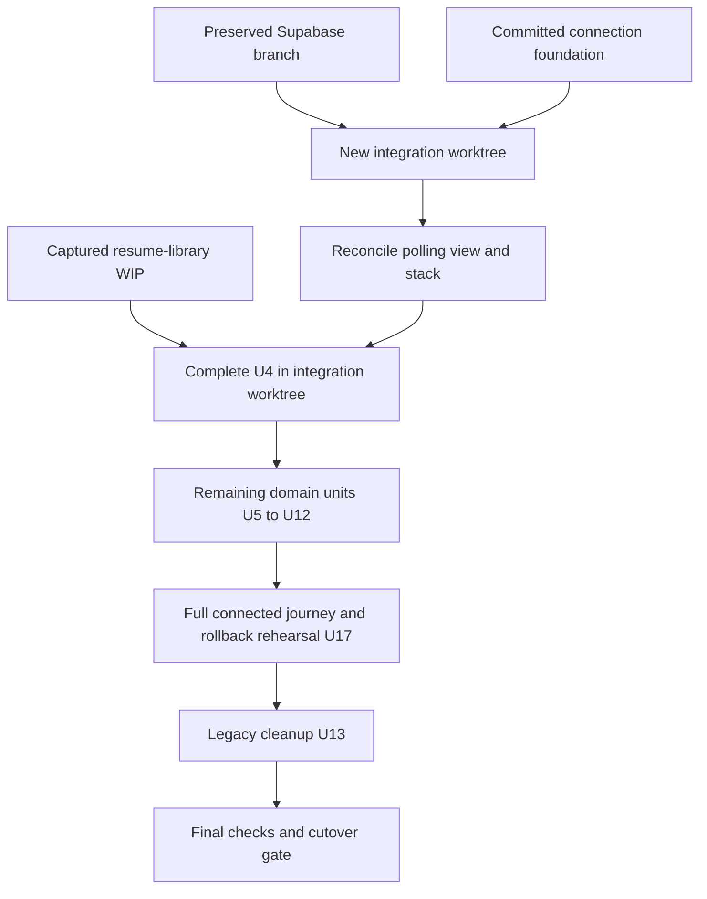
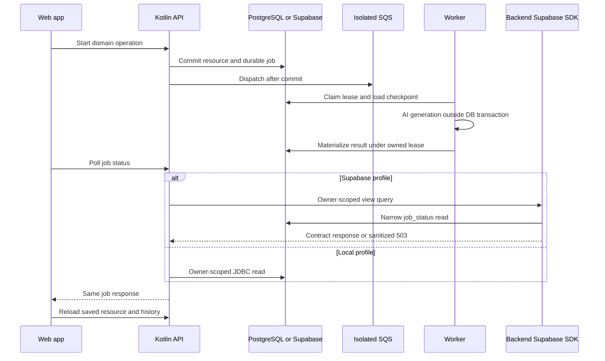
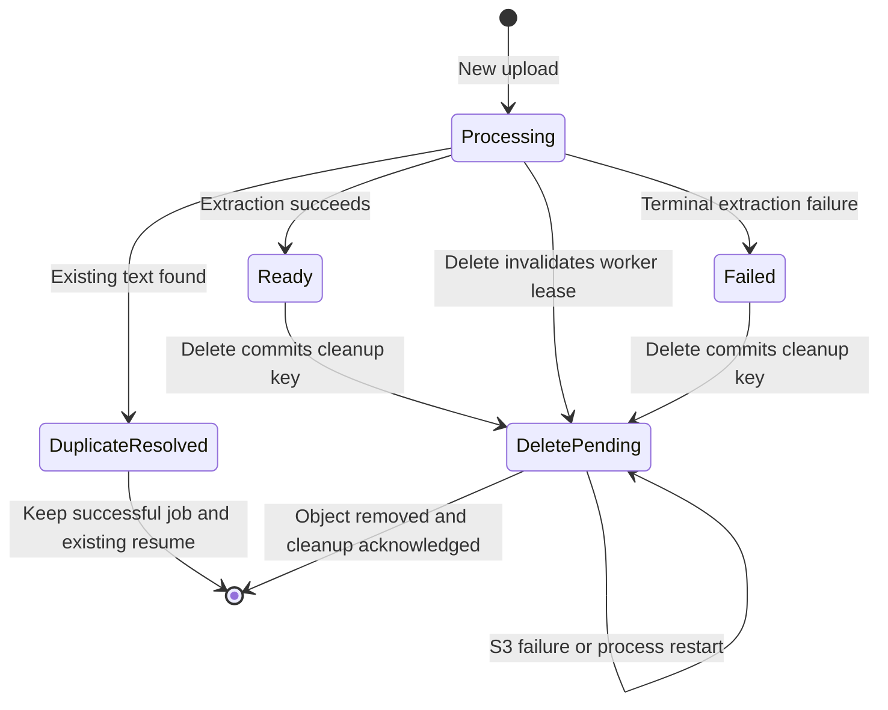

# Frontend Backend Supabase Continuation - Plan

## Goal Capsule

- **Objective:** Candidates complete the new web app's resume, fit, experience, practice and history journey with real saved results that survive reloads and restarts.
- **Means:** Continue the existing API contract work on an isolated integration branch that combines the connection foundation and the Supabase implementation (KTD14–KTD19).
- **Authority:** This continuation's integration constraints, then the original connection plan's unchanged product requirements, then `docs/api/frontend-api-contract.md`, then the frontend rewrite plan and `apps/web/mocks/store.ts` for specified edge behavior.
- **Execution profile:** Prepare U14, integrate U15 and U16, finish U4–U12 in their existing dependency order, verify U17, then perform gated U13 cleanup and repeat final verification. Commit focused, verified changes regularly. After the user took over this plan (KTD20), implementation continues on the session's native harness; no external implementation engine is assigned.
- **Stop conditions:** Pause an affected step if applied migration history conflicts with the preserved files, a source snapshot changes during transfer, or a product contract change is needed. Preserve source work and continue independent units. Deployment and database cutover require the live verification gate in R20.
- **Finishing:** Execution owns simplification, code review, checks and commits. Complete the verified integration before changing application traffic; follow the user's existing push authorization and repository review conventions.

---

## Product Contract

### Summary

Finish the remaining frontend API work using the current Kotlin backend, durable job system and AI layer. Bring in the Supabase work through a new integration branch, retain local PostgreSQL support, and prove the frontend journey against both database configurations before cutover.

### Problem Frame

The connection branch has committed shared-origin, Compose and resource-based job foundations, followed by unfinished resume-library edits. The Supabase branch independently changes job polling, deployment and database initialization. Their V8 migrations collide, and their job DTOs differ. Combining either checkout wholesale could overwrite working code, configuration or applied migration history.

### Requirements

**Connection**
- R1. Every endpoint in contract §2 is served by the Kotlin API with the contract's request, response, status code and error code. Each is marked `existing` in the contract when it ships.
- R2. With mocks off, the web app completes the full journey (library → score → target job → fit and suggestions → practice with attempts → history) against the API, both under `npm run dev` and in the Compose stack.
- R3. The browser calls `/api` on the page's own origin in development, in the container and behind nginx.
- R4. One command starts Postgres, Redis, LocalStack, the API, the worker and the web app locally.

**Contract obligations** (contract §11)
- R5. Every lookup is scoped to the local user, and an ID owned by someone else returns the same 404 as a missing one (§11.1).
- R6. Every AI job submission, retries included, counts against the AI limit, and uploads count against the upload limit. Limits apply per real client even behind nginx (§11.2).
- R7. Job de-duplication keys on resource IDs. Re-scores and retries always start a new job (§11.3, as clarified in KTD5).
- R8. Deletes cascade as in §3.7, §4.6 and §5.7. Delete-impact counts match what the delete removes, stored files are removed, and polls for jobs of deleted resources return `JOB_NOT_FOUND` (§11.4).
- R9. Duplicates resolve to the existing item: resumes by file bytes then normalized text, target jobs by normalized text, experiences by normalized title plus description (§11.5).
- R10. The general score uses only resume text and the optional job title. Rewrites use placeholders instead of invented facts. Suggestions name their source and give guidance, not bullets. Practice sets get 3–8 AI questions, each with a rationale (§11.6, §11.7; rewrite R6, R7, R10, R15).
- R11. The limits and attempt rules in §11.8 and §11.9 are enforced, and validation errors name the field.
- R12. Every resource that owns jobs returns its latest job as `activeJob`, and each resume and target job pair has at most one practice set (§11.10, §11.11).
- R13. A score is stale when the resume's job title changed after it. Suggestions are stale when their source set changed after they ran (rewrite R8, R12).

**Cleanup**
- R14. The old endpoints, the `ANALYSIS` job type, the `ASSESSING_RESUME` stage, the seniority input and the tables only they used are removed (§12).

**Preservation and integration**

- R15. Preserve the source branches, source worktrees and all tracked/untracked working changes; perform integration and subsequent feature work in a new worktree. Keep the earlier plan unchanged.
- R16. Keep Flyway as the only migration system and preserve every already-applied migration byte for byte. Application writes, durable jobs, transactions and vectors use JDBC; only Supabase job-status polling uses the SDK.
- R17. Keep backend keys and migration credentials out of frontend builds and runtime workers. Preserve the complete old database, queue, cache and storage environment with a separate configuration bundle; new Supabase runs use isolated Redis prefixes, SQS/DLQ names and an S3 bucket.
- R18. Supabase and local job polling return the same frontend contract, including maxAttempts, all input references, nested result JSON, nullable values and owner-scoped missing-job behavior.
- R19. The runtime database role can read/write every new private application table it needs and cannot perform DDL. Anonymous/authenticated clients cannot read application data through the Data API.
- R20. Before cutover, verify the full connected journey and recovery paths on Supabase, then rehearse restoration of the old configuration bundle. Do not call an SDK smoke test a full workflow or a rollback verification.

**Product Contract preservation:** Original R1–R14 unchanged; R15–R20 add the user's preservation and Supabase integration constraints. R14 cleanup applies only to obsolete `ai_interview_app` objects in the integrated environment.

### Key Decisions

- **Complete the existing contract in phases.** The original plan's whole-contract scope and product decisions remain binding. Governs R1–R14.
- **Preserve the earlier plan and create a continuation.** (session-settled: user-directed — chosen over updating the original artifact: preserve the earlier decisions and isolate the remaining integration work.) Governs R15.
- **Preserve Supabase work while finishing the frontend connection.** The integration must carry both sets of capabilities. Governs R15–R20.

### Scope Boundaries

Keep the existing fixed local user, Kotlin application code, Gemini embedding model, 1,024-dimensional cosine/HNSW vector configuration and frontend UX. Chat generation may use OpenAI gpt-4.1-mini instead of Gemini through `AI_CHAT_PROVIDER` (KTD21); Gemini stays the default and keeps embeddings. Authentication, voice, other provider replacements, DNS/domain work and a language rewrite remain outside scope. New browser access continues through the Kotlin `/api` boundary, with no frontend Supabase client.

#### Deferred to Follow-Up Work

EC2 provisioning, production ingress/TLS, authentication and replacement of Redis/SQS/S3 providers remain deferred as in the original plan. Removal of legacy `public.*` tables remains a separate follow-up. Existing Supabase security, secret wiring and Helm support must survive integration.

### Success Criteria

With mocks off, a candidate saves a resume and target job, receives a score and fit, saves experiences, refreshes suggestions, generates practice questions, submits and retries attempts, and sees history after reload and container restart. Both source code lines remain recoverable, and restoring the old environment bundle is proven separately from the new Supabase data.

---

## Planning Contract

### Inspected Baselines

| Surface | Source-visible evidence | Reuse or remaining work |
|---|---|---|
| Connection branch | `feat/backend-frontend-connection` at `8e8a8c3`; foundation commits `9a51de6`, `df88c35`, `8e8a8c3` | Reuse original U1–U3; reverify after integration |
| Resume library | Dirty tracked files plus untracked service, deletion helper, V8 and integration tests | Complete U4; these edits are not a working endpoint implementation |
| Later connection features | Original U5–U13 and contract endpoint index | Finish target jobs, scores, fit, experiences, suggestions, practice, history and cleanup |
| Supabase branch | `codex/supabase-migration` at `7b8c255`, based on `origin/master` at `3970d80` | Preserve SDK, migration runner, restrictive roles, profile, Helm and verification code |
| Supabase project | `mjzycnjhtwyqcblwbjvy`; previous implementation reported V1–V8 applied and SDK/JDBC smoke passed | Execution must revalidate history and live permissions; no live queries ran during this planning pass |

This inventory is evidence for the starting point, not execution progress. Reinspect source HEADs and dirty-file manifests before transferring anything.

### Key Technical Decisions

The original plan's KTD1–KTD13 remain the domain design authority, with the migration numbering and integration mechanics below superseding its V8–V16 convention. Existing U-IDs are retained; new integration units use U14–U17.

- KTD14. **Create `codex/frontend-backend-supabase` from the captured Supabase HEAD in a new integration worktree.** Merge the committed connection branch there, preserving both histories. Keep publication on the new integration branch so the rebased Supabase remote never needs a force-push. Before transfer, preserve immutable references to both source HEADs and capture staged/unstaged diffs plus an explicit manifest and copies of relevant untracked source/test/migration files. Exclude `.agents/`, `skills-lock.json`, dependencies, build output and credentials from the feature import. Do not stash, reset, clean, rebase, delete, archive or force-push either source. Compare manifests and file hashes before and after import; abort only the integration operation on conflict. Git worktrees have separate working directories and indexes but share refs, so use a distinct branch. [Git worktree documentation](https://git-scm.com/docs/git-worktree).
- KTD15. **Reserve V9 for the SDK view upgrade and V10–V18 for original U4–U13 schema changes.** First verify each target's applied history, including whether the connection V8 has been applied anywhere. Preserve Supabase V1–V8; rename only an unapplied copy in the integration branch. A target that already applied a different V8 must remain preserved and cannot be pointed at this history or repaired to conceal the mismatch. Reuse standalone Flyway validation and migration; no second Supabase CLI migration history. [Flyway versioned migrations](https://documentation.red-gate.com/flyway/flyway-concepts/migrations/versioned-migrations).
- KTD16. **Resolve the shared job contract during the committed merge, then extend the view additively in V9.** Keep SDK/JDBC reader selection and the connection branch's maxAttempts/four-reference DTO. Reuse one input-reference mapper with resource-type-aware fallback. Preserve existing view columns/order/types and append max_attempts/resource_type, while expanding the existing sanitized JSON whitelist to resumeId, targetJobId, legacy jobDescriptionId, practiceSetId and attemptId. Retain security_invoker and update the backend role's underlying column SELECT grants. Do not expose request text, prompts, answers, storage keys or unrelated payload fields. Keep owner filters, sanitized 503s, five-second timeout, no retries/redirects, apikey-only secret headers and API-only SDK lifecycle. [PostgreSQL view replacement rules](https://www.postgresql.org/docs/current/sql-createview.html), [Supabase custom schemas](https://supabase.com/docs/guides/api/using-custom-schemas).
- KTD17. **Re-run the existing runtime-role bootstrap after each privileged migration release.** Its existing table/sequence grants cover current private app objects, so reuse it instead of adding a default-privilege framework. Verify the runtime role against new domain tables before starting API/workers, and extend the runner's application-object allowlist if a new legacy-public counterpart is introduced; preserve no-DDL and no ownership/membership escalation. Keep Data API exposure limited to ai_interview_api and backend SELECT access to the narrow view. Provider defaults do not replace explicit grants. [Supabase grant change](https://github.com/orgs/supabase/discussions/45329), [API key guidance](https://supabase.com/docs/guides/getting-started/api-keys).
- KTD18. **Preserve local Compose and add an explicit Supabase full-stack configuration.** Reconcile source `.env.example`, application.yaml, Helm values and ConfigMap differences rather than choosing one branch wholesale. Preserve forwarded-header handling and the one-origin proxy. Supabase API/workers use verified session-pooler TLS, runtime JDBC credentials, Hikari maximum 4/minimum idle 0 and no startup migration; the SDK key is API-only and privileged migration credentials are bootstrap-only. Copy required ignored configuration and certificates securely into the new worktree without moving originals, and adjust certificate paths and verify copied `.env.supabase` permissions remain `600`. Keep local and new Supabase service namespaces/ports isolated. Use existing Helm secret and CA patterns; preserve the old PostgreSQL volume.
- KTD19. **Arbitrate concurrent resource operations in existing JDBC transactions.** Reuse database unique constraints and parent-row locking for duplicate saves, pair creation, question limits and attempt numbering. A domain row and its new job commit together before dispatch/cache success. Keep every effect under the owned lease and preserve checkpoints across retry. Delete-impact and deletion use the same owner-scoped selections. Persist a storage_cleanup key in the deletion transaction, independent of deleted jobs/resumes. Extend the existing ResumeStorageReconciler to retry idempotent S3 deletion in bounded batches and remove the cleanup record only after success. Do not create another public job type or a general outbox framework.
- KTD20. **This session carries the plan to completion.** (session-settled: user-approved — chosen over writing a new plan from scratch: the plan already carried the remaining integration work and the user chose to take it over.)
- KTD21. **Chat generation is selectable with `AI_CHAT_PROVIDER`: `gemini` (default) or `openai`, behind the existing `StructuredGenerationClient`.** The OpenAI client pins gpt-4.1-mini in code, with no model setting, uses JSON mode and reuses the `GEMINI_*` error codes, so retries, the single repair attempt and API error codes are unchanged. Embeddings stay on Gemini. (session-settled: user-directed — chosen over other OpenAI models or staying Gemini-only while Gemini returned sustained 503/429: the user offered their OpenAI account on the condition that only gpt-4.1-mini is used.)
- KTD22. **Every AI prompt uses one layout: role, numbered steps, rules, an `<output_format>` block, then each input in its own tag.** A closing tag inside an input is escaped. (session-settled: user-directed — chosen over free-form prompt prose: the user asked for clearly instructed, step-by-step prompts with delimiters that make formats unambiguous.)
- KTD23. **Apply V18 to the live Supabase project once U17's journey passes.** (session-settled: user-approved — chosen over deferring V18 until after cutover: the user approved applying it; the old environment bundle stays recoverable.)
- KTD24. **Migrate the new Supabase project without a pre-migration dump.** (session-settled: user-approved — chosen over taking a pg_dump restore point first: the user confirmed the new project's application data was empty; the old environment's data is preserved separately under R17.)

### Migration Sequence

| Version | Change | Unit |
|---|---|---|
| V1–V8 | Preserved Supabase foundation and original job-status view | inherited |
| V9 | Extend safe job-status view and backend column grants | U15 |
| V10 | Resume library and any minimum durable object-cleanup intent | U4 |
| V11 | Target-job names | U5 |
| V12 | Resume scores | U6 |
| V13 | Job fit | U7 |
| V14 | Experiences | U8 |
| V15 | Experience suggestions | U9 |
| V16 | Practice sets and questions | U10 |
| V17 | Answer attempts | U11 |
| V18 | Gated removal of the legacy application flow | U13 |

Reserve these versions only after U14 confirms that they are still free. If new source commits introduce another applied migration, allocate the next free versions and update only pending integration files and their tests.

### High-Level Technical Design

### System-Wide Impact and Risks

The API contract, SDK mapper, payload-retention cleanup and worker decoder must evolve together. New enum values are added before new submissions are enabled; do not run older consumers on queues carrying new payloads. Frontend 503 retries must retain the active job, whereas a deleted resource/job resolves to the contract's 404 recovery behavior.

Applied-history conflicts stop migration of the affected target (KTD15). New table access is checked using the runtime role rather than privileged migration credentials (KTD17). A successful SDK fixture proves polling only; live AI, queues, storage and vector retrieval still require U17. Destructive cleanup happens after the full new journey works and only in the integrated environment, leaving the old configuration bundle recoverable (R17, R20).

### Assumptions and Deferred Execution Checks

The connection branch's WIP V8 is assumed unapplied, but U14 must verify that before renaming its imported copy. Source files may advance while other work continues; use a captured manifest and reconcile any newer changes explicitly. Availability of isolated local ports, queue/storage names, secure credentials, live connection capacity including deployment overlap, and the old rollback environment must be checked during execution. A complete old configuration bundle is required before cutover; a code backup alone is insufficient.

---

## Implementation Units

| U-ID | Title | Primary files | Depends on |
|---|---|---|---|
| U14 | Preserve sources and prepare integration worktree | Captured Git refs and source/WIP manifest | none |
| U15 | Merge committed foundation and reconcile SDK contract | Job polling and V9 | U14 |
| U16 | Connect both database configurations to the full stack | Compose, Helm, environment examples | U15 |
| U4 | Finish resume library | Resume library and V10 | U15, U16 |
| U5 | Target jobs | Target jobs and V11 | U15, U16 |
| U6 | Resume score | Scoring and V12 | U4 |
| U7 | Job fit | Fit and V13 | U4, U5 |
| U8 | Experiences and split | Experiences and V14 | U15, U16 |
| U9 | Experience suggestions | Suggestions and V15 | U7, U8 |
| U10 | Practice sets and questions | Practice and V16 | U4, U5 |
| U11 | Attempts and feedback | Attempts and V17 | U10 |
| U12 | History | History queries | U6, U9, U11 |
| U17 | Prove live journey and rollback | API contract, migration runbook, frontend tests | U12, U16 |
| U13 | Gated legacy cleanup and final recheck | legacy modules, V18, mock configuration | U17 |

### U14. Preserve sources and prepare integration worktree

**Goal:** Capture recoverable source inputs and create the integration worktree without modifying either source checkout.

**Requirements:** R15–R17; KTD14, KTD15.

**Dependencies:** none.

**Files:** The source/WIP manifest is a private recovery artifact outside version control; the implementation worktree receives this plan and captured Git references. Existing ignored `.env.supabase` and `.supabase/prod-ca-2021.crt` remain in their original worktree.

**Approach:** Record current HEADs, dirty/staged state and hashes of transferable source files. Capture tracked binary-capable diffs and relevant untracked source files in a restricted recovery location. Retain source references, inspect known target histories read-only, and create the distinct integration worktree from the captured Supabase HEAD. Do not apply the WIP until U4 repairs its caller contracts.

**Test scenarios:** Test expectation: none -- Git isolation and file transfer preparation; verify identities/manifests instead of application unit tests.

**Verification:** Both source branches remain at their captured commits, dirty files are byte-identical, ignored files remain available, and the new worktree starts at the preserved Supabase commit. No source reset/rebase/stash/clean or credential export occurs.

### U15. Merge committed foundation and reconcile SDK contract

**Goal:** Combine the committed connection behavior and Supabase implementation into one buildable backend with equivalent polling responses.

**Requirements:** R1, R3, R6, R7, R12, R16, R18, R19; KTD14–KTD17.

**Dependencies:** U14.

**Files:** `src/main/resources/db/migration/V9__job_status_frontend_contract.sql` (new); `src/main/kotlin/dev/jiaming/ai_interview/jobs/JobController.kt`, `src/main/kotlin/dev/jiaming/ai_interview/jobs/JobStatusReader.kt`, `src/main/kotlin/dev/jiaming/ai_interview/jobs/JobInputRefs.kt`, `src/main/kotlin/dev/jiaming/ai_interview/jobs/JobStatusResponse.kt`, `src/main/kotlin/dev/jiaming/ai_interview/jobs/ActiveJob.kt`, `src/main/kotlin/dev/jiaming/ai_interview/jobs/BackgroundJobStore.kt`; `src/main/kotlin/dev/jiaming/ai_interview/supabase/SupabaseJobStatusReader.kt`, `src/main/kotlin/dev/jiaming/ai_interview/supabase/SupabaseMigrationMain.kt`; `src/main/resources/application.yaml`; `src/test/kotlin/dev/jiaming/ai_interview/jobs/AsyncJobControllerTests.kt`; `src/test/kotlin/dev/jiaming/ai_interview/supabase/SupabaseJobStatusReaderTests.kt`, `src/test/kotlin/dev/jiaming/ai_interview/supabase/JobStatusReaderConfigurationTests.kt`; `src/integrationTest/kotlin/dev/jiaming/ai_interview/supabase/SupabaseMigrationIntegrationTests.kt`, `src/integrationTest/kotlin/dev/jiaming/ai_interview/supabase/SupabaseLiveSmokeTests.kt`; `docs/api/frontend-api-contract.md`.

**Approach:** Merge committed connection code and reconcile the actual overlapping files. Preserve resource-keyed submission, shared AI budgeting, HTTP idempotency status replay and forwarded headers. Apply KTD16 to the shared response and mapper, including clearExpiredPayloads retention of all references. Add V9 without changing V8, refresh runtime grants through the existing entrypoint and verify the restricted backend view. Mark only the shipped job contract existing.

**Execution note:** Start with contract-parity fixtures and a migration-upgrade case before changing the adapter.

**Patterns to follow:** Existing SDK MockEngine/header tests, profile-specific reader selection, Jackson plain-value JSON conversion and standalone Flyway integration tests.

**Test scenarios:**
- The same job fixture returns identical maxAttempts, four input-reference keys, nested result and nullable values through both readers.
- Missing jobs and another owner's job return JOB_NOT_FOUND only after an empty successful query; malformed responses/timeouts/upstream denial return a sanitized 503.
- Resume resource fallback works only for resume resource types, and legacy jobDescriptionId maps to targetJobId; malformed reference UUIDs preserve existing null behavior.
- Payload expiration preserves all four references without exposing text or unrelated input in the view.
- A database already at Supabase V8 upgrades through V9 with unchanged earlier checksums; a fresh database runs V1–V9 and the provider-object baseline is still zero.
- SDK headers remain apikey-only with no generated Bearer header or redirects; anon/authenticated view reads fail, service-role reads succeed, and runtime DDL fails.

**Verification:** Merged backend checks pass, new view/mapper fixtures agree, and existing lease/checkpoint/effect integration tests remain valid. Supabase smoke remains opt-in and is recorded separately from U17.

### U16. Connect both database configurations to the full stack

**Goal:** The real frontend can exercise either the local database or the isolated Supabase runtime through the same API.

**Requirements:** R2–R4, R16, R17, R19; KTD17, KTD18.

**Dependencies:** U15.

**Files:** `docker-compose.yml`, `docker-compose.supabase.yml` (new only if an overlay is the smallest compatible configuration), `.env.example`, `.gitignore`, `README.md`, `docs/supabase-migration.md`, `deploy/ai-interview/values.yaml`, `deploy/ai-interview/values-supabase.example.yaml`, `deploy/ai-interview/templates/app-configmap.yaml`, `deploy/ai-interview/templates/api-deployment.yaml`, `deploy/ai-interview/templates/worker-deployment.yaml`, `deploy/ai-interview/templates/postgres.yaml`, `scripts/check-supabase-chart.cjs`, `apps/web/lib/api/config.ts`, `apps/web/tests/apiClient.test.ts`, `src/integrationTest/kotlin/dev/jiaming/ai_interview/common/ForwardedClientIntegrationTests.kt`.

**Approach:** Reconcile both branches' configuration under KTD18. Make database choice explicit, remove the Supabase path's local-Postgres readiness dependency, and preserve local one-command startup. Use an API environment allowlist so migration secrets never reach serving processes or web builds. After each feature's migration batch, use the existing runtime bootstrap before app startup (KTD17). Preserve old infrastructure, verify copied `.env.supabase` mode `600` without displaying its contents, and mount the CA read-only.

**Test scenarios:** Test expectation: no additional config unit suite -- reuse the chart rendering script and existing proxy/header tests, then prove packaging through runtime smoke.

**Verification:** Local Compose startup still succeeds. Supabase API/worker/web start with distinct namespaces, verified TLS, no bundled-Postgres dependency and no automatic migration. Rendered Helm keeps the existing PostgreSQL PVC when disabled; only the API gets the SDK key. Browser /api/status reaches the API on one origin and rate limits resolve the forwarded client correctly.

### U4. Resume library

- **Goal:** Resumes are named, listed, renamed and deleted; upload and paste resolve duplicates; `activeJob` tracks extraction.
- **Requirements:** R1, R5, R8, R9, R11, R12; KTD1, KTD3, KTD8, KTD9; contract §3.1–§3.7.
- **Dependencies:** U15, U16.
- **Files:**
  - `src/main/resources/db/migration/V10__resume_library.sql` (resume columns, backfill, and a partial unique index on `(user_id, file_hash)` where `file_hash` is not null)
  - `src/main/kotlin/dev/jiaming/ai_interview/resume/ResumeController.kt`, `src/main/kotlin/dev/jiaming/ai_interview/resume/ResumeJobSubmissionService.kt`, `src/main/kotlin/dev/jiaming/ai_interview/resume/ResumePersistenceService.kt`, `src/main/kotlin/dev/jiaming/ai_interview/resume/ResumeExtractionJobHandler.kt`, `src/main/kotlin/dev/jiaming/ai_interview/resume/ResumeModels.kt`
  - `src/main/kotlin/dev/jiaming/ai_interview/common/DeleteImpactService.kt` (new; each later phase adds its tables)
  - `src/test/kotlin/dev/jiaming/ai_interview/resume/ResumeControllerTests.kt`, `src/test/kotlin/dev/jiaming/ai_interview/resume/ResumeExtractionJobHandlerTests.kt`
  - `src/integrationTest/kotlin/dev/jiaming/ai_interview/resume/ResumeLibraryIntegrationTests.kt` (new)
  - `docs/api/frontend-api-contract.md`
- **Approach:**
  1. Upload hashes the file bytes, and a matching `file_hash` returns `200` with `duplicate: true` before any storage or job. Two uploads of the same bytes racing each other hit the unique index, and the loser returns the winner's resume as the duplicate. Otherwise it stores the file and returns `202` with `ResumeCreated`. `name` defaults to the filename without its extension.
  2. On success, extraction checks `content_hash` against the user's other resumes. On a match it removes the new resume and returns `{resumeId, duplicateOf}` (the KTD8 exception).
  3. Paste reuses the `findOrCreateDocument` dedupe and saves the resume as `READY` with `source = PASTE`.
  4. The status maps `PENDING` to `PROCESSING` in the API.
  5. `PATCH` updates `name` and `job_title` only.
  6. Delete and delete-impact follow KTD8, counting only resume-owned rows until later units add theirs.
  7. Mark §3.1–§3.7 `existing` in the contract.
- **Patterns to follow:** `ResumeJobSubmissionService` compensation on reuse; `ResumeTerminalFailureHandler` S3 cleanup.
- **Test scenarios:**
  - Uploading bytes identical to a saved resume returns `200`, `duplicate: true`, the saved resume, and starts no job.
  - A different file whose extracted text matches a saved resume ends `SUCCEEDED` with `duplicateOf`, and `GET` of the new ID returns `404`.
  - Pasting 99 characters returns `400 INVALID_REQUEST` naming `text`; 100 characters returns `201` with a `READY` resume and no job.
  - An upload with an 81-character `name` returns `400` naming `name`; a `.exe` file returns `415 UNSUPPORTED_FILE_TYPE`.
  - The list is newest first, and each item's `activeJob` is its extraction job.
  - `PATCH` with `jobTitle: null` clears the title.
  - `GET`, `PATCH` and `DELETE` for another user's resume ID return `404 RESUME_NOT_FOUND`.
  - Delete removes the S3 object, and its extraction job then returns `404 JOB_NOT_FOUND`.
  - The V10 migration test: an existing resume gets `name` from its filename and `source = UPLOAD`.
- **Verification:** With mocks off, the Resumes library screen adds, renames and deletes resumes against the API, and the duplicate notice appears for a repeated upload.

**Continuation deltas:** Import only the U4 files preserved in U14, using V10 in this integration branch (KTD15). Wire the existing library service into the controller; update upload submission and extraction to match the new persistence signatures. Keep score fields null until U6. Persist the accepted extraction job ID in environment-scoped browser storage, using the existing localStorage error handling style, until its duplicate outcome is shown or dismissed; recover through the retained successful job even when the temporary resume no longer exists. Apply KTD19 to concurrent pastes and extraction completion. Add the small storage_cleanup table to V10 and consume it through ResumeStorageReconciler. Use the same cleanup record for temporary-upload compensation after a race loss or failed resource/job transaction: once that transaction has settled, persist the key in a separate committed transaction before attempting object deletion; acknowledge it only after success. Preserve the existing pending-object lifecycle fallback and the extracted-text duplicate exception that retains its successful job.

**Additional files:** `src/main/kotlin/dev/jiaming/ai_interview/resume/ResumeTerminalFailureHandler.kt`, `src/main/kotlin/dev/jiaming/ai_interview/resume/ResumeStorageReconciler.kt`, `src/main/kotlin/dev/jiaming/ai_interview/common/LocalUserService.kt`, `src/integrationTest/kotlin/dev/jiaming/ai_interview/resume/ResumeLibraryMigrationIntegrationTests.kt`, `src/integrationTest/kotlin/dev/jiaming/ai_interview/resume/ResumeStorageCleanupIntegrationTests.kt` (new), `apps/web/components/library/UploadWatcher.tsx`, `apps/web/pages/ResumesPage.tsx`, `apps/web/tests/library.test.tsx`.

**Additional test scenarios:**
- Two simultaneous identical pastes yield one saved resume and duplicate responses referring to that ID.
- The upload insert loser removes only its temporary object and returns the winner; it creates no second job.
- Reload or a new tab after extracted-text duplicate completion recovers duplicateOf through the saved job ID even though the temporary resume is deleted; dismissal clears recovery state.
- Deletion during extraction rejects the stale worker's owned-lease write, and a failed S3 delete retains enough durable cleanup state for a subsequent worker run.
- Simulated S3 deletion failure after an upload race loss or rolled-back resource/job transaction leaves a committed cleanup key despite no surviving resume/job row; the existing reconciler removes only that temporary object after restart. Cover a provider where pending-object lifecycle setup is unavailable.

### U5. Target jobs

- **Goal:** Target jobs are saved from pasted text with a name, listed, renamed and deleted, with duplicates resolved.
- **Requirements:** R1, R5, R8, R9, R11; KTD1, KTD8; contract §4.
- **Dependencies:** U15, U16.
- **Files:**
  - `src/main/resources/db/migration/V11__target_job_names.sql`
  - `src/main/kotlin/dev/jiaming/ai_interview/targetjob/TargetJobController.kt` and `src/main/kotlin/dev/jiaming/ai_interview/targetjob/TargetJobService.kt` (new), reusing `src/main/kotlin/dev/jiaming/ai_interview/interview/JobDescriptionPersistenceService.kt`
  - `src/main/kotlin/dev/jiaming/ai_interview/common/ApiExceptionHandler.kt` (`TARGET_JOB_NOT_FOUND` replaces `JOB_DESCRIPTION_NOT_FOUND`)
  - `src/test/kotlin/dev/jiaming/ai_interview/targetjob/TargetJobControllerTests.kt`, `src/integrationTest/kotlin/dev/jiaming/ai_interview/targetjob/TargetJobIntegrationTests.kt` (new)
  - `docs/api/frontend-api-contract.md`
- **Approach:** Create dedupes on the normalized-text `content_hash`. `PATCH` accepts only `name`. Delete and delete-impact follow KTD8; `scores` and `staleSuggestionSets` are always `0`. Mark §4 `existing`.
- **Patterns to follow:** `JobDescriptionPersistenceService` normalization and hashing.
- **Test scenarios:**
  - Saving text that normalizes to an existing job's text returns `200`, `duplicate: true` and the existing item.
  - 99 characters or 20,001 characters return `400` naming `text`.
  - `PATCH` with a `text` field leaves the text unchanged.
  - An unknown or foreign ID returns `404 TARGET_JOB_NOT_FOUND`.
  - The V11 migration names an existing row from its title, and falls back to `Untitled job`.
- **Verification:** With mocks off, the Target jobs screen and the flow's job picker save, reuse and delete jobs against the API.

**Continuation deltas:** Use V11 (KTD15), and reuse `JobDescriptionPersistenceService` for normalization and hashing. Apply the owner/deletion and runtime-grant release rules in KTD17 and KTD19.

**Additional test scenario:** Concurrent equivalent target-job creates resolve to one owner-scoped saved item; a foreign owner's item never becomes the duplicate response.

### Phase 2: Score and fit

### U6. Resume score

- **Goal:** A resume gets a general score with fixes and placeholder rewrites, shown as its latest score with staleness.
- **Requirements:** R1, R6, R7, R10, R12, R13; KTD2, KTD4, KTD6, KTD7; contract §3.8, `ResumeScoreResult`.
- **Dependencies:** U4.
- **Files:**
  - `src/main/resources/db/migration/V12__resume_scores.sql`
  - `src/main/kotlin/dev/jiaming/ai_interview/score/ResumeScoreJobHandler.kt`, `src/main/kotlin/dev/jiaming/ai_interview/score/ResumeScorePayload.kt` and `src/main/kotlin/dev/jiaming/ai_interview/score/ResumeScoreService.kt` (new)
  - `src/main/kotlin/dev/jiaming/ai_interview/resume/ResumeController.kt` (`POST /score`, `score` and `latestScore` in the views)
  - `src/main/kotlin/dev/jiaming/ai_interview/coach/CoachPromptBuilder.kt`, `src/main/kotlin/dev/jiaming/ai_interview/coach/CoachResponseMapper.kt`
  - `src/main/kotlin/dev/jiaming/ai_interview/jobs/JobType.kt`, `src/main/kotlin/dev/jiaming/ai_interview/jobs/JobStage.kt`, `src/main/kotlin/dev/jiaming/ai_interview/jobs/JobPayloadDecoder.kt`, `src/test/kotlin/dev/jiaming/ai_interview/contract/ContractFreezeTests.kt`
  - `src/test/kotlin/dev/jiaming/ai_interview/score/ResumeScoreJobHandlerTests.kt`, `src/test/kotlin/dev/jiaming/ai_interview/coach/CoachResponseMapperTests.kt`
  - `docs/api/frontend-api-contract.md`
- **Approach:**
  1. The prompt takes the resume text and optional job title only.
  2. The mapper clamps scores, ranks fixes, and collects bracketed placeholders from each rewrite into `placeholders`.
  3. Each successful run inserts a `resume_scores` row with the job title it used. `ResumeDetail.score` is the newest row, and staleness follows KTD4.
  4. Submitting while the resume isn't `READY` returns `409 RESUME_NOT_READY`.
  5. Mark §3.8 `existing`.
- **Patterns to follow:** `src/main/kotlin/dev/jiaming/ai_interview/jobs/FeedbackJobHandler.kt` checkpoint and materialization flow.
- **Test scenarios:**
  - The built prompt contains the job title and resume text, and no job description or seniority.
  - A model rewrite `"cut time by [X%]"` maps to `placeholders: ["[X%]"]`; a score of 130 maps to 100.
  - Invalid JSON gets one repair attempt; a second failure ends `FAILED` with a `GEMINI_*` code and `retryable` set.
  - Scoring, then changing `jobTitle`, makes `latestScore.stale` true without starting a job. Re-scoring clears it.
  - Two scores leave both rows for history, and `ResumeDetail.score` is the newer one.
  - Scoring a `PROCESSING` resume returns `409 RESUME_NOT_READY`.
- **Verification:** With mocks off, the score step shows a real score that survives a reload.

**Continuation deltas:** Use V12. Keep all effect writes under the existing owned-lease transaction and add the new job type to SDK parity fixtures (KTD16, KTD19). Run the phase gate with SDK polling as well as local JDBC reads.

**Additional test scenarios:**
- A worker retry after checkpoint persistence materializes exactly one score/history row.
- A score completed over JDBC is returned identically by the SDK and the resume detail endpoint.

### U7. Job fit

- **Goal:** Each resume and target job pair gets a fit score with matched and missing requirements and feedback.
- **Requirements:** R1, R6, R10, R12; KTD2, KTD3, KTD6, KTD7; contract §6.1–§6.2, `JobFitResult`.
- **Dependencies:** U4, U5.
- **Files:**
  - `src/main/resources/db/migration/V13__job_fits.sql`
  - `src/main/kotlin/dev/jiaming/ai_interview/fit/FitController.kt`, `src/main/kotlin/dev/jiaming/ai_interview/fit/JobFitJobHandler.kt`, `src/main/kotlin/dev/jiaming/ai_interview/fit/JobFitService.kt` (new)
  - `src/main/kotlin/dev/jiaming/ai_interview/coach/` prompt and mapper additions
  - `src/main/kotlin/dev/jiaming/ai_interview/common/DeleteImpactService.kt` (fits)
  - `src/test/kotlin/dev/jiaming/ai_interview/fit/FitControllerTests.kt`, `src/test/kotlin/dev/jiaming/ai_interview/fit/JobFitJobHandlerTests.kt`
  - `docs/api/frontend-api-contract.md`
- **Approach:**
  1. `GET` returns `FitView` for any existing pair, with a null `result` before the first run.
  2. `POST` upserts the pair row, then submits `JOB_FIT` with that row as its resource.
  3. The handler replaces the stored result.
  4. Resume and target-job delete cascade the pair row and count it in delete-impact.
  5. Context uses the existing `CoachRagContextService` resume and job-description retrieval.
  6. Mark §6.1–§6.2 `existing`.
- **Patterns to follow:** the U6 handler; `CoachRagContextService` assessment budgets.
- **Test scenarios:**
  - `GET` for a pair never run returns `200` with `result: null` and `activeJob: null`.
  - A missing resume or missing job returns `404 RESUME_NOT_FOUND` or `404 TARGET_JOB_NOT_FOUND` respectively.
  - Running fit twice keeps one row per pair with the newer result.
  - Delete-impact for the resume counts the fit, and deleting the target job removes it.
- **Verification:** With mocks off, the fit card shows a real result after a reload, and the mode chooser enables Practice.

**Continuation deltas:** Use V13. Arbitrate pair creation in the database and extend delete-impact from the same owned-row selection used by deletion (KTD19).

**Additional test scenario:** Concurrent fit starts create one pair resource and reuse its active job; a later re-run keeps the pair ID and replaces its result.

### Phase 3: Experiences and suggestions

### U8. Experiences and LinkedIn split

- **Goal:** Users save experiences from the project form or from reviewed LinkedIn text split by AI, with duplicates skipped.
- **Requirements:** R1, R6, R9, R11; KTD6, KTD7, KTD9; contract §5.
- **Dependencies:** U15, U16.
- **Files:**
  - `src/main/resources/db/migration/V14__experiences.sql`
  - `src/main/kotlin/dev/jiaming/ai_interview/experience/ExperienceController.kt`, `src/main/kotlin/dev/jiaming/ai_interview/experience/ExperienceService.kt`, `src/main/kotlin/dev/jiaming/ai_interview/experience/ExperienceSplitJobHandler.kt` (new)
  - `src/main/kotlin/dev/jiaming/ai_interview/coach/` prompt and mapper additions
  - `src/test/kotlin/dev/jiaming/ai_interview/experience/ExperienceControllerTests.kt`, `src/test/kotlin/dev/jiaming/ai_interview/experience/ExperienceSplitJobHandlerTests.kt`
  - `src/integrationTest/kotlin/dev/jiaming/ai_interview/experience/ExperienceIntegrationTests.kt` (new)
  - `docs/api/frontend-api-contract.md`
- **Approach:**
  1. Create and batch dedupe on the hash of normalized title plus description. Batch records `source = LINKEDIN` and returns `created` and `skipped`.
  2. The split job returns `ExperienceSplitResult`, setting `duplicateOf` for items already saved. It saves nothing.
  3. Delete is wired fully in U9, once suggestions exist.
  4. Mark §5 `existing` except delete-impact and delete, which U9 marks.
- **Patterns to follow:** `apps/web/mocks/store.ts` `experienceKey` normalization.
- **Test scenarios:**
  - Saving the same title and description with different spacing and case returns `200` with `duplicate: true`.
  - A batch of three items where one is already saved returns two in `created` and one in `skipped` with `existingId`.
  - A batch of 31 items returns `400` naming `items`.
  - A split of text containing an already-saved role marks that item's `duplicateOf` and saves nothing.
  - Two splits of different text submitted while the first is running create two jobs.
  - A title of 121 characters or a `startDate` of `2023-1` returns `400` naming the field.
- **Verification:** With mocks off, the Experiences screen saves form items and reviewed LinkedIn items.

**Continuation deltas:** Use V14. Keep split results as review-only data on the job; saving the reviewed items belongs to batch creation. Add EXPERIENCE_SPLIT to JDBC/SDK mapping and reload fixtures (KTD16). In LinkedInDialog, retain the split job ID, paste text and removed-item indices in browser localStorage scoped to this application environment and workflow, reusing the existing drafts/lastPair storage error handling style. Restore the input and review choices after reload or in a new tab, and load the result through GET /api/jobs/{id}. Clear the recovery draft after save or explicit discard. A missing/expired job shows a recoverable notice and permits explicit resplitting from the retained text; never resubmit automatically. This delivers the inherited frontend rewrite requirements for input-preserving retry and reload/new-tab recovery (rewrite R20–R21).

**Additional files:** `apps/web/components/library/LinkedInDialog.tsx`, `apps/web/tests/library.test.tsx` (extend the existing component/query test setup).

**Additional test scenarios:** Reload and a new tab during and after a split recover the job, review result, paste text and removed-item choices without silently creating experiences; saving or discarding clears recovery state; a missing/expired job shows the recovery notice and an explicit resplit uses the retained input.

### U9. Experience suggestions

- **Goal:** A pair gets suggestions drawn from the user's other resumes and experiences, with honest empty, no-match and stale states.
- **Requirements:** R1, R6, R8, R10, R12, R13; KTD4, KTD7, KTD8; contract §5.6–§5.7, §6.3–§6.4.
- **Dependencies:** U7, U8.
- **Files:**
  - `src/main/resources/db/migration/V15__experience_suggestions.sql`
  - `src/main/kotlin/dev/jiaming/ai_interview/suggestions/SuggestionsController.kt`, `src/main/kotlin/dev/jiaming/ai_interview/suggestions/SuggestionsService.kt`, `src/main/kotlin/dev/jiaming/ai_interview/suggestions/ExperienceSuggestionsJobHandler.kt` (new)
  - `src/main/kotlin/dev/jiaming/ai_interview/experience/ExperienceController.kt` (delete and delete-impact), `src/main/kotlin/dev/jiaming/ai_interview/common/DeleteImpactService.kt`
  - `src/main/kotlin/dev/jiaming/ai_interview/coach/` prompt and mapper additions
  - `src/test/kotlin/dev/jiaming/ai_interview/suggestions/SuggestionsJobHandlerTests.kt`, `src/integrationTest/kotlin/dev/jiaming/ai_interview/suggestions/SuggestionsIntegrationTests.kt` (new)
  - `docs/api/frontend-api-contract.md`
- **Approach:**
  1. Sources are every other `READY` resume plus every experience.
  2. `sourcesAvailable` and staleness are computed when read (KTD4). The run stores its sorted source-ID snapshot.
  3. `POST` with no sources returns `409 NO_EXPERIENCE_SOURCES` before any job.
  4. The prompt follows KTD7's budget and asks for guidance, not bullets.
  5. The mapper drops items whose source ID wasn't provided.
  6. Items whose source was deleted are filtered out when read (KTD4). Delete-impact's `staleSuggestionSets` counts other pairs whose snapshot contains the item.
  7. Mark §5.6–§5.7 and §6.3–§6.4 `existing`.
- **Patterns to follow:** `CoachResponseMapper` filtering of `sourceContextIds` to retrieved IDs.
- **Test scenarios:**
  - With no other resume and no experience, `GET` shows `sourcesAvailable: false`, and `POST` returns `409 NO_EXPERIENCE_SOURCES` without creating a job.
  - Adding an experience after a run makes `stale` true; running again clears it.
  - A model item citing an unknown source ID is dropped, and an empty item list is stored as "no strong matches".
  - Deleting an experience used by two pairs reports `staleSuggestionSets: 2`, hides its items from both views, and marks both stale.
  - Deleting a source resume hides its items from other pairs' suggestions and marks them stale.
  - A queued first run shows `stale: false`, and delete-impact does not count its pair row.
  - A resume over the character budget is narrowed through retrieval, while an experience is always sent whole.
- **Verification:** With mocks off, the fit page shows the add-experience prompt, then real suggestions, then Refresh after a new experience.

**Continuation deltas:** Use V15. Build current-source snapshots and filter stored items through owner-scoped source lookups. Exclude the selected resume, deleted sources and other owners (KTD19).

**Additional test scenario:** A source deleted between retrieval and materialization cannot appear as a usable source in the read response; refresh still has the contract's stale/no-source behavior.

### Phase 4: Practice

### U10. Practice sets and questions

- **Goal:** Each pair gets one practice set with 3–8 AI questions, retry on failure, and up to 10 user questions.
- **Requirements:** R1, R6, R10, R11, R12; KTD3, KTD4, KTD6, KTD7; contract §7.1–§7.4.
- **Dependencies:** U4, U5.
- **Files:**
  - `src/main/resources/db/migration/V16__practice_sets.sql` (sets and questions)
  - `src/main/kotlin/dev/jiaming/ai_interview/practice/PracticeController.kt`, `src/main/kotlin/dev/jiaming/ai_interview/practice/PracticeService.kt`, `src/main/kotlin/dev/jiaming/ai_interview/practice/PracticeQuestionsJobHandler.kt` (new)
  - `src/main/kotlin/dev/jiaming/ai_interview/coach/` prompt and mapper additions (reusing the question prompt without seniority)
  - `src/main/kotlin/dev/jiaming/ai_interview/common/DeleteImpactService.kt`
  - `src/test/kotlin/dev/jiaming/ai_interview/practice/PracticeControllerTests.kt`, `src/integrationTest/kotlin/dev/jiaming/ai_interview/practice/PracticeIntegrationTests.kt` (new)
  - `docs/api/frontend-api-contract.md`
- **Approach:**
  1. `POST` inserts the pair's set if absent, handling concurrent inserts through the unique constraint. It returns `201` with a new job for a new set, or `200` for an existing one; only the new-set path counts against the AI limit.
  2. The handler writes AI questions in order.
  3. Set status is derived (KTD4). Retry is allowed only when it is `FAILED`.
  4. User questions append after AI questions.
  5. Mark §7.1–§7.4 `existing`.
- **Patterns to follow:** `AnalysisJobHandler` question generation and checkpoint, before U13 removes it.
- **Test scenarios:**
  - Two concurrent `POST`s for one pair create one set: one `201`, one `200`.
  - `mode: "VOICE"` returns `400 INVALID_REQUEST`.
  - The model returning two questions triggers the repair path; twelve are trimmed to eight.
  - A failed generation shows `status: FAILED`. Retry starts a new job, and retry on a `READY` set returns `409 PRACTICE_SET_NOT_FAILED`.
  - Adding a user question while generating returns `409 PRACTICE_SET_NOT_READY`. The eleventh user question returns `409 QUESTION_LIMIT_REACHED`, and 9 characters returns `400`.
  - Deleting the resume removes the set and its questions, and delete-impact counted them.
- **Verification:** With mocks off, choosing Practice opens a generating set that fills with real questions.

**Continuation deltas:** Use V16. The unique pair constraint chooses the practice-set winner; lock its parent row when enforcing the ten-user-question cap (KTD19). SDK polling recognizes PRACTICE_QUESTIONS (KTD16).

**Additional test scenario:** With nine saved user questions, two concurrent additions leave ten, and the loser receives QUESTION_LIMIT_REACHED.

### U11. Answer attempts and feedback

- **Goal:** Answers are saved as numbered attempts with feedback and score changes, and failed attempts can be retried.
- **Requirements:** R1, R6, R7, R11, R12; KTD4, KTD5, KTD6, KTD7; contract §7.5–§7.6, `AnswerFeedbackResult`.
- **Dependencies:** U10.
- **Files:**
  - `src/main/resources/db/migration/V17__answer_attempts.sql`
  - `src/main/kotlin/dev/jiaming/ai_interview/practice/AttemptController.kt` (new), `src/main/kotlin/dev/jiaming/ai_interview/practice/PracticeService.kt`
  - `src/main/kotlin/dev/jiaming/ai_interview/jobs/FeedbackJobHandler.kt`, `src/main/kotlin/dev/jiaming/ai_interview/jobs/FeedbackJobPayload.kt` (attempt-based input)
  - `src/main/kotlin/dev/jiaming/ai_interview/interview/InterviewController.kt` (remove `POST /api/interview/feedback`, whose job input changes here)
  - `src/main/kotlin/dev/jiaming/ai_interview/coach/` feedback prompt without seniority
  - `src/test/kotlin/dev/jiaming/ai_interview/jobs/FeedbackJobHandlerTests.kt`, `src/integrationTest/kotlin/dev/jiaming/ai_interview/practice/AttemptIntegrationTests.kt` (new)
  - `docs/api/frontend-api-contract.md`
- **Approach:**
  1. Submit trims the text and checks it (empty → `ANSWER_EMPTY`, over 4,000 → `ANSWER_TOO_LONG`, same as latest → `ANSWER_UNCHANGED`).
  2. It then creates attempt `max(number) + 1` and submits `ANSWER_FEEDBACK` keyed on the attempt ID.
  3. The handler scores against the question, its expected signals, and the pair's resume and job context, then stores feedback and score.
  4. `scoreDelta` is computed when read against the previous `SCORED` attempt. Retry is allowed only for a `FAILED` attempt and keeps its ID, number and text.
  5. Mark §7.5–§7.6 `existing`.
- **Patterns to follow:** the existing `FeedbackJobHandler` checkpoint flow.
- **Test scenarios:**
  - Two attempts scoring 62 then 74 show `scoreDelta: 12` on the second and null on the first.
  - A failed attempt between two scored ones does not break the delta chain.
  - Whitespace-only text returns `400 ANSWER_EMPTY`; 4,001 characters returns `400 ANSWER_TOO_LONG`.
  - Resubmitting the latest attempt's text with extra outer spaces returns `409 ANSWER_UNCHANGED`, even when that attempt `FAILED`.
  - Identical text on two different questions creates two jobs; both can be pending at once.
  - Retrying a `SCORED` attempt returns `409 ATTEMPT_NOT_FAILED`, and a foreign attempt ID returns `404 ATTEMPT_NOT_FOUND`.
  - Replaying a successful submission's `Idempotency-Key` returns the same `201` attempt, not `409 ANSWER_UNCHANGED`.
- **Verification:** With mocks off, two attempts on one question show the real score change after a reload.

**Continuation deltas:** Use V17. Lock the question while checking unchanged answers and assigning attempt numbers. Pair a new attempt and its job in the same transaction; cache only the committed result (KTD19). Version attempt-based feedback separately from existing payloadVersion 2 and unversioned inputs, and dispatch decoding/materialization by version and resource_type. Retain legacy feedback handling until active legacy work is settled for U13; never decode an old resume-backed feedback job as an attempt job.

**Additional files:** `src/main/kotlin/dev/jiaming/ai_interview/jobs/JobPayloadDecoder.kt`, `src/test/kotlin/dev/jiaming/ai_interview/jobs/JobPayloadDecoderTests.kt`.

**Additional test scenarios:**
- Existing version-2 and unversioned feedback jobs decode through their legacy path while new attempt jobs use their own payload version and resource type; checkpoints remain resumable.
- Two different concurrent answers for one question receive distinct sequential numbers and correct previous-scored deltas.
- Job creation failure rolls back the new attempt, and retrying the same idempotency key can then succeed.
- A replayed successful response preserves its original status, ID and body when a later attempt already exists.

### Phase 5: History and cleanup

### U12. History

- **Goal:** History lists score, fit and practice trends from saved data.
- **Requirements:** R1, R5; contract §9.
- **Dependencies:** U6, U9, U11.
- **Files:** `src/main/kotlin/dev/jiaming/ai_interview/history/HistoryController.kt` and `src/main/kotlin/dev/jiaming/ai_interview/history/HistoryService.kt` (new), `src/integrationTest/kotlin/dev/jiaming/ai_interview/history/HistoryIntegrationTests.kt` (new), `docs/api/frontend-api-contract.md`.
- **Approach:** Three owner-scoped queries (resume scores, the pair fit per target job, and practice sets with the scores of `SCORED` attempts), with arrays oldest first. Mark §9 `existing`.
- **Test scenarios:**
  - A resume scored twice lists both scores oldest first.
  - A question with attempts scored, failed, then scored lists two scores.
  - A new user gets three empty arrays.
- **Verification:** With mocks off, the History screen shows the trend lines from the earlier phases' runs.

**Continuation deltas:** Reuse JDBC persisted domain results; history does not issue new AI calls. U17 exercises the real history screen before cleanup.

**Additional test scenario:** Foreign-owner scores, pairs and attempts are absent from every history array.

### U17. Prove live journey and rollback

**Goal:** Demonstrate that the new UI works with real Supabase results and that the complete old environment can be restored.

**Requirements:** R1, R2, R8, R13, R15–R20; KTD15–KTD19.

**Dependencies:** U12, U16, with U4–U11 complete through their dependencies.

**Files:** `docs/supabase-migration.md`, `docs/api/frontend-api-contract.md`, `apps/web/tests/useJob.test.tsx`, `apps/web/tests/flow.test.tsx`, `apps/web/tests/library.test.tsx`, `apps/web/tests/practice.test.tsx`, `apps/web/tests/history.test.tsx`, `src/integrationTest/kotlin/dev/jiaming/ai_interview/supabase/SupabaseLiveSmokeTests.kt`, `src/integrationTest/kotlin/dev/jiaming/ai_interview/jobs/QueueAndStorageLocalStackIntegrationTests.kt`, `src/integrationTest/kotlin/dev/jiaming/ai_interview/jobs/JobEffectMaterializationIntegrationTests.kt`, `src/integrationTest/kotlin/dev/jiaming/ai_interview/jobs/BackgroundJobStoreIntegrationTests.kt`, `src/test/kotlin/dev/jiaming/ai_interview/jobs/JobWorkerTests.kt`.

**Approach:** Exercise the complete new journey on both runtime configurations with mocks off, then the real Supabase environment. Clear only this app's old saved browser workflow state when switching environments. Inject/reproduce the existing retry, restart and deletion scenarios using isolated resources. Record the old configuration bundle identity and a rehearsal that stops the new consumers before restoring the old ones. The old bundle is the original checkout's `ai_interview` Compose project: its postgres, redis and localstack volumes, its `.env`, and the pre-integration API, worker and web images recorded by image ID and started without `--build`. Stop the integration branch's local stack first, since both use the same container names and ports, and never start an integration or master build against those volumes before cutover is final. Replay a saved workflow against the old bundle and record its `flyway_schema_history` before and after to show it was not migrated. Retain new Supabase data separately; rollback does not merge new writes.

**Test scenarios:**
- Upload and paste, extraction, score, target job, fit, experience split/save, suggestions, questions, two answer attempts and history all survive reload and a full app/worker restart.
- A transient SDK 503 retains the browser's active job and resumes polling; a deleted job/resource gives the contract's recovery state instead of indefinite polling.
- Restart after an AI checkpoint does not repeat a materialized effect; deleting during an owned job prevents stale writes and eventually removes its object.
- JDBC transitions are visible through SDK polling for every new job type, with consistent result and references.
- Vector retrieval retains index-ID and claim-version filtering and the existing dimensions/index/model.
- Restoring the old configuration after stopping new submissions/consumers restores old data, queues and objects; no old process consumes new queues and no new data is silently merged.

**Continuation deltas:** The live journey runs on the chat provider KTD21 selects, with prompts in KTD22's layout. The new project is migrated without a dump (KTD24).

**Verification:** Record actual frontend/API/worker/database outcomes, permission checks, connection capacity, browser-state handling and rollback rehearsal evidence in the runbook. U13 cleanup and live V18 become eligible once the connected journey passes (KTD23). The permission, connection-capacity, browser-state and rollback evidence gates cutover and traffic changes, together with the final gates and connected journey repeated after U13 on the cutover deployment's chat provider.

### U13. Remove the old API

- **Goal:** Only the contract's API remains; the old endpoints, job type, seniority and tables are gone, and the frontend drops `new-only`.
- **Requirements:** R14, R1; Key Decisions (old endpoints removed in the last phase).
- **Dependencies:** U17.
- **Files:**
  - Removed:
    - `src/main/kotlin/dev/jiaming/ai_interview/assessment/`
    - `src/main/kotlin/dev/jiaming/ai_interview/jobs/AnalysisController.kt`, `src/main/kotlin/dev/jiaming/ai_interview/jobs/AnalysisJobHandler.kt`, `src/main/kotlin/dev/jiaming/ai_interview/jobs/AnalysisJobPayload.kt`, `src/main/kotlin/dev/jiaming/ai_interview/jobs/AnalysisJobResult.kt`
    - `src/main/kotlin/dev/jiaming/ai_interview/interview/` services only the old flow used
    - `src/main/kotlin/dev/jiaming/ai_interview/coach/SenioritySettings.kt`, and seniority fields across `src/main/kotlin/dev/jiaming/ai_interview/coach/` and payloads
    - The "current resume" fallback in `src/main/kotlin/dev/jiaming/ai_interview/document/DocumentReferenceResolver.kt`
    - Their tests
  - `src/main/kotlin/dev/jiaming/ai_interview/jobs/JobType.kt`, `src/main/kotlin/dev/jiaming/ai_interview/jobs/JobStage.kt`, `src/main/kotlin/dev/jiaming/ai_interview/jobs/JobWorker.kt`, `src/main/kotlin/dev/jiaming/ai_interview/jobs/BackgroundJobStore.kt` (`ANALYSIS` `PARTIAL` special cases), `src/main/kotlin/dev/jiaming/ai_interview/jobs/JobPayloadDecoder.kt`, `src/test/kotlin/dev/jiaming/ai_interview/contract/ContractFreezeTests.kt`
  - `src/main/resources/db/migration/V18__remove_legacy_flow.sql`: delete `ANALYSIS` and legacy `interview-answer` feedback jobs with their effects, preserve new attempt-backed feedback jobs, narrow the effect CHECK, drop `question_embeddings` and `answer_embeddings` (they reference the interview tables), then `resume_assessments` and the three `interview_*` tables
  - Frontend: `apps/web/lib/api/config.ts`, `apps/web/mocks/handlers.ts`, `apps/web/app/MockProvider.tsx`, `apps/web/tests/config.test.ts` (remove `new-only`)
  - `docs/api/frontend-api-contract.md` (§12 removed, §13 rewritten), `README.md`
- **Approach:** After U17 proves the connected journey, stop legacy submissions and drain or explicitly settle active legacy jobs before cleanup. Remove code in dependency order, then apply V18 only to the integrated environment (the new Supabase project per KTD23 and the integration branch's local stack), never to the old configuration bundle. Preserve the complete old rollback environment (R15, R17). The migration test asserts that seeded legacy `ANALYSIS` rows upgrade cleanly.
- **Test scenarios:**
  - After V18, a database seeded with an `ANALYSIS` job and a `resume_assessments` row migrates without error, the job is gone, and both embedding tables are gone. Seed legacy and attempt-backed ANSWER_FEEDBACK jobs together: only legacy jobs/effects are removed; new attempts retain their feedback and retry behavior.
  - `JobHandlerRegistry` starts with exactly the seven contract job types.
  - `parseMockMode("new-only", false)` falls back to `all`.
- **Verification:**
  - A source search finds no legacy seniority, ANALYSIS, ASSESSING_RESUME or removed endpoint references in active backend/frontend code and tests. Applied Flyway files and migration characterization tests remain unchanged.
  - All gates pass.

**Continuation deltas:** Use V18 (KTD15) and apply it live per KTD23; keep `public.vector_store`, its 1,024 dimensions, cosine HNSW index and model unchanged. Run the bootstrap privilege refresh after migration (KTD17). This removes obsolete application-schema tables only; legacy `public.*` objects and the old environment are preserved.

**Additional files:** `src/integrationTest/kotlin/dev/jiaming/ai_interview/jobs/LegacyFlowRemovalIntegrationTests.kt` (new), `docs/supabase-migration.md`.

**Additional test scenarios:**
- Cleanup cannot begin while legacy consumers may still write the tables being removed.
- After V18, fresh initialization and upgrade from V8 both validate, vector retrieval still respects index IDs and claim versions, and the connected journey still passes.

---

## Verification Contract

These are execution gates; planning did not run them. Existing prior branch test results do not prove the assembled branch.

| Gate | Check | Completion evidence |
|---|---|---|
| Preservation | Source HEADs, tracked/untracked manifests and file hashes | Source checkouts remain recoverable with no WIP loss |
| Backend | `./gradlew check bootJar --no-daemon` | Unit/integration results and build pass on integrated branch |
| Schema | SupabaseMigrationIntegrationTests plus per-domain migration tests | Fresh local initialization, provider baseline zero, upgrade from V8, immutable history, unique versions |
| Permissions | Existing runtime bootstrap and role-scoped integration/live checks | New domain DML succeeds; runtime DDL and client Data API reads fail |
| SDK | SDK adapter/header tests and opt-in `SUPABASE_LIVE_SMOKE=true ./gradlew integrationTest --tests '*SupabaseLiveSmokeTests' --rerun-tasks --no-daemon` | Contract parity, headers, 404/503 behavior and JDBC transition visibility |
| Frontend | `npm ci`, `npm run lint`, `npm run typecheck`, `npm test`, `npm run build` in `apps/web` using the Vite-supported Node runtime from the existing web Dockerfile | Real client and polling tests pass; no backend secrets in browser assets |
| Helm | `node scripts/check-supabase-chart.cjs` plus local/Supabase chart rendering | Secret separation, CA mount, optional Postgres/PVC keep, namespaces and proxy settings |
| Runtime | Local and Supabase full-stack startup and mocks-off browser journey | Every shipped phase's screens complete and survive reload/restart |
| Final acceptance | U17 rehearsal, gated U13, repeat journey on the chat provider, model and secret wiring the cutover deployment uses (chart included) | New workflow complete on that provider, recorded in the runbook, and rollback path actually verified against the old bundle |

No `release:validate` script exists in the current web manifest. Keep the existing Gradle/frontend/chart gates rather than introducing a new release framework.

---

## Definition of Done

- The original frontend contract is implemented and its endpoint index matches verified behavior; mock-only coverage does not count.
- Both database configurations pass the Verification Contract, and Supabase's restricted API/JDBC split remains intact.
- Source branches, WIP, ignored secrets/certificates and old infrastructure remain recoverable under R15–R17.
- All applied migrations remain immutable; new schemas and view grants validate under real runtime/backend roles.
- U17 proves the connected journey and rollback, and U13's cleanup is followed by a passing final journey.
- Delete-impact matches actual removal, concurrent saves/attempts respect contract rules, and retry/restart/deletion do not duplicate effects or lose cleanup intent.
- Focused commits preserve the integration history; review and required checks are complete before publishing or cutover.
- Abandoned implementation paths, temporary scaffolding and experimental production code are removed from the integration diff. Recovery snapshots remain outside the committed source tree.
